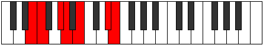

# Mode AFlatTholimic

## Links

- [Documentation](index.md)
- [Scales Index](Scales.md)
- [Modes Index](Modes.md)
- [Chords Index](Chords.md)

## Scale

[Bolimic](ScaleBolimic.md)

## Mode

[AFlatTholimic](ModeAFlatTholimic.md)

## Tonic

Ab

## Signature

[CNaturalMajor]

## Perfection

 - 3 Perfect Notes

 - 3 Imperfect Notes

## Notes

- Ab
- Bbb
- Cb (Imperfect)
- D# (Imperfect)
- E
- F (Imperfect)
- Ab

## Illustration

## Relative Modes

| Number | Mode | Tonic | Notes | Illustration |
|--------|------|-------|-------|--------------|
| [359](https://ianring.com/musictheory/scales/359) | [Bothimic](ModeBothimic.md) | D# | D#, E, F, G#, A, B, D# |  |
| [359](https://ianring.com/musictheory/scales/359) | [Bothimic](ModeBothimic.md) | Eb | Eb, Fb, Gbb, Ab, Bbb, Cb, Eb |  |
| [907](https://ianring.com/musictheory/scales/907) | [Tholimic](ModeTholimic.md) | G# | G#, A, B, C###, D##, E#, G# |  |
| [907](https://ianring.com/musictheory/scales/907) | [Tholimic](ModeTholimic.md) | Ab | Ab, Bbb, Cb, D#, E, F, Ab |  |
| [1649](https://ianring.com/musictheory/scales/1649) | [Bolimic](ModeBolimic.md) | B | B, C###, D##, E#, F###, G##, B |  |
| [2227](https://ianring.com/musictheory/scales/2227) | [Katadimic](ModeKatadimic.md) | E | E, F, G#, A, B, C###, E |  |
| [2501](https://ianring.com/musictheory/scales/2501) | [Ralimic](ModeRalimic.md) | A | A, B, C###, D##, E#, F###, A |  |
| [3161](https://ianring.com/musictheory/scales/3161) | [Kodimic](ModeKodimic.md) | F | F, G#, A, B, C###, D##, F |  |

## Chords

### Ab

| Number | Root | Name | Notes | Illustration | Audio |
|--------|------|------|-------|--------------|-------|

### Bbb

| Number | Root | Name | Notes | Illustration | Audio |
|--------|------|------|-------|--------------|-------|

### Cb

| Number | Root | Name | Notes | Illustration | Audio |
|--------|------|------|-------|--------------|-------|

### D#

| Number | Root | Name | Notes | Illustration | Audio |
|--------|------|------|-------|--------------|-------|

### E

| Number | Root | Name | Notes | Illustration | Audio |
|--------|------|------|-------|--------------|-------|

### F

| Number | Root | Name | Notes | Illustration | Audio |
|--------|------|------|-------|--------------|-------|

