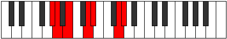

# Mode AFlatZodimic

## Links

- [Documentation](index.md)
- [Scales Index](Scales.md)
- [Modes Index](Modes.md)
- [Chords Index](Chords.md)

## Scale

[Kanimic](ScaleKanimic.md)

## Mode

[AFlatZodimic](ModeAFlatZodimic.md)

## Tonic

Ab

## Signature

[CNaturalMajor]

## Perfection

 - 3 Perfect Notes

 - 3 Imperfect Notes

## Notes

- Ab
- Bbb (Imperfect)
- Cb (Imperfect)
- D
- Eb (Imperfect)
- F##
- Ab

## Illustration

## Relative Modes

| Number | Mode | Tonic | Notes | Illustration |
|--------|------|-------|-------|--------------|
| [2251](https://ianring.com/musictheory/scales/2251) | [Zodimic](ModeZodimic.md) | Ab | Ab, Bbb, Cb, D, Eb, F##, Ab |  |
| [739](https://ianring.com/musictheory/scales/739) | [Rorimic](ModeRorimic.md) | D | D, Eb, F##, G#, A, B, D |  |
| [2417](https://ianring.com/musictheory/scales/2417) | [Kanimic](ModeKanimic.md) | Eb | Eb, F##, G#, A, B, C##, Eb |  |

## Chords

### Ab

| Number | Root | Name | Notes | Illustration | Audio |
|--------|------|------|-------|--------------|-------|

### Bbb

| Number | Root | Name | Notes | Illustration | Audio |
|--------|------|------|-------|--------------|-------|

### Cb

| Number | Root | Name | Notes | Illustration | Audio |
|--------|------|------|-------|--------------|-------|

### D

| Number | Root | Name | Notes | Illustration | Audio |
|--------|------|------|-------|--------------|-------|

### Eb

| Number | Root | Name | Notes | Illustration | Audio |
|--------|------|------|-------|--------------|-------|

### F##

| Number | Root | Name | Notes | Illustration | Audio |
|--------|------|------|-------|--------------|-------|

