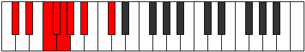

# Mode AFlatZothian

## Links

- [Documentation](index.md)
- [Scales Index](Scales.md)
- [Modes Index](Modes.md)
- [Chords Index](Chords.md)

## Scale

[Soptian](ScaleSoptian.md)

## Mode

[AFlatZothian](ModeAFlatZothian.md)

## Tonic

Ab

## Signature

[CNaturalMajor]

## Perfection

 - 5 Perfect Notes

 - 2 Imperfect Notes

## Notes

- Ab
- Bb
- C#
- D#
- E# (Imperfect)
- F#
- G (Imperfect)
- Ab

## Illustration

## Relative Modes

| Number | Mode | Tonic | Notes | Illustration |
|--------|------|-------|-------|--------------|
| [757](https://ianring.com/musictheory/scales/757) | [Ionyptian](ModeIonyptian.md) | C# | C#, D#, E#, F#, G, Ab, Bb, C# |  |
| [757](https://ianring.com/musictheory/scales/757) | [Ionyptian](ModeIonyptian.md) | Db | Db, Eb, F, Gb, Abb, Bbbb, Cbb, Db |  |
| [1213](https://ianring.com/musictheory/scales/1213) | [Gyrian](ModeGyrian.md) | D# | D#, E#, F#, G, Ab, Bb, C#, D# |  |
| [1213](https://ianring.com/musictheory/scales/1213) | [Gyrian](ModeGyrian.md) | Eb | Eb, F, Gb, Abb, Bbbb, Cbb, Db, Eb |  |
| [1327](https://ianring.com/musictheory/scales/1327) | [Zalian](ModeZalian.md) | F | F, Gb, Abb, Bbbb, Cbb, Db, Eb, F |  |
| [1961](https://ianring.com/musictheory/scales/1961) | [Soptian](ModeSoptian.md) | A# | A#, B##, C###, D###, E##, F##, G#, A# |  |
| [1961](https://ianring.com/musictheory/scales/1961) | [Soptian](ModeSoptian.md) | Bb | Bb, C#, D#, E#, F#, G, Ab, Bb |  |
| [2711](https://ianring.com/musictheory/scales/2711) | [Stolian](ModeStolian.md) | F# | F#, G, Ab, Bb, C#, D#, E#, F# |  |
| [2711](https://ianring.com/musictheory/scales/2711) | [Stolian](ModeStolian.md) | Gb | Gb, Abb, Bbbb, Cbb, Db, Eb, F, Gb |  |
| [3403](https://ianring.com/musictheory/scales/3403) | [Bylian](ModeBylian.md) | G | G, Ab, Bb, C#, D#, E#, F#, G |  |
| [3749](https://ianring.com/musictheory/scales/3749) | [Zothian](ModeZothian.md) | G# | G#, A#, B##, C###, D###, E##, F##, G# |  |
| [3749](https://ianring.com/musictheory/scales/3749) | [Zothian](ModeZothian.md) | Ab | Ab, Bb, C#, D#, E#, F#, G, Ab |  |

## Chords

### Ab

| Number | Root | Name | Notes | Illustration | Audio |
|--------|------|------|-------|--------------|-------|
| 1282 | Ab | [Absus2bb5](ChordAFlatSuspendedSecondDoubleFlatFifth.md) | Ab, Bb, Db |  | [midi](ChordAFlatSuspendedSecondDoubleFlatFifthRootPosition.mid) [ogg](ChordAFlatSuspendedSecondDoubleFlatFifthRootPosition.ogg) |
| 264 | Ab | [Ab5](ChordAFlatPowerChord.md) | Ab, Eb |  | [midi](ChordAFlatPowerChordRootPosition.mid) [ogg](ChordAFlatPowerChordRootPosition.ogg) |
| 1288 | Ab | [Absus2](ChordAFlatSuspendedSecond.md) | Ab, Bb, Eb |  | [midi](ChordAFlatSuspendedSecondRootPosition.mid) [ogg](ChordAFlatSuspendedSecondRootPosition.ogg) |
| 266 | Ab | [Absus4](ChordAFlatSuspendedFourth.md) | Ab, Db, Eb |  | [midi](ChordAFlatSuspendedFourthRootPosition.mid) [ogg](ChordAFlatSuspendedFourthRootPosition.ogg) |
| 290 | Ab | [Absus4##5](ChordAFlatSuspendedFourthDoubleSharpFifth.md) | Ab, Db, F |  | [midi](ChordAFlatSuspendedFourthDoubleSharpFifthRootPosition.mid) [ogg](ChordAFlatSuspendedFourthDoubleSharpFifthRootPosition.ogg) |
| 1314 | Ab | [AbM6sus2bb5](ChordAFlatMajorSixthSuspendedSecondDoubleFlatFifth.md) | Ab, Bb, Db, F |  | [midi](ChordAFlatMajorSixthSuspendedSecondDoubleFlatFifthRootPosition.mid) [ogg](ChordAFlatMajorSixthSuspendedSecondDoubleFlatFifthRootPosition.ogg) |
| 1320 | Ab | [AbM6sus2](ChordAFlatMajorSixthSuspendedSecond.md) | Ab, Bb, Eb, F |  | [midi](ChordAFlatMajorSixthSuspendedSecondRootPosition.mid) [ogg](ChordAFlatMajorSixthSuspendedSecondRootPosition.ogg) |
| 1320 | Ab | [Ab7sus2b5](ChordAFlatDominantSeventhSuspendedSecondFlatFifth.md) | Ab, Bb, Eb, Gbb |  | [midi](ChordAFlatDominantSeventhSuspendedSecondFlatFifthRootPosition.mid) [ogg](ChordAFlatDominantSeventhSuspendedSecondFlatFifthRootPosition.ogg) |
| 298 | Ab | [AbM6sus4](ChordAFlatMajorSixthSuspendedFourth.md) | Ab, Db, Eb, F |  | [midi](ChordAFlatMajorSixthSuspendedFourthRootPosition.mid) [ogg](ChordAFlatMajorSixthSuspendedFourthRootPosition.ogg) |
| 322 | Ab | [AbQ](ChordAFlatQuartal.md) | Ab, Db, Gb |  | [midi](ChordAFlatQuartalRootPosition.mid) [ogg](ChordAFlatQuartalRootPosition.ogg) |
| 1352 | Ab | [Ab7sus2](ChordAFlatDominantSeventhSuspendedSecond.md) | Ab, Bb, Eb, Gb |  | [midi](ChordAFlatDominantSeventhSuspendedSecondRootPosition.mid) [ogg](ChordAFlatDominantSeventhSuspendedSecondRootPosition.ogg) |
| 1352 | Ab | [Ab9sus2](ChordAFlatDominantNinthSuspendedSecond.md) | Ab, Bb, Eb, Gb, Bb |  | [midi](ChordAFlatDominantNinthSuspendedSecondRootPosition.mid) [ogg](ChordAFlatDominantNinthSuspendedSecondRootPosition.ogg) |
| 330 | Ab | [Ab7sus4](ChordAFlatDominantSeventhSuspendedFourth.md) | Ab, Db, Eb, Gb |  | [midi](ChordAFlatDominantSeventhSuspendedFourthRootPosition.mid) [ogg](ChordAFlatDominantSeventhSuspendedFourthRootPosition.ogg) |
| 1354 | Ab | [Ab9sus4](ChordAFlatDominantNinthSuspendedFourth.md) | Ab, Db, Eb, Gb, Bb |  | [midi](ChordAFlatDominantNinthSuspendedFourthRootPosition.mid) [ogg](ChordAFlatDominantNinthSuspendedFourthRootPosition.ogg) |
| 386 | Ab | [AbQ+](ChordAFlatQuartalAugmented.md) | Ab, Db, G |  | [midi](ChordAFlatQuartalAugmentedRootPosition.mid) [ogg](ChordAFlatQuartalAugmentedRootPosition.ogg) |
| 1416 | Ab | [AbM7(sus2)](ChordAFlatMajorSeventhSuspendedSecond.md) | Ab, Bb, Eb, G |  | [midi](ChordAFlatMajorSeventhSuspendedSecondRootPosition.mid) [ogg](ChordAFlatMajorSeventhSuspendedSecondRootPosition.ogg) |
| 1416 | Ab | [AbM9sus2](ChordAFlatMajorNinthSuspendedSecond.md) | Ab, Bb, Eb, G, Bb |  | [midi](ChordAFlatMajorNinthSuspendedSecondRootPosition.mid) [ogg](ChordAFlatMajorNinthSuspendedSecondRootPosition.ogg) |
| 394 | Ab | [AbM7(sus4)](ChordAFlatMajorSeventhSuspendedFourth.md) | Ab, Db, Eb, G |  | [midi](ChordAFlatMajorSeventhSuspendedFourthRootPosition.mid) [ogg](ChordAFlatMajorSeventhSuspendedFourthRootPosition.ogg) |
| 1418 | Ab | [AbM9sus4](ChordAFlatMajorNinthSuspendedFourth.md) | Ab, Db, Eb, G, Bb |  | [midi](ChordAFlatMajorNinthSuspendedFourthRootPosition.mid) [ogg](ChordAFlatMajorNinthSuspendedFourthRootPosition.ogg) |
| 418 | Ab | [AbM7(sus4)##5](ChordAFlatMajorSeventhSuspendedFourthDoubleSharpFifth.md) | Ab, Db, F, G |  | [midi](ChordAFlatMajorSeventhSuspendedFourthDoubleSharpFifthRootPosition.mid) [ogg](ChordAFlatMajorSeventhSuspendedFourthDoubleSharpFifthRootPosition.ogg) |

### Bb

| Number | Root | Name | Notes | Illustration | Audio |
|--------|------|------|-------|--------------|-------|
| 1034 | Bb | [Bbmbb5](ChordBFlatMinorDoubleFlatFifth.md) | Bb, Db, Eb |  | [midi](ChordBFlatMinorDoubleFlatFifthRootPosition.mid) [ogg](ChordBFlatMinorDoubleFlatFifthRootPosition.ogg) |
| 1056 | Bb | [Bb5](ChordBFlatPowerChord.md) | Bb, F |  | [midi](ChordBFlatPowerChordRootPosition.mid) [ogg](ChordBFlatPowerChordRootPosition.ogg) |
| 1058 | Bb | [Bbm](ChordBFlatMinor.md) | Bb, Db, F |  | [midi](ChordBFlatMinorRootPosition.mid) [ogg](ChordBFlatMinorRootPosition.ogg) |
| 1058 | Bb | [Bbm(add(#9))](ChordBFlatMinorAddSharpNinth.md) | Bb, Db, F, C# |  | [midi](ChordBFlatMinorAddSharpNinthRootPosition.mid) [ogg](ChordBFlatMinorAddSharpNinthRootPosition.ogg) |
| 1064 | Bb | [Bbsus4](ChordBFlatSuspendedFourth.md) | Bb, Eb, F |  | [midi](ChordBFlatSuspendedFourthRootPosition.mid) [ogg](ChordBFlatSuspendedFourthRootPosition.ogg) |
| 1066 | Bb | [Bbm(add11)](ChordBFlatMinorAddEleventh.md) | Bb, Db, F, Eb |  | [midi](ChordBFlatMinorAddEleventhRootPosition.mid) [ogg](ChordBFlatMinorAddEleventhRootPosition.ogg) |
| 1066 | Bb | [Bbm(add4)](ChordBFlatMinorAddFourth.md) | Bb, Db, Eb, F |  | [midi](ChordBFlatMinorAddFourthRootPosition.mid) [ogg](ChordBFlatMinorAddFourthRootPosition.ogg) |
| 1090 | Bb | [Bbm#5](ChordBFlatMinorSharpFifth.md) | Bb, Db, Gb |  | [midi](ChordBFlatMinorSharpFifthRootPosition.mid) [ogg](ChordBFlatMinorSharpFifthRootPosition.ogg) |
| 1096 | Bb | [Bbsus4#5](ChordBFlatSuspendedFourthSharpFifth.md) | Bb, Eb, F# |  | [midi](ChordBFlatSuspendedFourthSharpFifthRootPosition.mid) [ogg](ChordBFlatSuspendedFourthSharpFifthRootPosition.ogg) |
| 1160 | Bb | [Bbsus4##5](ChordBFlatSuspendedFourthDoubleSharpFifth.md) | Bb, Eb, G |  | [midi](ChordBFlatSuspendedFourthDoubleSharpFifthRootPosition.mid) [ogg](ChordBFlatSuspendedFourthDoubleSharpFifthRootPosition.ogg) |
| 1186 | Bb | [Bbm6](ChordBFlatMinorSixth.md) | Bb, Db, F, G |  | [midi](ChordBFlatMinorSixthRootPosition.mid) [ogg](ChordBFlatMinorSixthRootPosition.ogg) |
| 1192 | Bb | [BbM6sus4](ChordBFlatMajorSixthSuspendedFourth.md) | Bb, Eb, F, G |  | [midi](ChordBFlatMajorSixthSuspendedFourthRootPosition.mid) [ogg](ChordBFlatMajorSixthSuspendedFourthRootPosition.ogg) |
| 1288 | Bb | [BbQ](ChordBFlatQuartal.md) | Bb, Eb, Ab |  | [midi](ChordBFlatQuartalRootPosition.mid) [ogg](ChordBFlatQuartalRootPosition.ogg) |
| 1290 | Bb | [Bbm7bb5](ChordBFlatMinorSeventhDoubleFlatFifth.md) | Bb, Db, Eb, Ab |  | [midi](ChordBFlatMinorSeventhDoubleFlatFifthRootPosition.mid) [ogg](ChordBFlatMinorSeventhDoubleFlatFifthRootPosition.ogg) |
| 1314 | Bb | [Bbm7](ChordBFlatMinorSeventh.md) | Bb, Db, F, Ab |  | [midi](ChordBFlatMinorSeventhRootPosition.mid) [ogg](ChordBFlatMinorSeventhRootPosition.ogg) |
| 1320 | Bb | [Bb7sus4](ChordBFlatDominantSeventhSuspendedFourth.md) | Bb, Eb, F, Ab |  | [midi](ChordBFlatDominantSeventhSuspendedFourthRootPosition.mid) [ogg](ChordBFlatDominantSeventhSuspendedFourthRootPosition.ogg) |
| 1322 | Bb | [Bbm7add11](ChordBFlatMinorSeventhAddEleventh.md) | Bb, Db, F, Ab, Eb |  | [midi](ChordBFlatMinorSeventhAddEleventhRootPosition.mid) [ogg](ChordBFlatMinorSeventhAddEleventhRootPosition.ogg) |
| 1346 | Bb | [Bbm7#5](ChordBFlatMinorSeventhSharpFifth.md) | Bb, Db, F#, Ab |  | [midi](ChordBFlatMinorSeventhSharpFifthRootPosition.mid) [ogg](ChordBFlatMinorSeventhSharpFifthRootPosition.ogg) |
| 1442 | Bb | [Bbm7add13](ChordBFlatMinorSeventhAddThirteenth.md) | Bb, Db, F, Ab, G |  | [midi](ChordBFlatMinorSeventhAddThirteenthRootPosition.mid) [ogg](ChordBFlatMinorSeventhAddThirteenthRootPosition.ogg) |

### C#

| Number | Root | Name | Notes | Illustration | Audio |
|--------|------|------|-------|--------------|-------|
| 74 | C# | [C#sus2bb5](ChordCSharpSuspendedSecondDoubleFlatFifth.md) | C#, D#, F# |  | [midi](ChordCSharpSuspendedSecondDoubleFlatFifthRootPosition.mid) [ogg](ChordCSharpSuspendedSecondDoubleFlatFifthRootPosition.ogg) |
| 138 | C# | [C#sus2b5](ChordCSharpSuspendedSecondFlatFifth.md) | C#, D#, G |  | [midi](ChordCSharpSuspendedSecondFlatFifthRootPosition.mid) [ogg](ChordCSharpSuspendedSecondFlatFifthRootPosition.ogg) |
| 162 | C# | [C#Mb5](ChordCSharpMajorFlatFifth.md) | C#, E#, G |  | [midi](ChordCSharpMajorFlatFifthRootPosition.mid) [ogg](ChordCSharpMajorFlatFifthRootPosition.ogg) |
| 194 | C# | [C#sus4b5](ChordCSharpSuspendedFourthFlatFifth.md) | C#, F#, G |  | [midi](ChordCSharpSuspendedFourthFlatFifthRootPosition.mid) [ogg](ChordCSharpSuspendedFourthFlatFifthRootPosition.ogg) |
| 258 | C# | [C#5](ChordCSharpPowerChord.md) | C#, G# |  | [midi](ChordCSharpPowerChordRootPosition.mid) [ogg](ChordCSharpPowerChordRootPosition.ogg) |
| 266 | C# | [C#sus2](ChordCSharpSuspendedSecond.md) | C#, D#, G# |  | [midi](ChordCSharpSuspendedSecondRootPosition.mid) [ogg](ChordCSharpSuspendedSecondRootPosition.ogg) |
| 290 | C# | [C#M](ChordCSharpMajor.md) | C#, E#, G# |  | [midi](ChordCSharpMajorRootPosition.mid) [ogg](ChordCSharpMajorRootPosition.ogg) |
| 298 | C# | [C#M(add9)](ChordCSharpMajorAddNinth.md) | C#, E#, G#, D# |  | [midi](ChordCSharpMajorAddNinthRootPosition.mid) [ogg](ChordCSharpMajorAddNinthRootPosition.ogg) |
| 322 | C# | [C#sus4](ChordCSharpSuspendedFourth.md) | C#, F#, G# |  | [midi](ChordCSharpSuspendedFourthRootPosition.mid) [ogg](ChordCSharpSuspendedFourthRootPosition.ogg) |
| 354 | C# | [C#M(add11)](ChordCSharpMajorAddEleventh.md) | C#, E#, G#, F# |  | [midi](ChordCSharpMajorAddEleventhRootPosition.mid) [ogg](ChordCSharpMajorAddEleventhRootPosition.ogg) |
| 354 | C# | [C#M(add4)](ChordCSharpMajorAddFourth.md) | C#, E#, F#, G# |  | [midi](ChordCSharpMajorAddFourthRootPosition.mid) [ogg](ChordCSharpMajorAddFourthRootPosition.ogg) |
| 386 | C# | [C#lyd](ChordCSharpLydian.md) | C#, F##, G# |  | [midi](ChordCSharpLydianRootPosition.mid) [ogg](ChordCSharpLydianRootPosition.ogg) |
| 418 | C# | [C#M(add(#4))](ChordCSharpMajorAddSharpFourth.md) | C#, E#, F##, G# |  | [midi](ChordCSharpMajorAddSharpFourthRootPosition.mid) [ogg](ChordCSharpMajorAddSharpFourthRootPosition.ogg) |
| 1058 | C# | [C#M##5](ChordCSharpMajorDoubleSharpFifth.md) | C#, E#, A# |  | [midi](ChordCSharpMajorDoubleSharpFifthRootPosition.mid) [ogg](ChordCSharpMajorDoubleSharpFifthRootPosition.ogg) |
| 1090 | C# | [C#sus4##5](ChordCSharpSuspendedFourthDoubleSharpFifth.md) | C#, F#, A# |  | [midi](ChordCSharpSuspendedFourthDoubleSharpFifthRootPosition.mid) [ogg](ChordCSharpSuspendedFourthDoubleSharpFifthRootPosition.ogg) |
| 1098 | C# | [C#M6sus2bb5](ChordCSharpMajorSixthSuspendedSecondDoubleFlatFifth.md) | C#, D#, F#, A# |  | [midi](ChordCSharpMajorSixthSuspendedSecondDoubleFlatFifthRootPosition.mid) [ogg](ChordCSharpMajorSixthSuspendedSecondDoubleFlatFifthRootPosition.ogg) |
| 1162 | C# | [C#M6sus2b5](ChordCSharpMajorSixthSuspendedSecondFlatFifth.md) | C#, D#, G, A# |  | [midi](ChordCSharpMajorSixthSuspendedSecondFlatFifthRootPosition.mid) [ogg](ChordCSharpMajorSixthSuspendedSecondFlatFifthRootPosition.ogg) |
| 1186 | C# | [C#M6b5](ChordCSharpMajorSixthFlatFifth.md) | C#, E#, G, A# |  | [midi](ChordCSharpMajorSixthFlatFifthRootPosition.mid) [ogg](ChordCSharpMajorSixthFlatFifthRootPosition.ogg) |
| 1290 | C# | [C#M6sus2](ChordCSharpMajorSixthSuspendedSecond.md) | C#, D#, G#, A# |  | [midi](ChordCSharpMajorSixthSuspendedSecondRootPosition.mid) [ogg](ChordCSharpMajorSixthSuspendedSecondRootPosition.ogg) |
| 1290 | C# | [C#7sus2b5](ChordCSharpDominantSeventhSuspendedSecondFlatFifth.md) | C#, D#, G#, Bb |  | [midi](ChordCSharpDominantSeventhSuspendedSecondFlatFifthRootPosition.mid) [ogg](ChordCSharpDominantSeventhSuspendedSecondFlatFifthRootPosition.ogg) |
| 1314 | C# | [C#M6](ChordCSharpMajorSixth.md) | C#, E#, G#, A# |  | [midi](ChordCSharpMajorSixthRootPosition.mid) [ogg](ChordCSharpMajorSixthRootPosition.ogg) |
| 1322 | C# | [C#M6(add9)](ChordCSharpMajorSixthAddNinth.md) | C#, E#, G#, A#, D# |  | [midi](ChordCSharpMajorSixthAddNinthRootPosition.mid) [ogg](ChordCSharpMajorSixthAddNinthRootPosition.ogg) |
| 1346 | C# | [C#M6sus4](ChordCSharpMajorSixthSuspendedFourth.md) | C#, F#, G#, A# |  | [midi](ChordCSharpMajorSixthSuspendedFourthRootPosition.mid) [ogg](ChordCSharpMajorSixthSuspendedFourthRootPosition.ogg) |

### D#

| Number | Root | Name | Notes | Illustration | Audio |
|--------|------|------|-------|--------------|-------|
| 296 | D# | [D#sus2bb5](ChordDSharpSuspendedSecondDoubleFlatFifth.md) | D#, E#, G# |  | [midi](ChordDSharpSuspendedSecondDoubleFlatFifthRootPosition.mid) [ogg](ChordDSharpSuspendedSecondDoubleFlatFifthRootPosition.ogg) |
| 328 | D# | [D#mbb5](ChordDSharpMinorDoubleFlatFifth.md) | D#, F#, G# |  | [midi](ChordDSharpMinorDoubleFlatFifthRootPosition.mid) [ogg](ChordDSharpMinorDoubleFlatFifthRootPosition.ogg) |
| 1032 | D# | [D#5](ChordDSharpPowerChord.md) | D#, A# |  | [midi](ChordDSharpPowerChordRootPosition.mid) [ogg](ChordDSharpPowerChordRootPosition.ogg) |
| 1064 | D# | [D#sus2](ChordDSharpSuspendedSecond.md) | D#, E#, A# |  | [midi](ChordDSharpSuspendedSecondRootPosition.mid) [ogg](ChordDSharpSuspendedSecondRootPosition.ogg) |
| 1096 | D# | [D#m](ChordDSharpMinor.md) | D#, F#, A# |  | [midi](ChordDSharpMinorRootPosition.mid) [ogg](ChordDSharpMinorRootPosition.ogg) |
| 1096 | D# | [D#m(add(#9))](ChordDSharpMinorAddSharpNinth.md) | D#, F#, A#, E## |  | [midi](ChordDSharpMinorAddSharpNinthRootPosition.mid) [ogg](ChordDSharpMinorAddSharpNinthRootPosition.ogg) |
| 1128 | D# | [D#m(add9)](ChordDSharpMinorAddNinth.md) | D#, F#, A#, E# |  | [midi](ChordDSharpMinorAddNinthRootPosition.mid) [ogg](ChordDSharpMinorAddNinthRootPosition.ogg) |
| 1160 | D# | [D#M](ChordDSharpMajor.md) | D#, F##, A# |  | [midi](ChordDSharpMajorRootPosition.mid) [ogg](ChordDSharpMajorRootPosition.ogg) |
| 1192 | D# | [D#M(add9)](ChordDSharpMajorAddNinth.md) | D#, F##, A#, E# |  | [midi](ChordDSharpMajorAddNinthRootPosition.mid) [ogg](ChordDSharpMajorAddNinthRootPosition.ogg) |
| 1224 | D# | [D#M(add(#9))](ChordDSharpMajorAddSharpNinth.md) | D#, F##, A#, E## |  | [midi](ChordDSharpMajorAddSharpNinthRootPosition.mid) [ogg](ChordDSharpMajorAddSharpNinthRootPosition.ogg) |
| 1288 | D# | [D#sus4](ChordDSharpSuspendedFourth.md) | D#, G#, A# |  | [midi](ChordDSharpSuspendedFourthRootPosition.mid) [ogg](ChordDSharpSuspendedFourthRootPosition.ogg) |
| 1352 | D# | [D#m(add11)](ChordDSharpMinorAddEleventh.md) | D#, F#, A#, G# |  | [midi](ChordDSharpMinorAddEleventhRootPosition.mid) [ogg](ChordDSharpMinorAddEleventhRootPosition.ogg) |
| 1352 | D# | [D#m(add4)](ChordDSharpMinorAddFourth.md) | D#, F#, G#, A# |  | [midi](ChordDSharpMinorAddFourthRootPosition.mid) [ogg](ChordDSharpMinorAddFourthRootPosition.ogg) |
| 1416 | D# | [D#M(add11)](ChordDSharpMajorAddEleventh.md) | D#, F##, A#, G# |  | [midi](ChordDSharpMajorAddEleventhRootPosition.mid) [ogg](ChordDSharpMajorAddEleventhRootPosition.ogg) |
| 1416 | D# | [D#M(add4)](ChordDSharpMajorAddFourth.md) | D#, F##, G#, A# |  | [midi](ChordDSharpMajorAddFourthRootPosition.mid) [ogg](ChordDSharpMajorAddFourthRootPosition.ogg) |
| 266 | D# | [D#Q](ChordDSharpQuartal.md) | D#, G#, C# |  | [midi](ChordDSharpQuartalRootPosition.mid) [ogg](ChordDSharpQuartalRootPosition.ogg) |
| 330 | D# | [D#m7bb5](ChordDSharpMinorSeventhDoubleFlatFifth.md) | D#, F#, G#, C# |  | [midi](ChordDSharpMinorSeventhDoubleFlatFifthRootPosition.mid) [ogg](ChordDSharpMinorSeventhDoubleFlatFifthRootPosition.ogg) |
| 1066 | D# | [D#7sus2](ChordDSharpDominantSeventhSuspendedSecond.md) | D#, E#, A#, C# |  | [midi](ChordDSharpDominantSeventhSuspendedSecondRootPosition.mid) [ogg](ChordDSharpDominantSeventhSuspendedSecondRootPosition.ogg) |
| 1066 | D# | [D#9sus2](ChordDSharpDominantNinthSuspendedSecond.md) | D#, E#, A#, C#, E# |  | [midi](ChordDSharpDominantNinthSuspendedSecondRootPosition.mid) [ogg](ChordDSharpDominantNinthSuspendedSecondRootPosition.ogg) |
| 1098 | D# | [D#m7](ChordDSharpMinorSeventh.md) | D#, F#, A#, C# |  | [midi](ChordDSharpMinorSeventhRootPosition.mid) [ogg](ChordDSharpMinorSeventhRootPosition.ogg) |
| 1130 | D# | [D#m9](ChordDSharpMinorNinth.md) | D#, F#, A#, C#, E# |  | [midi](ChordDSharpMinorNinthRootPosition.mid) [ogg](ChordDSharpMinorNinthRootPosition.ogg) |
| 1162 | D# | [D#7](ChordDSharpDominantSeventh.md) | D#, F##, A#, C# |  | [midi](ChordDSharpDominantSeventhRootPosition.mid) [ogg](ChordDSharpDominantSeventhRootPosition.ogg) |
| 1194 | D# | [D#9](ChordDSharpDominantNinth.md) | D#, F##, A#, C#, E# |  | [midi](ChordDSharpDominantNinthRootPosition.mid) [ogg](ChordDSharpDominantNinthRootPosition.ogg) |
| 1226 | D# | [D#7#9](ChordDSharpDominantSeventhSharpNinth.md) | D#, F##, A#, C#, E## |  | [midi](ChordDSharpDominantSeventhSharpNinthRootPosition.mid) [ogg](ChordDSharpDominantSeventhSharpNinthRootPosition.ogg) |
| 1290 | D# | [D#7sus4](ChordDSharpDominantSeventhSuspendedFourth.md) | D#, G#, A#, C# |  | [midi](ChordDSharpDominantSeventhSuspendedFourthRootPosition.mid) [ogg](ChordDSharpDominantSeventhSuspendedFourthRootPosition.ogg) |
| 1322 | D# | [D#9sus4](ChordDSharpDominantNinthSuspendedFourth.md) | D#, G#, A#, C#, E# |  | [midi](ChordDSharpDominantNinthSuspendedFourthRootPosition.mid) [ogg](ChordDSharpDominantNinthSuspendedFourthRootPosition.ogg) |
| 1354 | D# | [D#m7add11](ChordDSharpMinorSeventhAddEleventh.md) | D#, F#, A#, C#, G# |  | [midi](ChordDSharpMinorSeventhAddEleventhRootPosition.mid) [ogg](ChordDSharpMinorSeventhAddEleventhRootPosition.ogg) |
| 1386 | D# | [D#m11](ChordDSharpMinorEleventh.md) | D#, F#, A#, C#, E#, G# |  | [midi](ChordDSharpMinorEleventhRootPosition.mid) [ogg](ChordDSharpMinorEleventhRootPosition.ogg) |
| 1418 | D# | [D#7add4](ChordDSharpDominantSeventhAddFourth.md) | D#, F##, G#, A#, C# |  | [midi](ChordDSharpDominantSeventhAddFourthRootPosition.mid) [ogg](ChordDSharpDominantSeventhAddFourthRootPosition.ogg) |
| 1418 | D# | [D#7add11](ChordDSharpDominantSeventhAddEleventh.md) | D#, F##, A#, C#, G# |  | [midi](ChordDSharpDominantSeventhAddEleventhRootPosition.mid) [ogg](ChordDSharpDominantSeventhAddEleventhRootPosition.ogg) |
| 1450 | D# | [D#11](ChordDSharpDominantEleventh.md) | D#, F##, A#, C#, E#, G# |  | [midi](ChordDSharpDominantEleventhRootPosition.mid) [ogg](ChordDSharpDominantEleventhRootPosition.ogg) |

### E#

| Number | Root | Name | Notes | Illustration | Audio |
|--------|------|------|-------|--------------|-------|

### F#

| Number | Root | Name | Notes | Illustration | Audio |
|--------|------|------|-------|--------------|-------|
| 66 | F# | [F#5](ChordFSharpPowerChord.md) | F#, C# |  | [midi](ChordFSharpPowerChordRootPosition.mid) [ogg](ChordFSharpPowerChordRootPosition.ogg) |
| 194 | F# | [F#phryg](ChordFSharpPhrygian.md) | F#, G, C# |  | [midi](ChordFSharpPhrygianRootPosition.mid) [ogg](ChordFSharpPhrygianRootPosition.ogg) |
| 322 | F# | [F#sus2](ChordFSharpSuspendedSecond.md) | F#, G#, C# |  | [midi](ChordFSharpSuspendedSecondRootPosition.mid) [ogg](ChordFSharpSuspendedSecondRootPosition.ogg) |
| 1090 | F# | [F#M](ChordFSharpMajor.md) | F#, A#, C# |  | [midi](ChordFSharpMajorRootPosition.mid) [ogg](ChordFSharpMajorRootPosition.ogg) |
| 1346 | F# | [F#M(add9)](ChordFSharpMajorAddNinth.md) | F#, A#, C#, G# |  | [midi](ChordFSharpMajorAddNinthRootPosition.mid) [ogg](ChordFSharpMajorAddNinthRootPosition.ogg) |
| 1096 | F# | [F#M##5](ChordFSharpMajorDoubleSharpFifth.md) | F#, A#, D# |  | [midi](ChordFSharpMajorDoubleSharpFifthRootPosition.mid) [ogg](ChordFSharpMajorDoubleSharpFifthRootPosition.ogg) |
| 330 | F# | [F#M6sus2](ChordFSharpMajorSixthSuspendedSecond.md) | F#, G#, C#, D# |  | [midi](ChordFSharpMajorSixthSuspendedSecondRootPosition.mid) [ogg](ChordFSharpMajorSixthSuspendedSecondRootPosition.ogg) |
| 330 | F# | [F#7sus2b5](ChordFSharpDominantSeventhSuspendedSecondFlatFifth.md) | F#, G#, C#, Eb |  | [midi](ChordFSharpDominantSeventhSuspendedSecondFlatFifthRootPosition.mid) [ogg](ChordFSharpDominantSeventhSuspendedSecondFlatFifthRootPosition.ogg) |
| 1098 | F# | [F#M6](ChordFSharpMajorSixth.md) | F#, A#, C#, D# |  | [midi](ChordFSharpMajorSixthRootPosition.mid) [ogg](ChordFSharpMajorSixthRootPosition.ogg) |
| 1226 | F# | [F#M6(addb9)](ChordFSharpMajorSixthAddFlatNinth.md) | F#, A#, C#, D#, G |  | [midi](ChordFSharpMajorSixthAddFlatNinthRootPosition.mid) [ogg](ChordFSharpMajorSixthAddFlatNinthRootPosition.ogg) |
| 1354 | F# | [F#M6(add9)](ChordFSharpMajorSixthAddNinth.md) | F#, A#, C#, D#, G# |  | [midi](ChordFSharpMajorSixthAddNinthRootPosition.mid) [ogg](ChordFSharpMajorSixthAddNinthRootPosition.ogg) |
| 226 | F# | [F#phryg+7](ChordFSharpPhrygianAddSeventh.md) | F#, G, C#, E# |  | [midi](ChordFSharpPhrygianAddSeventhRootPosition.mid) [ogg](ChordFSharpPhrygianAddSeventhRootPosition.ogg) |
| 354 | F# | [F#M7(sus2)](ChordFSharpMajorSeventhSuspendedSecond.md) | F#, G#, C#, E# |  | [midi](ChordFSharpMajorSeventhSuspendedSecondRootPosition.mid) [ogg](ChordFSharpMajorSeventhSuspendedSecondRootPosition.ogg) |
| 354 | F# | [F#M9sus2](ChordFSharpMajorNinthSuspendedSecond.md) | F#, G#, C#, E#, G# |  | [midi](ChordFSharpMajorNinthSuspendedSecondRootPosition.mid) [ogg](ChordFSharpMajorNinthSuspendedSecondRootPosition.ogg) |
| 1122 | F# | [F#M7](ChordFSharpMajorSeventh.md) | F#, A#, C#, E# |  | [midi](ChordFSharpMajorSeventhRootPosition.mid) [ogg](ChordFSharpMajorSeventhRootPosition.ogg) |
| 1378 | F# | [F#M9](ChordFSharpMajorNinth.md) | F#, A#, C#, E#, G# |  | [midi](ChordFSharpMajorNinthRootPosition.mid) [ogg](ChordFSharpMajorNinthRootPosition.ogg) |
| 1128 | F# | [F#M7##5](ChordFSharpMajorSeventhDoubleSharpFifth.md) | F#, A#, D#, E# |  | [midi](ChordFSharpMajorSeventhDoubleSharpFifthRootPosition.mid) [ogg](ChordFSharpMajorSeventhDoubleSharpFifthRootPosition.ogg) |
| 1130 | F# | [F#M7add13](ChordFSharpMajorSeventhAddThirteenth.md) | F#, A#, C#, E#, D# |  | [midi](ChordFSharpMajorSeventhAddThirteenthRootPosition.mid) [ogg](ChordFSharpMajorSeventhAddThirteenthRootPosition.ogg) |

### G

| Number | Root | Name | Notes | Illustration | Audio |
|--------|------|------|-------|--------------|-------|
| 386 | G | [Gloc](ChordGNaturalLocrian.md) | G, Ab, Db |  | [midi](ChordGNaturalLocrianRootPosition.mid) [ogg](ChordGNaturalLocrianRootPosition.ogg) |
| 1154 | G | [Go](ChordGNaturalDiminished.md) | G, Bb, Db |  | [midi](ChordGNaturalDiminishedRootPosition.mid) [ogg](ChordGNaturalDiminishedRootPosition.ogg) |
| 1160 | G | [Gm#5](ChordGNaturalMinorSharpFifth.md) | G, Bb, Eb |  | [midi](ChordGNaturalMinorSharpFifthRootPosition.mid) [ogg](ChordGNaturalMinorSharpFifthRootPosition.ogg) |
| 1186 | G | [Gø7](ChordGNaturalHalfDiminishedSeventh.md) | G, Bb, Db, F |  | [midi](ChordGNaturalHalfDiminishedSeventhRootPosition.mid) [ogg](ChordGNaturalHalfDiminishedSeventhRootPosition.ogg) |
| 1192 | G | [Gm7#5](ChordGNaturalMinorSeventhSharpFifth.md) | G, Bb, D#, F |  | [midi](ChordGNaturalMinorSeventhSharpFifthRootPosition.mid) [ogg](ChordGNaturalMinorSeventhSharpFifthRootPosition.ogg) |
| 1218 | G | [GoM7](ChordGNaturalDiminishedMajorSeventh.md) | G, Bb, Db, F# |  | [midi](ChordGNaturalDiminishedMajorSeventhRootPosition.mid) [ogg](ChordGNaturalDiminishedMajorSeventhRootPosition.ogg) |

