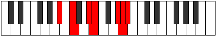

# Mode AFlatZylimic

## Links

- [Documentation](index.md)
- [Scales Index](Scales.md)
- [Modes Index](Modes.md)
- [Chords Index](Chords.md)

## Scale

[Kanimic](ScaleKanimic.md)

## Mode

[AFlatZylimic](ModeAFlatZylimic.md)

## Tonic

Ab

## Signature

[CNaturalMajor]

## Perfection

 - 3 Perfect Notes

 - 3 Imperfect Notes

## Notes

- Ab
- Bbb
- Cbb (Imperfect)
- Dbb (Imperfect)
- Eb
- Fb (Imperfect)
- Ab

## Illustration

## Relative Modes

| Number | Mode | Tonic | Notes | Illustration |
|--------|------|-------|-------|--------------|
| [407](https://ianring.com/musictheory/scales/407) | [Zylimic](ModeZylimic.md) | G# | G#, A, Bb, C, D#, E, G# |  |
| [407](https://ianring.com/musictheory/scales/407) | [Zylimic](ModeZylimic.md) | Ab | Ab, Bbb, Cbb, Dbb, Eb, Fb, Ab |  |
| [739](https://ianring.com/musictheory/scales/739) | [Rorimic](ModeRorimic.md) | D# | D#, E, F###, G##, A#, B#, D# |  |
| [739](https://ianring.com/musictheory/scales/739) | [Rorimic](ModeRorimic.md) | Eb | Eb, Fb, G#, A, Bb, C, Eb |  |
| [1817](https://ianring.com/musictheory/scales/1817) | [Phrythimic](ModePhrythimic.md) | C | C, D#, E, F###, G##, A#, C |  |
| [2251](https://ianring.com/musictheory/scales/2251) | [Zodimic](ModeZodimic.md) | A | A, Bb, C, D#, E, F###, A |  |
| [2417](https://ianring.com/musictheory/scales/2417) | [Kanimic](ModeKanimic.md) | E | E, F###, G##, A#, B#, C###, E |  |
| [3173](https://ianring.com/musictheory/scales/3173) | [Zarimic](ModeZarimic.md) | A# | A#, B#, C###, D##, F###, G##, A# |  |
| [3173](https://ianring.com/musictheory/scales/3173) | [Zarimic](ModeZarimic.md) | Bb | Bb, C, D#, E, F###, G##, Bb |  |

## Chords

### Ab

| Number | Root | Name | Notes | Illustration | Audio |
|--------|------|------|-------|--------------|-------|

### Bbb

| Number | Root | Name | Notes | Illustration | Audio |
|--------|------|------|-------|--------------|-------|

### Cbb

| Number | Root | Name | Notes | Illustration | Audio |
|--------|------|------|-------|--------------|-------|

### Dbb

| Number | Root | Name | Notes | Illustration | Audio |
|--------|------|------|-------|--------------|-------|

### Eb

| Number | Root | Name | Notes | Illustration | Audio |
|--------|------|------|-------|--------------|-------|

### Fb

| Number | Root | Name | Notes | Illustration | Audio |
|--------|------|------|-------|--------------|-------|

