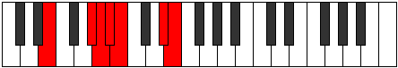

# Mode AFlatZynimic

## Links

- [Documentation](index.md)
- [Scales Index](Scales.md)
- [Modes Index](Modes.md)
- [Chords Index](Chords.md)

## Scale

[Daptimic](ScaleDaptimic.md)

## Mode

[AFlatZynimic](ModeAFlatZynimic.md)

## Tonic

Ab

## Signature

[CNaturalMajor]

## Perfection

 - 4 Perfect Notes

 - 2 Imperfect Notes

## Notes

- Ab
- Bbb
- Cbb (Imperfect)
- Dbbb (Imperfect)
- Eb
- Fb
- Ab

## Illustration

## Relative Modes

| Number | Mode | Tonic | Notes | Illustration |
|--------|------|-------|-------|--------------|
| [399](https://ianring.com/musictheory/scales/399) | [Zynimic](ModeZynimic.md) | G# | G#, A, Bb, Cb, D#, E, G# |  |
| [399](https://ianring.com/musictheory/scales/399) | [Zynimic](ModeZynimic.md) | Ab | Ab, Bbb, Cbb, Dbbb, Eb, Fb, Ab |  |
| [483](https://ianring.com/musictheory/scales/483) | [Kygimic](ModeKygimic.md) | D# | D#, E, F###, G##, A#, B, D# |  |
| [483](https://ianring.com/musictheory/scales/483) | [Kygimic](ModeKygimic.md) | Eb | Eb, Fb, G#, A, Bb, Cb, Eb |  |
| [2247](https://ianring.com/musictheory/scales/2247) | [Aeolimic](ModeAeolimic.md) | A | A, Bb, Cb, D#, E, F###, A |  |
| [2289](https://ianring.com/musictheory/scales/2289) | [Mocrimic](ModeMocrimic.md) | E | E, F###, G##, A#, B, C###, E |  |
| [3171](https://ianring.com/musictheory/scales/3171) | [Zythimic](ModeZythimic.md) | A# | A#, B, C###, D##, F###, G##, A# |  |
| [3171](https://ianring.com/musictheory/scales/3171) | [Zythimic](ModeZythimic.md) | Bb | Bb, Cb, D#, E, F###, G##, Bb |  |
| [3633](https://ianring.com/musictheory/scales/3633) | [Daptimic](ModeDaptimic.md) | B | B, C###, D##, F###, G##, A#, B |  |

## Chords

### Ab

| Number | Root | Name | Notes | Illustration | Audio |
|--------|------|------|-------|--------------|-------|

### Bbb

| Number | Root | Name | Notes | Illustration | Audio |
|--------|------|------|-------|--------------|-------|

### Cbb

| Number | Root | Name | Notes | Illustration | Audio |
|--------|------|------|-------|--------------|-------|

### Dbbb

| Number | Root | Name | Notes | Illustration | Audio |
|--------|------|------|-------|--------------|-------|

### Eb

| Number | Root | Name | Notes | Illustration | Audio |
|--------|------|------|-------|--------------|-------|

### Fb

| Number | Root | Name | Notes | Illustration | Audio |
|--------|------|------|-------|--------------|-------|

