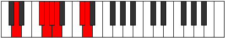

# Mode AFlatZythimic

## Links

- [Documentation](index.md)
- [Scales Index](Scales.md)
- [Modes Index](Modes.md)
- [Chords Index](Chords.md)

## Scale

[Daptimic](ScaleDaptimic.md)

## Mode

[AFlatZythimic](ModeAFlatZythimic.md)

## Tonic

Ab

## Signature

[CNaturalMajor]

## Perfection

 - 4 Perfect Notes

 - 2 Imperfect Notes

## Notes

- Ab (Imperfect)
- Bbb (Imperfect)
- C#
- D
- E##
- F##
- Ab (Imperfect)

## Illustration

## Relative Modes

| Number | Mode | Tonic | Notes | Illustration |
|--------|------|-------|-------|--------------|
| [3171](https://ianring.com/musictheory/scales/3171) | [Zythimic](ModeZythimic.md) | Ab | Ab, Bbb, C#, D, E##, F##, Ab |  |
| [483](https://ianring.com/musictheory/scales/483) | [Kygimic](ModeKygimic.md) | C# | C#, D, E##, F##, G#, A, C# |  |
| [2289](https://ianring.com/musictheory/scales/2289) | [Mocrimic](ModeMocrimic.md) | D | D, E##, F##, G#, A, B##, D |  |

## Chords

### Ab

| Number | Root | Name | Notes | Illustration | Audio |
|--------|------|------|-------|--------------|-------|

### Bbb

| Number | Root | Name | Notes | Illustration | Audio |
|--------|------|------|-------|--------------|-------|

### C#

| Number | Root | Name | Notes | Illustration | Audio |
|--------|------|------|-------|--------------|-------|

### D

| Number | Root | Name | Notes | Illustration | Audio |
|--------|------|------|-------|--------------|-------|

### E##

| Number | Root | Name | Notes | Illustration | Audio |
|--------|------|------|-------|--------------|-------|

### F##

| Number | Root | Name | Notes | Illustration | Audio |
|--------|------|------|-------|--------------|-------|

