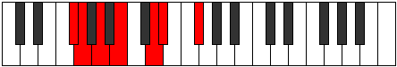

# Mode ANaturalAeolothian

## Links

- [Documentation](index.md)
- [Scales Index](Scales.md)
- [Modes Index](Modes.md)
- [Chords Index](Chords.md)

## Scale

[Katathian](ScaleKatathian.md)

## Mode

[ANaturalAeolothian](ModeANaturalAeolothian.md)

## Tonic

A

## Signature

[CNaturalMajor]

## Perfection

 - 4 Perfect Notes

 - 3 Imperfect Notes

## Notes

- A (Imperfect)
- Bb (Imperfect)
- Cb
- D
- Eb
- F# (Imperfect)
- G
- A (Imperfect)

## Illustration

## Relative Modes

| Number | Mode | Tonic | Notes | Illustration |
|--------|------|-------|-------|--------------|
| [827](https://ianring.com/musictheory/scales/827) | [Mixolocrian](ModeMixolocrian.md) | F# | F#, G, A, Bb, Cb, D, Eb, F# |  |
| [827](https://ianring.com/musictheory/scales/827) | [Mixolocrian](ModeMixolocrian.md) | Gb | Gb, Abb, Bbb, Cbb, Dbbb, Ebb, Fbb, Gb |  |
| [947](https://ianring.com/musictheory/scales/947) | [Modian](ModeModian.md) | D | D, Eb, F#, G, A, Bb, Cb, D |  |
| [1639](https://ianring.com/musictheory/scales/1639) | [Aeolothian](ModeAeolothian.md) | A | A, Bb, Cb, D, Eb, F#, G, A |  |
| [2461](https://ianring.com/musictheory/scales/2461) | [Sagian](ModeSagian.md) | G | G, A, Bb, Cb, D, Eb, F#, G |  |
| [2521](https://ianring.com/musictheory/scales/2521) | [Barian](ModeBarian.md) | D# | D#, E##, F##, G##, A#, B, C##, D# |  |
| [2521](https://ianring.com/musictheory/scales/2521) | [Barian](ModeBarian.md) | Eb | Eb, F#, G, A, Bb, Cb, D, Eb |  |
| [2867](https://ianring.com/musictheory/scales/2867) | [Socrian](ModeSocrian.md) | A# | A#, B, C##, D#, E##, F##, G##, A# |  |
| [2867](https://ianring.com/musictheory/scales/2867) | [Socrian](ModeSocrian.md) | Bb | Bb, Cb, D, Eb, F#, G, A, Bb |  |
| [3481](https://ianring.com/musictheory/scales/3481) | [Katathian](ModeKatathian.md) | B | B, C##, D#, E##, F##, G##, A#, B |  |

## Chords

### A

| Number | Root | Name | Notes | Illustration | Audio |
|--------|------|------|-------|--------------|-------|

### Bb

| Number | Root | Name | Notes | Illustration | Audio |
|--------|------|------|-------|--------------|-------|

### Cb

| Number | Root | Name | Notes | Illustration | Audio |
|--------|------|------|-------|--------------|-------|

### D

| Number | Root | Name | Notes | Illustration | Audio |
|--------|------|------|-------|--------------|-------|

### Eb

| Number | Root | Name | Notes | Illustration | Audio |
|--------|------|------|-------|--------------|-------|

### F#

| Number | Root | Name | Notes | Illustration | Audio |
|--------|------|------|-------|--------------|-------|

### G

| Number | Root | Name | Notes | Illustration | Audio |
|--------|------|------|-------|--------------|-------|

