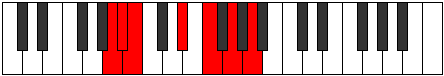

# Mode ANaturalAeraptimic

## Links

- [Documentation](index.md)
- [Scales Index](Scales.md)
- [Modes Index](Modes.md)
- [Chords Index](Chords.md)

## Scale

[Katanimic](ScaleKatanimic.md)

## Mode

[ANaturalAeraptimic](ModeANaturalAeraptimic.md)

## Tonic

A

## Signature

[CNaturalMajor]

## Perfection

 - 2 Perfect Notes

 - 4 Imperfect Notes

## Notes

- A (Imperfect)
- Bb
- Cb (Imperfect)
- D#
- E# (Imperfect)
- F## (Imperfect)
- A (Imperfect)

## Illustration

## Relative Modes

| Number | Mode | Tonic | Notes | Illustration |
|--------|------|-------|-------|--------------|
| [1351](https://ianring.com/musictheory/scales/1351) | [Aeraptimic](ModeAeraptimic.md) | A | A, Bb, Cb, D#, E#, F##, A |  |
| [2723](https://ianring.com/musictheory/scales/2723) | [Epylimic](ModeEpylimic.md) | Bb | Bb, Cb, D#, E#, F##, G##, Bb |  |
| [469](https://ianring.com/musictheory/scales/469) | [Katyrimic](ModeKatyrimic.md) | D# | D#, E#, F##, G##, A#, B, D# |  |

## Chords

### A

| Number | Root | Name | Notes | Illustration | Audio |
|--------|------|------|-------|--------------|-------|

### Bb

| Number | Root | Name | Notes | Illustration | Audio |
|--------|------|------|-------|--------------|-------|

### Cb

| Number | Root | Name | Notes | Illustration | Audio |
|--------|------|------|-------|--------------|-------|

### D#

| Number | Root | Name | Notes | Illustration | Audio |
|--------|------|------|-------|--------------|-------|

### E#

| Number | Root | Name | Notes | Illustration | Audio |
|--------|------|------|-------|--------------|-------|

### F##

| Number | Root | Name | Notes | Illustration | Audio |
|--------|------|------|-------|--------------|-------|

