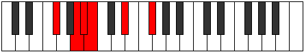

# Mode ANaturalAeritonic

## Links

- [Documentation](index.md)
- [Scales Index](Scales.md)
- [Modes Index](Modes.md)
- [Chords Index](Chords.md)

## Scale

[Molitonic](ScaleMolitonic.md)

## Mode

[ANaturalAeritonic](ModeANaturalAeritonic.md)

## Tonic

A

## Signature

[CNaturalMajor]

## Perfection

 - 2 Perfect Notes

 - 3 Imperfect Notes

## Notes

- A (Imperfect)
- A# (Imperfect)
- B
- D#
- F# (Imperfect)
- A (Imperfect)

## Illustration

## Relative Modes

| Number | Mode | Tonic | Notes | Illustration |
|--------|------|-------|-------|--------------|
| [457](https://ianring.com/musictheory/scales/457) | [Staptitonic](ModeStaptitonic.md) | D# | D#, F#, A, A#, B, D# |  |
| [457](https://ianring.com/musictheory/scales/457) | [Staptitonic](ModeStaptitonic.md) | Eb | Eb, Gb, A, Bb, B, Eb |  |
| [569](https://ianring.com/musictheory/scales/569) | [Mothitonic](ModeMothitonic.md) | F# | F#, A, A#, B, D#, F# |  |
| [569](https://ianring.com/musictheory/scales/569) | [Mothitonic](ModeMothitonic.md) | Gb | Gb, A, Bb, B, Eb, Gb |  |
| [583](https://ianring.com/musictheory/scales/583) | [Aeritonic](ModeAeritonic.md) | A | A, A#, B, D#, F#, A |  |
| [2339](https://ianring.com/musictheory/scales/2339) | [Ragitonic](ModeRagitonic.md) | A# | A#, B, D#, F#, A, A# |  |
| [2339](https://ianring.com/musictheory/scales/2339) | [Ragitonic](ModeRagitonic.md) | Bb | Bb, B, Eb, Gb, A, Bb |  |
| [3217](https://ianring.com/musictheory/scales/3217) | [Molitonic](ModeMolitonic.md) | B | B, D#, F#, A, A#, B |  |

## Chords

### A

| Number | Root | Name | Notes | Illustration | Audio |
|--------|------|------|-------|--------------|-------|
| 1544 | A | [Aloc](ChordANaturalLocrian.md) | A, Bb, Eb |  | [midi](ChordANaturalLocrianRootPosition.mid) [ogg](ChordANaturalLocrianRootPosition.ogg) |
| 2568 | A | [Asus2b5](ChordANaturalSuspendedSecondFlatFifth.md) | A, B, Eb |  | [midi](ChordANaturalSuspendedSecondFlatFifthRootPosition.mid) [ogg](ChordANaturalSuspendedSecondFlatFifthRootPosition.ogg) |
| 2632 | A | [AM6sus2b5](ChordANaturalMajorSixthSuspendedSecondFlatFifth.md) | A, B, Eb, F# |  | [midi](ChordANaturalMajorSixthSuspendedSecondFlatFifthRootPosition.mid) [ogg](ChordANaturalMajorSixthSuspendedSecondFlatFifthRootPosition.ogg) |

### A#

| Number | Root | Name | Notes | Illustration | Audio |
|--------|------|------|-------|--------------|-------|
| 1096 | A# | [A#sus4#5](ChordASharpSuspendedFourthSharpFifth.md) | A#, D#, E## |  | [midi](ChordASharpSuspendedFourthSharpFifthRootPosition.mid) [ogg](ChordASharpSuspendedFourthSharpFifthRootPosition.ogg) |
| 1544 | A# | [A#Q+](ChordASharpQuartalAugmented.md) | A#, D#, G## |  | [midi](ChordASharpQuartalAugmentedRootPosition.mid) [ogg](ChordASharpQuartalAugmentedRootPosition.ogg) |
| 1608 | A# | [A#M7(sus4)#5](ChordASharpMajorSeventhSuspendedFourthSharpFifth.md) | A#, D#, E##, G## |  | [midi](ChordASharpMajorSeventhSuspendedFourthSharpFifthRootPosition.mid) [ogg](ChordASharpMajorSeventhSuspendedFourthSharpFifthRootPosition.ogg) |

### B

| Number | Root | Name | Notes | Illustration | Audio |
|--------|------|------|-------|--------------|-------|
| 2112 | B | [B5](ChordBNaturalPowerChord.md) | B, F# |  | [midi](ChordBNaturalPowerChordRootPosition.mid) [ogg](ChordBNaturalPowerChordRootPosition.ogg) |
| 2120 | B | [BM](ChordBNaturalMajor.md) | B, D#, F# |  | [midi](ChordBNaturalMajorRootPosition.mid) [ogg](ChordBNaturalMajorRootPosition.ogg) |
| 2632 | B | [B7](ChordBNaturalDominantSeventh.md) | B, D#, F#, A |  | [midi](ChordBNaturalDominantSeventhRootPosition.mid) [ogg](ChordBNaturalDominantSeventhRootPosition.ogg) |
| 3144 | B | [BM7](ChordBNaturalMajorSeventh.md) | B, D#, F#, A# |  | [midi](ChordBNaturalMajorSeventhRootPosition.mid) [ogg](ChordBNaturalMajorSeventhRootPosition.ogg) |

### D#

| Number | Root | Name | Notes | Illustration | Audio |
|--------|------|------|-------|--------------|-------|
| 584 | D# | [D#o](ChordDSharpDiminished.md) | D#, F#, A |  | [midi](ChordDSharpDiminishedRootPosition.mid) [ogg](ChordDSharpDiminishedRootPosition.ogg) |
| 1032 | D# | [D#5](ChordDSharpPowerChord.md) | D#, A# |  | [midi](ChordDSharpPowerChordRootPosition.mid) [ogg](ChordDSharpPowerChordRootPosition.ogg) |
| 1096 | D# | [D#m](ChordDSharpMinor.md) | D#, F#, A# |  | [midi](ChordDSharpMinorRootPosition.mid) [ogg](ChordDSharpMinorRootPosition.ogg) |
| 1096 | D# | [D#m(add(#9))](ChordDSharpMinorAddSharpNinth.md) | D#, F#, A#, E## |  | [midi](ChordDSharpMinorAddSharpNinthRootPosition.mid) [ogg](ChordDSharpMinorAddSharpNinthRootPosition.ogg) |
| 1544 | D# | [D#lyd](ChordDSharpLydian.md) | D#, G##, A# |  | [midi](ChordDSharpLydianRootPosition.mid) [ogg](ChordDSharpLydianRootPosition.ogg) |
| 1608 | D# | [D#m(add(#4))](ChordDSharpMinorAddSharpFourth.md) | D#, F#, G##, A# |  | [midi](ChordDSharpMinorAddSharpFourthRootPosition.mid) [ogg](ChordDSharpMinorAddSharpFourthRootPosition.ogg) |
| 2120 | D# | [D#m#5](ChordDSharpMinorSharpFifth.md) | D#, F#, B |  | [midi](ChordDSharpMinorSharpFifthRootPosition.mid) [ogg](ChordDSharpMinorSharpFifthRootPosition.ogg) |

### F#

| Number | Root | Name | Notes | Illustration | Audio |
|--------|------|------|-------|--------------|-------|
| 2624 | F# | [F#mbb5](ChordFSharpMinorDoubleFlatFifth.md) | F#, A, B |  | [midi](ChordFSharpMinorDoubleFlatFifthRootPosition.mid) [ogg](ChordFSharpMinorDoubleFlatFifthRootPosition.ogg) |
| 1096 | F# | [F#M##5](ChordFSharpMajorDoubleSharpFifth.md) | F#, A#, D# |  | [midi](ChordFSharpMajorDoubleSharpFifthRootPosition.mid) [ogg](ChordFSharpMajorDoubleSharpFifthRootPosition.ogg) |
| 2120 | F# | [F#sus4##5](ChordFSharpSuspendedFourthDoubleSharpFifth.md) | F#, B, D# |  | [midi](ChordFSharpSuspendedFourthDoubleSharpFifthRootPosition.mid) [ogg](ChordFSharpSuspendedFourthDoubleSharpFifthRootPosition.ogg) |

