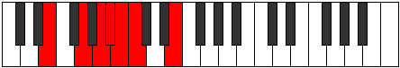

# Mode ANaturalAerodimic

## Links

- [Documentation](index.md)
- [Scales Index](Scales.md)
- [Modes Index](Modes.md)
- [Chords Index](Chords.md)

## Scale

[Starimic](ScaleStarimic.md)

## Mode

[ANaturalAerodimic](ModeANaturalAerodimic.md)

## Tonic

A

## Signature

[CNaturalMajor]

## Perfection

 - 3 Perfect Notes

 - 3 Imperfect Notes

## Notes

- A
- Bb (Imperfect)
- Cb (Imperfect)
- Dbb
- E
- F## (Imperfect)
- A

## Illustration

## Relative Modes

| Number | Mode | Tonic | Notes | Illustration |
|--------|------|-------|-------|--------------|
| [1167](https://ianring.com/musictheory/scales/1167) | [Aerodimic](ModeAerodimic.md) | A | A, Bb, Cb, Dbb, E, F##, A |  |
| [2631](https://ianring.com/musictheory/scales/2631) | [Macrimic](ModeMacrimic.md) | Bb | Bb, Cb, Dbb, E, F##, G##, Bb |  |
| [489](https://ianring.com/musictheory/scales/489) | [Phrathimic](ModePhrathimic.md) | E | E, F##, G##, A#, B, C, E |  |

## Chords

### A

| Number | Root | Name | Notes | Illustration | Audio |
|--------|------|------|-------|--------------|-------|

### Bb

| Number | Root | Name | Notes | Illustration | Audio |
|--------|------|------|-------|--------------|-------|

### Cb

| Number | Root | Name | Notes | Illustration | Audio |
|--------|------|------|-------|--------------|-------|

### Dbb

| Number | Root | Name | Notes | Illustration | Audio |
|--------|------|------|-------|--------------|-------|

### E

| Number | Root | Name | Notes | Illustration | Audio |
|--------|------|------|-------|--------------|-------|

### F##

| Number | Root | Name | Notes | Illustration | Audio |
|--------|------|------|-------|--------------|-------|

