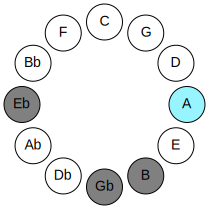
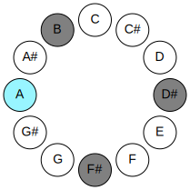
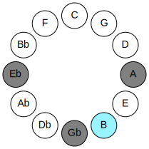
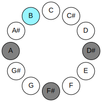
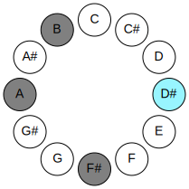
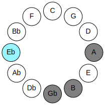
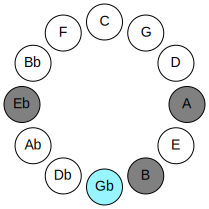
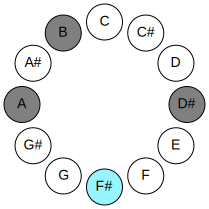

# Mode ANaturalBolic

## Links

- [Documentation](README.md)
- [Scales Index](Scales.md)
- [Modes Index](Modes.md)
- [Chords Index](Chords.md)

## Parent Scale

[Daric](ScaleDaric.md)

## Mode

[ANaturalBolic](ModeANaturalBolic.md)

## Number

581

## Luminosity

-1

## Tonic

A

## Signature

C

## Transposition

2, 4, 3, 3

## Chord Pattern

## Perfection

 - 1 Perfect Notes

 - 3 Imperfect Notes

 - Perfection Profile - false, true, false, false

## Notes

- A (Imperfect)
- B
- D# (Imperfect)
- F# (Imperfect)
- A (Imperfect)

## Illustration

## Diagram

| Circle of Fifth | Chromatic Circle |
|-----------------|------------------|
|  |  |
## Relative Modes

| Number | Mode | Luminosity | Tonic | Notes | Illustration |
|--------|------|------------|-------|-------|--------------|
| [581](https://ianring.com/musictheory/scales/581) | [Bolic](ModeBolic.md) | -1 | A | A, B, D#, F#, A |  |
| [1169](https://ianring.com/musictheory/scales/1169) | [Daric](ModeDaric.md) | 4 | B | B, D#, F#, A, B |  |
| [329](https://ianring.com/musictheory/scales/329) | [Lonic](ModeLonic.md) | -1 | D# | D#, F#, A, B, D# |  |
| [553](https://ianring.com/musictheory/scales/553) | [Phradic](ModePhradic.md) | 3 | F# | F#, A, B, D#, F# |  |
## Relative Brightness

| Number | Mode | Luminosity | Tonic | Notes | Circle Of Fifth | Chromatic Circle |
|--------|------|------------|-------|-------|-----------------|------------------|
| [581](https://ianring.com/musictheory/scales/581) | [Bolic](ModeBolic.md) | -1 | A | A, B, D#, F#, A |  |  |
| [1169](https://ianring.com/musictheory/scales/1169) | [Daric](ModeDaric.md) | 4 | B | B, D#, F#, A, B |  |  |
| [329](https://ianring.com/musictheory/scales/329) | [Lonic](ModeLonic.md) | -1 | D# | D#, F#, A, B, D# |  |  |
| [329](https://ianring.com/musictheory/scales/329) | [Lonic](ModeLonic.md) | -1 | Eb | Eb, Gb, A, B, Eb |  |  |
| [553](https://ianring.com/musictheory/scales/553) | [Phradic](ModePhradic.md) | 3 | F# | F#, A, B, D#, F# |  |  |
| [553](https://ianring.com/musictheory/scales/553) | [Phradic](ModePhradic.md) | 3 | Gb | Gb, A, B, Eb, Gb |  |  |

## Chords

### A

| Number | Root | Name | Notes | Illustration | Audio |
|--------|------|------|-------|--------------|-------|
| 2568 | A | [A](ChordANaturalDiminishedFlatThird.md) | A, Cb, Eb |  | [midi](ChordANaturalDiminishedFlatThirdRootPosition.mid) |
| 2568 | A | [Asus2b5](ChordANaturalSuspendedSecondFlatFifth.md) | A, B, Eb |  | [midi](ChordANaturalSuspendedSecondFlatFifthRootPosition.mid) |
| 2632 | A | [AM6sus2b5](ChordANaturalMajorSixthSuspendedSecondFlatFifth.md) | A, B, Eb, F# |  | [midi](ChordANaturalMajorSixthSuspendedSecondFlatFifthRootPosition.mid) |

### B

| Number | Root | Name | Notes | Illustration | Audio |
|--------|------|------|-------|--------------|-------|
| 2112 | B | [B5](ChordBNaturalPowerChord.md) | B, F# |  | [midi](ChordBNaturalPowerChordRootPosition.mid) |
| 2120 | B | [BM](ChordBNaturalMajor.md) | B, D#, F# |  | [midi](ChordBNaturalMajorRootPosition.mid) |
| 2632 | B | [B7](ChordBNaturalDominantSeventh.md) | B, D#, F#, A |  | [midi](ChordBNaturalDominantSeventhRootPosition.mid) |

### D#

| Number | Root | Name | Notes | Illustration | Audio |
|--------|------|------|-------|--------------|-------|
| 584 | D# | [D#o](ChordDSharpDiminished.md) | D#, F#, A |  | [midi](ChordDSharpDiminishedRootPosition.mid) |
| 584 | D# | [Ebo](ChordEFlatDiminished.md) | Eb, Gb, Bbb |  | [midi](ChordEFlatDiminishedRootPosition.mid) |
| 2120 | D# | [D#m#5](ChordDSharpMinorSharpFifth.md) | D#, F#, B |  | [midi](ChordDSharpMinorSharpFifthRootPosition.mid) |
| 2120 | D# | [Ebm#5](ChordEFlatMinorSharpFifth.md) | Eb, Gb, Cb |  | [midi](ChordEFlatMinorSharpFifthRootPosition.mid) |

### F#

| Number | Root | Name | Notes | Illustration | Audio |
|--------|------|------|-------|--------------|-------|
| 2624 | F# | [F#mbb5](ChordFSharpMinorDoubleFlatFifth.md) | F#, A, B |  | [midi](ChordFSharpMinorDoubleFlatFifthRootPosition.mid) |
| 2624 | F# | [Gbmbb5](ChordGFlatMinorDoubleFlatFifth.md) | Gb, Bbb, Cb |  | [midi](ChordGFlatMinorDoubleFlatFifthRootPosition.mid) |
| 2120 | F# | [F#sus4##5](ChordFSharpSuspendedFourthDoubleSharpFifth.md) | F#, B, D# |  | [midi](ChordFSharpSuspendedFourthDoubleSharpFifthRootPosition.mid) |
| 2120 | F# | [Gbsus4##5](ChordGFlatSuspendedFourthDoubleSharpFifth.md) | Gb, Cb, Eb |  | [midi](ChordGFlatSuspendedFourthDoubleSharpFifthRootPosition.mid) |

