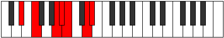

# Mode ANaturalBothimic

## Links

- [Documentation](index.md)
- [Scales Index](Scales.md)
- [Modes Index](Modes.md)
- [Chords Index](Chords.md)

## Scale

[Bolimic](ScaleBolimic.md)

## Mode

[ANaturalBothimic](ModeANaturalBothimic.md)

## Tonic

A

## Signature

[CNaturalMajor]

## Perfection

 - 3 Perfect Notes

 - 3 Imperfect Notes

## Notes

- A (Imperfect)
- Bb
- Cb (Imperfect)
- D
- Eb
- F (Imperfect)
- A (Imperfect)

## Illustration

## Relative Modes

| Number | Mode | Tonic | Notes | Illustration |
|--------|------|-------|-------|--------------|
| [359](https://ianring.com/musictheory/scales/359) | [Bothimic](ModeBothimic.md) | A | A, Bb, Cb, D, Eb, F, A |  |
| [2227](https://ianring.com/musictheory/scales/2227) | [Katadimic](ModeKatadimic.md) | Bb | Bb, Cb, D, Eb, F, G##, Bb |  |
| [907](https://ianring.com/musictheory/scales/907) | [Tholimic](ModeTholimic.md) | D | D, Eb, F, G##, A#, B, D |  |
| [2501](https://ianring.com/musictheory/scales/2501) | [Ralimic](ModeRalimic.md) | Eb | Eb, F, G##, A#, B, C##, Eb |  |
| [1649](https://ianring.com/musictheory/scales/1649) | [Bolimic](ModeBolimic.md) | F | F, G##, A#, B, C##, D#, F |  |

## Chords

### A

| Number | Root | Name | Notes | Illustration | Audio |
|--------|------|------|-------|--------------|-------|

### Bb

| Number | Root | Name | Notes | Illustration | Audio |
|--------|------|------|-------|--------------|-------|

### Cb

| Number | Root | Name | Notes | Illustration | Audio |
|--------|------|------|-------|--------------|-------|

### D

| Number | Root | Name | Notes | Illustration | Audio |
|--------|------|------|-------|--------------|-------|

### Eb

| Number | Root | Name | Notes | Illustration | Audio |
|--------|------|------|-------|--------------|-------|

### F

| Number | Root | Name | Notes | Illustration | Audio |
|--------|------|------|-------|--------------|-------|

