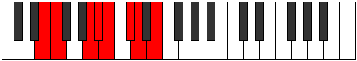

# Mode ANaturalBythian

## Links

- [Documentation](index.md)
- [Scales Index](Scales.md)
- [Modes Index](Modes.md)
- [Chords Index](Chords.md)

## Scale

[Aeolathian](ScaleAeolathian.md)

## Mode

[ANaturalBythian](ModeANaturalBythian.md)

## Tonic

A

## Signature

[CNaturalMajor]

## Perfection

 - 4 Perfect Notes

 - 3 Imperfect Notes

## Notes

- A
- Bb
- Cb (Imperfect)
- Db (Imperfect)
- Ebb
- Fb
- Gbb (Imperfect)
- A

## Illustration

## Relative Modes

| Number | Mode | Tonic | Notes | Illustration |
|--------|------|-------|-------|--------------|
| [439](https://ianring.com/musictheory/scales/439) | [Bythian](ModeBythian.md) | A | A, Bb, Cb, Db, Ebb, Fb, Gbb, A |  |
| [1763](https://ianring.com/musictheory/scales/1763) | [Katalian](ModeKatalian.md) | E | E, F, G##, A#, B, C#, D, E |  |
| [1819](https://ianring.com/musictheory/scales/1819) | [Pydian](ModePydian.md) | C# | C#, D, E, F, G##, A#, B, C# |  |
| [1819](https://ianring.com/musictheory/scales/1819) | [Pydian](ModePydian.md) | Db | Db, Ebb, Fb, Gbb, A, Bb, Cb, Db |  |
| [2267](https://ianring.com/musictheory/scales/2267) | [Padian](ModePadian.md) | A# | A#, B, C#, D, E, F, G##, A# |  |
| [2267](https://ianring.com/musictheory/scales/2267) | [Padian](ModePadian.md) | Bb | Bb, Cb, Db, Ebb, Fb, Gbb, A, Bb |  |
| [2929](https://ianring.com/musictheory/scales/2929) | [Aeolathian](ModeAeolathian.md) | F | F, G##, A#, B, C#, D, E, F |  |
| [2957](https://ianring.com/musictheory/scales/2957) | [Thygian](ModeThygian.md) | D | D, E, F, G##, A#, B, C#, D |  |
| [3181](https://ianring.com/musictheory/scales/3181) | [Rolian](ModeRolian.md) | B | B, C#, D, E, F, G##, A#, B |  |

## Chords

### A

| Number | Root | Name | Notes | Illustration | Audio |
|--------|------|------|-------|--------------|-------|

### Bb

| Number | Root | Name | Notes | Illustration | Audio |
|--------|------|------|-------|--------------|-------|

### Cb

| Number | Root | Name | Notes | Illustration | Audio |
|--------|------|------|-------|--------------|-------|

### Db

| Number | Root | Name | Notes | Illustration | Audio |
|--------|------|------|-------|--------------|-------|

### Ebb

| Number | Root | Name | Notes | Illustration | Audio |
|--------|------|------|-------|--------------|-------|

### Fb

| Number | Root | Name | Notes | Illustration | Audio |
|--------|------|------|-------|--------------|-------|

### Gbb

| Number | Root | Name | Notes | Illustration | Audio |
|--------|------|------|-------|--------------|-------|

