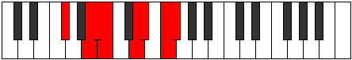

# Mode ANaturalEpadian

## Links

- [Documentation](index.md)
- [Scales Index](Scales.md)
- [Modes Index](Modes.md)
- [Chords Index](Chords.md)

## Scale

[Loptian](ScaleLoptian.md)

## Mode

[ANaturalEpadian](ModeANaturalEpadian.md)

## Tonic

A

## Signature

[CNaturalMajor]

## Perfection

 - 4 Perfect Notes

 - 3 Imperfect Notes

## Notes

- A (Imperfect)
- Bb
- Cb
- D
- Eb
- F (Imperfect)
- Gb (Imperfect)
- A (Imperfect)

## Illustration

## Relative Modes

| Number | Mode | Tonic | Notes | Illustration |
|--------|------|-------|-------|--------------|
| [871](https://ianring.com/musictheory/scales/871) | [Epadian](ModeEpadian.md) | A | A, Bb, Cb, D, Eb, F, Gb, A |  |
| [923](https://ianring.com/musictheory/scales/923) | [Ionodian](ModeIonodian.md) | D | D, Eb, F, Gb, A, Bb, Cb, D |  |
| [1651](https://ianring.com/musictheory/scales/1651) | [Mogian](ModeMogian.md) | F | F, Gb, A, Bb, Cb, D, Eb, F |  |
| [2483](https://ianring.com/musictheory/scales/2483) | [Aerynian](ModeAerynian.md) | A# | A#, B, C##, D#, E#, F#, G##, A# |  |
| [2483](https://ianring.com/musictheory/scales/2483) | [Aerynian](ModeAerynian.md) | Bb | Bb, Cb, D, Eb, F, Gb, A, Bb |  |
| [2509](https://ianring.com/musictheory/scales/2509) | [Bogian](ModeBogian.md) | D# | D#, E#, F#, G##, A#, B, C##, D# |  |
| [2509](https://ianring.com/musictheory/scales/2509) | [Bogian](ModeBogian.md) | Eb | Eb, F, Gb, A, Bb, Cb, D, Eb |  |
| [2873](https://ianring.com/musictheory/scales/2873) | [Docrian](ModeDocrian.md) | F# | F#, G##, A#, B, C##, D#, E#, F# |  |
| [2873](https://ianring.com/musictheory/scales/2873) | [Docrian](ModeDocrian.md) | Gb | Gb, A, Bb, Cb, D, Eb, F, Gb |  |
| [3289](https://ianring.com/musictheory/scales/3289) | [Loptian](ModeLoptian.md) | B | B, C##, D#, E#, F#, G##, A#, B |  |

## Chords

### A

| Number | Root | Name | Notes | Illustration | Audio |
|--------|------|------|-------|--------------|-------|

### Bb

| Number | Root | Name | Notes | Illustration | Audio |
|--------|------|------|-------|--------------|-------|

### Cb

| Number | Root | Name | Notes | Illustration | Audio |
|--------|------|------|-------|--------------|-------|

### D

| Number | Root | Name | Notes | Illustration | Audio |
|--------|------|------|-------|--------------|-------|

### Eb

| Number | Root | Name | Notes | Illustration | Audio |
|--------|------|------|-------|--------------|-------|

### F

| Number | Root | Name | Notes | Illustration | Audio |
|--------|------|------|-------|--------------|-------|

### Gb

| Number | Root | Name | Notes | Illustration | Audio |
|--------|------|------|-------|--------------|-------|

