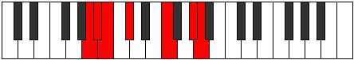

# Mode ANaturalEpalimic

## Links

- [Documentation](index.md)
- [Scales Index](Scales.md)
- [Modes Index](Modes.md)
- [Chords Index](Chords.md)

## Scale

[Galimic](ScaleGalimic.md)

## Mode

[ANaturalEpalimic](ModeANaturalEpalimic.md)

## Tonic

A

## Signature

[CNaturalMajor]

## Perfection

 - 2 Perfect Notes

 - 4 Imperfect Notes

## Notes

- A (Imperfect)
- Bb
- Cb (Imperfect)
- Db
- E# (Imperfect)
- F### (Imperfect)
- A (Imperfect)

## Illustration

## Relative Modes

| Number | Mode | Tonic | Notes | Illustration |
|--------|------|-------|-------|--------------|
| [2327](https://ianring.com/musictheory/scales/2327) | [Epalimic](ModeEpalimic.md) | A | A, Bb, Cb, Db, E#, F###, A |  |
| [3211](https://ianring.com/musictheory/scales/3211) | [Epacrimic](ModeEpacrimic.md) | Bb | Bb, Cb, Db, E#, F###, G##, Bb |  |
| [1937](https://ianring.com/musictheory/scales/1937) | [Galimic](ModeGalimic.md) | Db | Db, E#, F###, G##, A#, B, Db |  |

## Chords

### A

| Number | Root | Name | Notes | Illustration | Audio |
|--------|------|------|-------|--------------|-------|

### Bb

| Number | Root | Name | Notes | Illustration | Audio |
|--------|------|------|-------|--------------|-------|

### Cb

| Number | Root | Name | Notes | Illustration | Audio |
|--------|------|------|-------|--------------|-------|

### Db

| Number | Root | Name | Notes | Illustration | Audio |
|--------|------|------|-------|--------------|-------|

### E#

| Number | Root | Name | Notes | Illustration | Audio |
|--------|------|------|-------|--------------|-------|

### F###

| Number | Root | Name | Notes | Illustration | Audio |
|--------|------|------|-------|--------------|-------|

