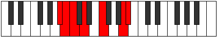

# Mode ANaturalGolimic

## Links

- [Documentation](index.md)
- [Scales Index](Scales.md)
- [Modes Index](Modes.md)
- [Chords Index](Chords.md)

## Scale

[Kytrimic](ScaleKytrimic.md)

## Mode

[ANaturalGolimic](ModeANaturalGolimic.md)

## Tonic

A

## Signature

[CNaturalMajor]

## Perfection

 - 3 Perfect Notes

 - 3 Imperfect Notes

## Notes

- A (Imperfect)
- Bb
- Cb (Imperfect)
- Dbb (Imperfect)
- Ebb
- F
- A (Imperfect)

## Illustration

## Relative Modes

| Number | Mode | Tonic | Notes | Illustration |
|--------|------|-------|-------|--------------|
| [303](https://ianring.com/musictheory/scales/303) | [Golimic](ModeGolimic.md) | A | A, Bb, Cb, Dbb, Ebb, F, A |  |
| [753](https://ianring.com/musictheory/scales/753) | [Kytrimic](ModeKytrimic.md) | F | F, G##, A#, B, C, D, F |  |
| [1929](https://ianring.com/musictheory/scales/1929) | [Aeolycrimic](ModeAeolycrimic.md) | D | D, E#, Cbbb, Cbb, Dbbb, Dbb, D |  |
| [2199](https://ianring.com/musictheory/scales/2199) | [Dyptimic](ModeDyptimic.md) | A# | A#, B, C, D, E#, Cbbb, A# |  |
| [2199](https://ianring.com/musictheory/scales/2199) | [Dyptimic](ModeDyptimic.md) | Bb | Bb, Cb, Dbb, Ebb, F, G##, Bb |  |
| [3147](https://ianring.com/musictheory/scales/3147) | [Ryrimic](ModeRyrimic.md) | B | B, C, D, E#, Cbbb, Cbb, B |  |
| [3621](https://ianring.com/musictheory/scales/3621) | [Gylimic](ModeGylimic.md) | C | C, D, E#, Cbbb, Cbb, Dbbb, C |  |

## Chords

### A

| Number | Root | Name | Notes | Illustration | Audio |
|--------|------|------|-------|--------------|-------|

### Bb

| Number | Root | Name | Notes | Illustration | Audio |
|--------|------|------|-------|--------------|-------|

### Cb

| Number | Root | Name | Notes | Illustration | Audio |
|--------|------|------|-------|--------------|-------|

### Dbb

| Number | Root | Name | Notes | Illustration | Audio |
|--------|------|------|-------|--------------|-------|

### Ebb

| Number | Root | Name | Notes | Illustration | Audio |
|--------|------|------|-------|--------------|-------|

### F

| Number | Root | Name | Notes | Illustration | Audio |
|--------|------|------|-------|--------------|-------|

