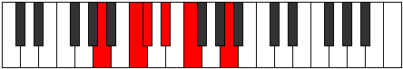
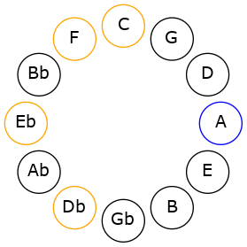
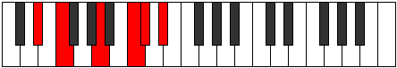
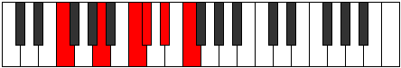
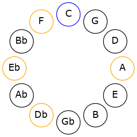
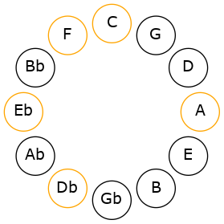
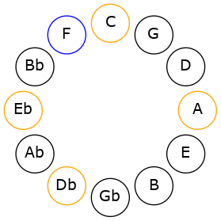

# Mode ANaturalGylitonic

## Links

- [Documentation](README.md)
- [Scales Index](Scales.md)
- [Modes Index](Modes.md)
- [Chords Index](Chords.md)

## Scale

[Ryphitonic](ScaleRyphitonic.md)

## Mode

[ANaturalGylitonic](ModeANaturalGylitonic.md)

## Tonic

A

## Signature

[CNaturalMajor]

## Interval Pattern

3, 1, 2, 2, 4

## Chord Pattern

I⁺

## Perfection

 - 1 Perfect Notes

 - 4 Imperfect Notes

## Notes

- A (Imperfect)
- C (Imperfect)
- C# (Imperfect)
- D# (Imperfect)
- F
- A (Imperfect)

## Illustration

## Diagram

## Relative Modes

| Number | Mode | Tonic | Notes | Illustration |
|--------|------|-------|-------|--------------|
| [345](https://ianring.com/musictheory/scales/345) | [Gylitonic](ModeGylitonic.md) | A | A, C, C#, D#, F, A |  |
| [555](https://ianring.com/musictheory/scales/555) | [Aeolycritonic](ModeAeolycritonic.md) | C | C, C#, D#, F, A, C |  |
| [2325](https://ianring.com/musictheory/scales/2325) | [Pynitonic](ModePynitonic.md) | C# | C#, D#, F, A, C, C# |  |
| [1605](https://ianring.com/musictheory/scales/1605) | [Zanitonic](ModeZanitonic.md) | D# | D#, F, A, C, C#, D# |  |
| [1425](https://ianring.com/musictheory/scales/1425) | [Ryphitonic](ModeRyphitonic.md) | F | F, A, C, C#, D#, F |  |
## Relative Brightness

| Number | Mode | Tonic | Notes | Illustration |
|--------|------|-------|-------|--------------|
| [345](https://ianring.com/musictheory/scales/345) | [Gylitonic](ModeGylitonic.md) | A | A, C, C#, D#, F, A |  |
| [555](https://ianring.com/musictheory/scales/555) | [Aeolycritonic](ModeAeolycritonic.md) | C | C, C#, D#, F, A, C |  |
| [2325](https://ianring.com/musictheory/scales/2325) | [Pynitonic](ModePynitonic.md) | C# | C#, D#, F, A, C, C# |  |
| [1605](https://ianring.com/musictheory/scales/1605) | [Zanitonic](ModeZanitonic.md) | D# | D#, F, A, C, C#, D# |  |
| [1425](https://ianring.com/musictheory/scales/1425) | [Ryphitonic](ModeRyphitonic.md) | F | F, A, C, C#, D#, F |  |

## Chords

### A

| Number | Root | Name | Notes | Illustration | Audio |
|--------|------|------|-------|--------------|-------|
| 521 | A | [Ao](ChordANaturalDiminished.md) | A, C, Eb |  | [midi](ChordANaturalDiminishedRootPosition.mid) |
| 522 | A | [AMb5](ChordANaturalMajorFlatFifth.md) | A, C#, Eb |  | [midi](ChordANaturalMajorFlatFifthRootPosition.mid) |
| 545 | A | [Am#5](ChordANaturalMinorSharpFifth.md) | A, C, F |  | [midi](ChordANaturalMinorSharpFifthRootPosition.mid) |
| 546 | A | [A+](ChordANaturalAugmented.md) | A, C#, E# |  | [midi](ChordANaturalAugmentedRootPosition.mid) |
| 546 | A | [A+7](ChordANaturalAugmentedAugmentedSeventh.md) | A, C#, E#, G## |  | [midi](ChordANaturalAugmentedAugmentedSeventhRootPosition.mid) |

### C

| Number | Root | Name | Notes | Illustration | Audio |
|--------|------|------|-------|--------------|-------|
| 41 | C | [Cmbb5](ChordCNaturalMinorDoubleFlatFifth.md) | C, Eb, F |  | [midi](ChordCNaturalMinorDoubleFlatFifthRootPosition.mid) |
| 545 | C | [Csus4##5](ChordCNaturalSuspendedFourthDoubleSharpFifth.md) | C, F, A |  | [midi](ChordCNaturalSuspendedFourthDoubleSharpFifthRootPosition.mid) |

### C#

| Number | Root | Name | Notes | Illustration | Audio |
|--------|------|------|-------|--------------|-------|
| 522 | C# | [C#sus2#5](ChordCSharpSuspendedSecondSharpFifth.md) | C#, D#, G## |  | [midi](ChordCSharpSuspendedSecondSharpFifthRootPosition.mid) |
| 546 | C# | [C#+](ChordCSharpAugmented.md) | C#, E#, G## |  | [midi](ChordCSharpAugmentedRootPosition.mid) |
| 546 | C# | [C#+7](ChordCSharpAugmentedAugmentedSeventh.md) | C#, E#, G##, B## |  | [midi](ChordCSharpAugmentedAugmentedSeventhRootPosition.mid) |
| 547 | C# | [C#+(M7)](ChordCSharpAugmentedMajorSeventh.md) | C#, E#, G##, B# |  | [midi](ChordCSharpAugmentedMajorSeventhRootPosition.mid) |

### D#

| Number | Root | Name | Notes | Illustration | Audio |
|--------|------|------|-------|--------------|-------|
| 552 | D# | [D#](ChordDSharpDiminishedFlatThird.md) | D#, F, A |  | [midi](ChordDSharpDiminishedFlatThirdRootPosition.mid) |
| 552 | D# | [D#sus2b5](ChordDSharpSuspendedSecondFlatFifth.md) | D#, E#, A |  | [midi](ChordDSharpSuspendedSecondFlatFifthRootPosition.mid) |
| 553 | D# | [D#M6sus2b5](ChordDSharpMajorSixthSuspendedSecondFlatFifth.md) | D#, E#, A, B# |  | [midi](ChordDSharpMajorSixthSuspendedSecondFlatFifthRootPosition.mid) |

### F

| Number | Root | Name | Notes | Illustration | Audio |
|--------|------|------|-------|--------------|-------|
| 33 | F | [F5](ChordFNaturalPowerChord.md) | F, C |  | [midi](ChordFNaturalPowerChordRootPosition.mid) |
| 545 | F | [FM](ChordFNaturalMajor.md) | F, A, C |  | [midi](ChordFNaturalMajorRootPosition.mid) |
| 546 | F | [F+](ChordFNaturalAugmented.md) | F, A, C# |  | [midi](ChordFNaturalAugmentedRootPosition.mid) |
| 546 | F | [F+7](ChordFNaturalAugmentedAugmentedSeventh.md) | F, A, C#, E# |  | [midi](ChordFNaturalAugmentedAugmentedSeventhRootPosition.mid) |
| 553 | F | [F7](ChordFNaturalDominantSeventh.md) | F, A, C, Eb |  | [midi](ChordFNaturalDominantSeventhRootPosition.mid) |

