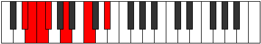

# Mode ANaturalIonogimic

## Links

- [Documentation](index.md)
- [Scales Index](Scales.md)
- [Modes Index](Modes.md)
- [Chords Index](Chords.md)

## Scale

[Epynimic](ScaleEpynimic.md)

## Mode

[ANaturalIonogimic](ModeANaturalIonogimic.md)

## Tonic

A

## Signature

[CNaturalMajor]

## Perfection

 - 2 Perfect Notes

 - 4 Imperfect Notes

## Notes

- A
- B# (Imperfect)
- C### (Imperfect)
- D## (Imperfect)
- E#
- F# (Imperfect)
- A

## Illustration

## Relative Modes

| Number | Mode | Tonic | Notes | Illustration |
|--------|------|-------|-------|--------------|
| [591](https://ianring.com/musictheory/scales/591) | [Gaptimic](ModeGaptimic.md) | D# | D#, E, F, Gb, A, B#, D# |  |
| [591](https://ianring.com/musictheory/scales/591) | [Gaptimic](ModeGaptimic.md) | Eb | Eb, Fb, Gbb, Abbb, Bbb, C, Eb |  |
| [633](https://ianring.com/musictheory/scales/633) | [Kydimic](ModeKydimic.md) | C | C, D#, E, F, Gb, A, C |  |
| [969](https://ianring.com/musictheory/scales/969) | [Ionogimic](ModeIonogimic.md) | A | A, B#, C###, D##, E#, F#, A |  |
| [2343](https://ianring.com/musictheory/scales/2343) | [Tharimic](ModeTharimic.md) | E | E, F, Gb, A, B#, C###, E |  |
| [3219](https://ianring.com/musictheory/scales/3219) | [Ionaphimic](ModeIonaphimic.md) | F | F, Gb, A, B#, C###, D##, F |  |
| [3657](https://ianring.com/musictheory/scales/3657) | [Epynimic](ModeEpynimic.md) | F# | F#, G##, A###, C###, D##, E#, F# |  |
| [3657](https://ianring.com/musictheory/scales/3657) | [Epynimic](ModeEpynimic.md) | Gb | Gb, A, B#, C###, D##, E#, Gb |  |

## Chords

### A

| Number | Root | Name | Notes | Illustration | Audio |
|--------|------|------|-------|--------------|-------|
| 521 | A | [Ao](ChordANaturalDiminished.md) | A, C, Eb |  | [midi](ChordANaturalDiminishedRootPosition.mid) [ogg](ChordANaturalDiminishedRootPosition.ogg) |
| 528 | A | [A5](ChordANaturalPowerChord.md) | A, E |  | [midi](ChordANaturalPowerChordRootPosition.mid) [ogg](ChordANaturalPowerChordRootPosition.ogg) |
| 529 | A | [Am](ChordANaturalMinor.md) | A, C, E |  | [midi](ChordANaturalMinorRootPosition.mid) [ogg](ChordANaturalMinorRootPosition.ogg) |
| 529 | A | [Am(add(#9))](ChordANaturalMinorAddSharpNinth.md) | A, C, E, B# |  | [midi](ChordANaturalMinorAddSharpNinthRootPosition.mid) [ogg](ChordANaturalMinorAddSharpNinthRootPosition.ogg) |
| 536 | A | [Alyd](ChordANaturalLydian.md) | A, D#, E |  | [midi](ChordANaturalLydianRootPosition.mid) [ogg](ChordANaturalLydianRootPosition.ogg) |
| 537 | A | [Am(add(#4))](ChordANaturalMinorAddSharpFourth.md) | A, C, D#, E |  | [midi](ChordANaturalMinorAddSharpFourthRootPosition.mid) [ogg](ChordANaturalMinorAddSharpFourthRootPosition.ogg) |
| 545 | A | [Am#5](ChordANaturalMinorSharpFifth.md) | A, C, F |  | [midi](ChordANaturalMinorSharpFifthRootPosition.mid) [ogg](ChordANaturalMinorSharpFifthRootPosition.ogg) |
| 585 | A | [Ao7](ChordANaturalFullDiminishedSeventh.md) | A, C, Eb, Gb |  | [midi](ChordANaturalFullDiminishedSeventhRootPosition.mid) [ogg](ChordANaturalFullDiminishedSeventhRootPosition.ogg) |
| 593 | A | [Am6](ChordANaturalMinorSixth.md) | A, C, E, F# |  | [midi](ChordANaturalMinorSixthRootPosition.mid) [ogg](ChordANaturalMinorSixthRootPosition.ogg) |

### B#

| Number | Root | Name | Notes | Illustration | Audio |
|--------|------|------|-------|--------------|-------|

### C###

| Number | Root | Name | Notes | Illustration | Audio |
|--------|------|------|-------|--------------|-------|

### D##

| Number | Root | Name | Notes | Illustration | Audio |
|--------|------|------|-------|--------------|-------|

### E#

| Number | Root | Name | Notes | Illustration | Audio |
|--------|------|------|-------|--------------|-------|

### F#

| Number | Root | Name | Notes | Illustration | Audio |
|--------|------|------|-------|--------------|-------|
| 577 | F# | [F#o](ChordFSharpDiminished.md) | F#, A, C |  | [midi](ChordFSharpDiminishedRootPosition.mid) [ogg](ChordFSharpDiminishedRootPosition.ogg) |
| 585 | F# | [F#o7](ChordFSharpFullDiminishedSeventh.md) | F#, A, C, Eb |  | [midi](ChordFSharpFullDiminishedSeventhRootPosition.mid) [ogg](ChordFSharpFullDiminishedSeventhRootPosition.ogg) |
| 593 | F# | [F#ø7](ChordFSharpHalfDiminishedSeventh.md) | F#, A, C, E |  | [midi](ChordFSharpHalfDiminishedSeventhRootPosition.mid) [ogg](ChordFSharpHalfDiminishedSeventhRootPosition.ogg) |
| 609 | F# | [F#oM7](ChordFSharpDiminishedMajorSeventh.md) | F#, A, C, E# |  | [midi](ChordFSharpDiminishedMajorSeventhRootPosition.mid) [ogg](ChordFSharpDiminishedMajorSeventhRootPosition.ogg) |

