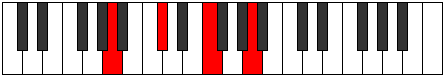
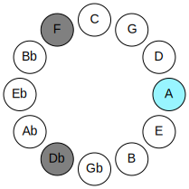
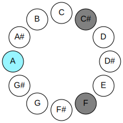
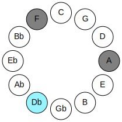
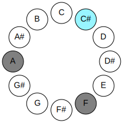
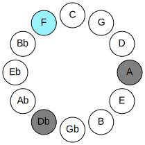
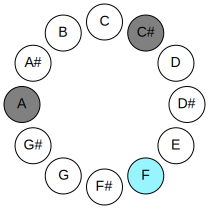

# Mode ANaturalMinoric

## Links

- [Documentation](README.md)
- [Scales Index](Scales.md)
- [Modes Index](Modes.md)
- [Chords Index](Chords.md)

## Parent Scale

[Minoric](ScaleMinoric.md)

## Mode

[ANaturalMinoric](ModeANaturalMinoric.md)

## Number

273

## Luminosity

-1

## Tonic

A

## Signature

C

## Transposition

4, 4, 4

## Chord Pattern

I⁺, II⁺, III⁺

## Perfection

 - 0 Perfect Notes

 - 3 Imperfect Notes

 - Perfection Profile - false, false, false

## Notes

- A (Imperfect)
- C# (Imperfect)
- F (Imperfect)
- A (Imperfect)

## Illustration

## Diagram

| Circle of Fifth | Chromatic Circle |
|-----------------|------------------|
|  |  |
## Relative Modes

| Number | Mode | Luminosity | Tonic | Notes | Illustration |
|--------|------|------------|-------|-------|--------------|
| [273](https://ianring.com/musictheory/scales/273) | [Minoric](ModeMinoric.md) | -1 | A | A, C#, F, A |  |
## Relative Brightness

| Number | Mode | Luminosity | Tonic | Notes | Circle Of Fifth | Chromatic Circle |
|--------|------|------------|-------|-------|-----------------|------------------|
| [273](https://ianring.com/musictheory/scales/273) | [Minoric](ModeMinoric.md) | -1 | A | A, C#, F, A |  |  |
| [273](https://ianring.com/musictheory/scales/273) | [Minoric](ModeMinoric.md) | -1 | C# | C#, F, A, C# |  |  |
| [273](https://ianring.com/musictheory/scales/273) | [Minoric](ModeMinoric.md) | -1 | Db | Db, F, A, Db |  |  |
| [273](https://ianring.com/musictheory/scales/273) | [Minoric](ModeMinoric.md) | -1 | F | F, A, C#, F |  |  |

## Chords

### A

| Number | Root | Name | Notes | Illustration | Audio |
|--------|------|------|-------|--------------|-------|
| 546 | A | [A+](ChordANaturalAugmented.md) | A, C#, E# |  | [midi](ChordANaturalAugmentedRootPosition.mid) |
| 546 | A | [A+7](ChordANaturalAugmentedAugmentedSeventh.md) | A, C#, E#, G## |  | [midi](ChordANaturalAugmentedAugmentedSeventhRootPosition.mid) |

### C#

| Number | Root | Name | Notes | Illustration | Audio |
|--------|------|------|-------|--------------|-------|
| 546 | C# | [C#+](ChordCSharpAugmented.md) | C#, E#, G## |  | [midi](ChordCSharpAugmentedRootPosition.mid) |
| 546 | C# | [C#+7](ChordCSharpAugmentedAugmentedSeventh.md) | C#, E#, G##, B## |  | [midi](ChordCSharpAugmentedAugmentedSeventhRootPosition.mid) |
| 546 | C# | [Db+](ChordDFlatAugmented.md) | Db, F, A |  | [midi](ChordDFlatAugmentedRootPosition.mid) |
| 546 | C# | [Db+7](ChordDFlatAugmentedAugmentedSeventh.md) | Db, F, A, C# |  | [midi](ChordDFlatAugmentedAugmentedSeventhRootPosition.mid) |

### F

| Number | Root | Name | Notes | Illustration | Audio |
|--------|------|------|-------|--------------|-------|
| 546 | F | [F+](ChordFNaturalAugmented.md) | F, A, C# |  | [midi](ChordFNaturalAugmentedRootPosition.mid) |
| 546 | F | [F+7](ChordFNaturalAugmentedAugmentedSeventh.md) | F, A, C#, E# |  | [midi](ChordFNaturalAugmentedAugmentedSeventhRootPosition.mid) |

