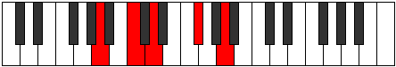
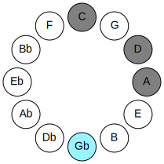

# Mode ANaturalPhradic

## Links

- [Documentation](README.md)
- [Scales Index](Scales.md)
- [Modes Index](Modes.md)
- [Chords Index](Chords.md)

## Parent Scale

[Daric](ScaleDaric.md)

## Mode

[Phradic](ModePhradic.md)

## Number

553

## Luminosity

3

## Tonic

A

## Signature

C

## Transposition

3, 2, 4, 3

## Chord Pattern

## Perfection

 - 1 Perfect Notes

 - 3 Imperfect Notes

 - Perfection Profile - false, false, true, false

## Notes

- A (Imperfect)
- C (Imperfect)
- D
- F# (Imperfect)
- A (Imperfect)

## Illustration

## Diagram

| Circle of Fifth | Chromatic Circle |
|-----------------|------------------|
|  |  |
## Relative Modes

| Number | Mode | Luminosity | Tonic | Notes | Illustration |
|--------|------|------------|-------|-------|--------------|
| [553](https://ianring.com/musictheory/scales/553) | [Phradic](ModePhradic.md) | 3 | A | A, C, D, F#, A |  |
| [581](https://ianring.com/musictheory/scales/581) | [Bolic](ModeBolic.md) | -1 | C | C, D, F#, A, C |  |
| [1169](https://ianring.com/musictheory/scales/1169) | [Daric](ModeDaric.md) | 4 | D | D, F#, A, C, D |  |
| [329](https://ianring.com/musictheory/scales/329) | [Lonic](ModeLonic.md) | -1 | F# | F#, A, C, D, F# |  |
## Relative Brightness

| Number | Mode | Luminosity | Tonic | Notes | Circle Of Fifth | Chromatic Circle |
|--------|------|------------|-------|-------|-----------------|------------------|
| [553](https://ianring.com/musictheory/scales/553) | [Phradic](ModePhradic.md) | 3 | A | A, C, D, F#, A |  |  |
| [581](https://ianring.com/musictheory/scales/581) | [Bolic](ModeBolic.md) | -1 | C | C, D, F#, A, C |  |  |
| [1169](https://ianring.com/musictheory/scales/1169) | [Daric](ModeDaric.md) | 4 | D | D, F#, A, C, D |  |  |
| [329](https://ianring.com/musictheory/scales/329) | [Lonic](ModeLonic.md) | -1 | F# | F#, A, C, D, F# |  |  |

## Chords

### A

| Number | Root | Name | Notes | Illustration | Audio |
|--------|------|------|-------|--------------|-------|
| 517 | A | [Ambb5](ChordANaturalMinorDoubleFlatFifth.md) | A, C, D |  | [midi](ChordANaturalMinorDoubleFlatFifthRootPosition.mid) |
| 580 | A | [Asus4##5](ChordANaturalSuspendedFourthDoubleSharpFifth.md) | A, D, F# |  | [midi](ChordANaturalSuspendedFourthDoubleSharpFifthRootPosition.mid) |

### C

| Number | Root | Name | Notes | Illustration | Audio |
|--------|------|------|-------|--------------|-------|
| 69 | C | [C](ChordCNaturalDiminishedFlatThird.md) | C, Ebb, Gb |  | [midi](ChordCNaturalDiminishedFlatThirdRootPosition.mid) |
| 69 | C | [Csus2b5](ChordCNaturalSuspendedSecondFlatFifth.md) | C, D, Gb |  | [midi](ChordCNaturalSuspendedSecondFlatFifthRootPosition.mid) |
| 581 | C | [CM6sus2b5](ChordCNaturalMajorSixthSuspendedSecondFlatFifth.md) | C, D, Gb, A |  | [midi](ChordCNaturalMajorSixthSuspendedSecondFlatFifthRootPosition.mid) |

### D

| Number | Root | Name | Notes | Illustration | Audio |
|--------|------|------|-------|--------------|-------|
| 516 | D | [D5](ChordDNaturalPowerChord.md) | D, A |  | [midi](ChordDNaturalPowerChordRootPosition.mid) |
| 580 | D | [DM](ChordDNaturalMajor.md) | D, F#, A |  | [midi](ChordDNaturalMajorRootPosition.mid) |
| 581 | D | [D7](ChordDNaturalDominantSeventh.md) | D, F#, A, C |  | [midi](ChordDNaturalDominantSeventhRootPosition.mid) |

### F#

| Number | Root | Name | Notes | Illustration | Audio |
|--------|------|------|-------|--------------|-------|
| 577 | F# | [F#o](ChordFSharpDiminished.md) | F#, A, C |  | [midi](ChordFSharpDiminishedRootPosition.mid) |
| 577 | F# | [Gbo](ChordGFlatDiminished.md) | Gb, Bbb, Dbb |  | [midi](ChordGFlatDiminishedRootPosition.mid) |
| 580 | F# | [F#m#5](ChordFSharpMinorSharpFifth.md) | F#, A, D |  | [midi](ChordFSharpMinorSharpFifthRootPosition.mid) |
| 580 | F# | [Gbm#5](ChordGFlatMinorSharpFifth.md) | Gb, Bbb, Ebb |  | [midi](ChordGFlatMinorSharpFifthRootPosition.mid) |

