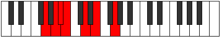
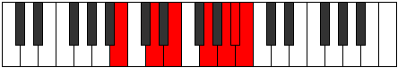

# Mode ANaturalPyrimic

## Links

- [Documentation](index.md)
- [Scales Index](Scales.md)
- [Modes Index](Modes.md)
- [Chords Index](Chords.md)

## Scale

[Mixolimic](ScaleMixolimic.md)

## Mode

[ANaturalPyrimic](ModeANaturalPyrimic.md)

## Tonic

A

## Signature

[CNaturalMajor]

## Perfection

 - 4 Perfect Notes

 - 2 Imperfect Notes

## Notes

- A
- Bb (Imperfect)
- Cb (Imperfect)
- D
- E
- F##
- A

## Illustration

## Relative Modes

| Number | Mode | Tonic | Notes | Illustration |
|--------|------|-------|-------|--------------|
| [669](https://ianring.com/musictheory/scales/669) | [Gycrimic](ModeGycrimic.md) | G | G, A, Bb, Cb, D, E, G |  |
| [933](https://ianring.com/musictheory/scales/933) | [Dadimic](ModeDadimic.md) | D | D, E, F##, G##, A#, B, D |  |
| [1191](https://ianring.com/musictheory/scales/1191) | [Pyrimic](ModePyrimic.md) | A | A, Bb, Cb, D, E, F##, A |  |
| [1257](https://ianring.com/musictheory/scales/1257) | [Aeolyphimic](ModeAeolyphimic.md) | E | E, F##, G##, A#, B, C##, E |  |
| [2643](https://ianring.com/musictheory/scales/2643) | [Lydimic](ModeLydimic.md) | A# | A#, B, C##, D##, E###, Cbbb, A# |  |
| [2643](https://ianring.com/musictheory/scales/2643) | [Lydimic](ModeLydimic.md) | Bb | Bb, Cb, D, E, F##, G##, Bb |  |
| [3369](https://ianring.com/musictheory/scales/3369) | [Mixolimic](ModeMixolimic.md) | B | B, C##, D##, E###, Cbbb, Cbb, B |  |

## Chords

### A

| Number | Root | Name | Notes | Illustration | Audio |
|--------|------|------|-------|--------------|-------|

### Bb

| Number | Root | Name | Notes | Illustration | Audio |
|--------|------|------|-------|--------------|-------|

### Cb

| Number | Root | Name | Notes | Illustration | Audio |
|--------|------|------|-------|--------------|-------|

### D

| Number | Root | Name | Notes | Illustration | Audio |
|--------|------|------|-------|--------------|-------|

### E

| Number | Root | Name | Notes | Illustration | Audio |
|--------|------|------|-------|--------------|-------|

### F##

| Number | Root | Name | Notes | Illustration | Audio |
|--------|------|------|-------|--------------|-------|

