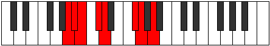

# Mode ANaturalRodian

## Links

- [Documentation](index.md)
- [Scales Index](Scales.md)
- [Modes Index](Modes.md)
- [Chords Index](Chords.md)

## Scale

[Stythian](ScaleStythian.md)

## Mode

[ANaturalRodian](ModeANaturalRodian.md)

## Tonic

A

## Signature

[CNaturalMajor]

## Perfection

 - 4 Perfect Notes

 - 3 Imperfect Notes

## Notes

- A (Imperfect)
- Bb (Imperfect)
- Cb
- Db (Imperfect)
- Ebb
- F#
- G
- A (Imperfect)

## Illustration

## Relative Modes

| Number | Mode | Tonic | Notes | Illustration |
|--------|------|-------|-------|--------------|
| [1591](https://ianring.com/musictheory/scales/1591) | [Rodian](ModeRodian.md) | A | A, Bb, Cb, Db, Ebb, F#, G, A |  |
| [2843](https://ianring.com/musictheory/scales/2843) | [Sorian](ModeSorian.md) | Bb | Bb, Cb, Db, Ebb, F#, G, A, Bb |  |
| [1891](https://ianring.com/musictheory/scales/1891) | [Thalian](ModeThalian.md) | Db | Db, Ebb, F#, G, A, Bb, Cb, Db |  |
| [443](https://ianring.com/musictheory/scales/443) | [Kothian](ModeKothian.md) | F# | F#, G, A, Bb, Cb, Db, Ebb, F# |  |
| [2269](https://ianring.com/musictheory/scales/2269) | [Pygian](ModePygian.md) | G | G, A, Bb, Cb, Db, Ebb, F#, G |  |

## Chords

### A

| Number | Root | Name | Notes | Illustration | Audio |
|--------|------|------|-------|--------------|-------|

### Bb

| Number | Root | Name | Notes | Illustration | Audio |
|--------|------|------|-------|--------------|-------|

### Cb

| Number | Root | Name | Notes | Illustration | Audio |
|--------|------|------|-------|--------------|-------|

### Db

| Number | Root | Name | Notes | Illustration | Audio |
|--------|------|------|-------|--------------|-------|

### Ebb

| Number | Root | Name | Notes | Illustration | Audio |
|--------|------|------|-------|--------------|-------|

### F#

| Number | Root | Name | Notes | Illustration | Audio |
|--------|------|------|-------|--------------|-------|

### G

| Number | Root | Name | Notes | Illustration | Audio |
|--------|------|------|-------|--------------|-------|

