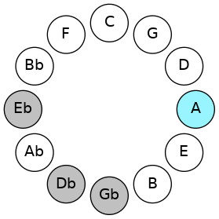
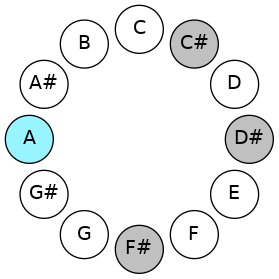
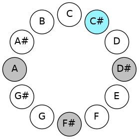
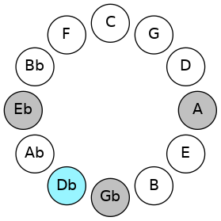
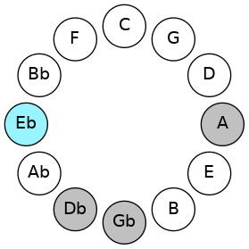
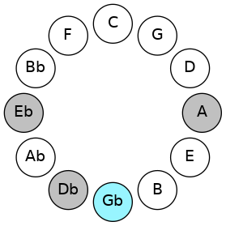
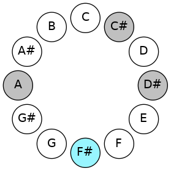

# Mode ANaturalSaric

## Links

- [Documentation](README.md)
- [Scales Index](Scales.md)
- [Modes Index](Modes.md)
- [Chords Index](Chords.md)

## Scale

[Saric](ScaleSaric.md)

## Mode

[ANaturalSaric](ModeANaturalSaric.md)

## Tonic

A

## Signature

[CNaturalMajor]

## Transposition

4, 2, 3, 3

## Chord Pattern

## Perfection

 - 1 Perfect Notes

 - 3 Imperfect Notes

## Notes

- A (Imperfect)
- C# (Imperfect)
- D# (Imperfect)
- F#
- A (Imperfect)

## Illustration

## Diagram

| Circle of Fifth | Chromatic Circle |
|-----------------|------------------|
|  |  |
## Relative Modes

| Number | Mode | Tonic | Notes | Illustration |
|--------|------|-------|-------|--------------|
| [593](https://ianring.com/musictheory/scales/593) | [Saric](ModeSaric.md) | A | A, C#, D#, F#, A |  |
| [293](https://ianring.com/musictheory/scales/293) | [Zoptic](ModeZoptic.md) | C# | C#, D#, F#, A, C# |  |
| [293](https://ianring.com/musictheory/scales/293) | [Zoptic](ModeZoptic.md) | Db | Db, Eb, Gb, A, Db |  |
| [1097](https://ianring.com/musictheory/scales/1097) | [Aeraphic](ModeAeraphic.md) | D# | D#, F#, A, C#, D# |  |
| [1097](https://ianring.com/musictheory/scales/1097) | [Aeraphic](ModeAeraphic.md) | Eb | Eb, Gb, A, Db, Eb |  |
| [649](https://ianring.com/musictheory/scales/649) | [Byptic](ModeByptic.md) | F# | F#, A, C#, D#, F# |  |
| [649](https://ianring.com/musictheory/scales/649) | [Byptic](ModeByptic.md) | Gb | Gb, A, Db, Eb, Gb |  |
## Relative Brightness

| Number | Mode | Tonic | Notes | Circle Of Fifth | Chromatic Circle |
|--------|------|-------|-------|-----------------|------------------|
| [593](https://ianring.com/musictheory/scales/593) | [Saric](ModeSaric.md) | A | A, C#, D#, F#, A |  |  
| [293](https://ianring.com/musictheory/scales/293) | [Zoptic](ModeZoptic.md) | C# | C#, D#, F#, A, C# |  |  
| [293](https://ianring.com/musictheory/scales/293) | [Zoptic](ModeZoptic.md) | Db | Db, Eb, Gb, A, Db |  |  
| [1097](https://ianring.com/musictheory/scales/1097) | [Aeraphic](ModeAeraphic.md) | D# | D#, F#, A, C#, D# |  |  
| [1097](https://ianring.com/musictheory/scales/1097) | [Aeraphic](ModeAeraphic.md) | Eb | Eb, Gb, A, Db, Eb |  |  
| [649](https://ianring.com/musictheory/scales/649) | [Byptic](ModeByptic.md) | F# | F#, A, C#, D#, F# |  |  
| [649](https://ianring.com/musictheory/scales/649) | [Byptic](ModeByptic.md) | Gb | Gb, A, Db, Eb, Gb |  |  

## Chords

### A

| Number | Root | Name | Notes | Illustration | Audio |
|--------|------|------|-------|--------------|-------|
| 522 | A | [AMb5](ChordANaturalMajorFlatFifth.md) | A, C#, Eb |  | [midi](ChordANaturalMajorFlatFifthRootPosition.mid) |
| 578 | A | [AM##5](ChordANaturalMajorDoubleSharpFifth.md) | A, C#, F# |  | [midi](ChordANaturalMajorDoubleSharpFifthRootPosition.mid) |
| 586 | A | [AM6b5](ChordANaturalMajorSixthFlatFifth.md) | A, C#, Eb, F# |  | [midi](ChordANaturalMajorSixthFlatFifthRootPosition.mid) |

### C#

| Number | Root | Name | Notes | Illustration | Audio |
|--------|------|------|-------|--------------|-------|
| 74 | C# | [C#sus2bb5](ChordCSharpSuspendedSecondDoubleFlatFifth.md) | C#, D#, F# |  | [midi](ChordCSharpSuspendedSecondDoubleFlatFifthRootPosition.mid) |
| 74 | C# | [Dbsus2bb5](ChordDFlatSuspendedSecondDoubleFlatFifth.md) | Db, Eb, Gb |  | [midi](ChordDFlatSuspendedSecondDoubleFlatFifthRootPosition.mid) |
| 522 | C# | [C#sus2#5](ChordCSharpSuspendedSecondSharpFifth.md) | C#, D#, G## |  | [midi](ChordCSharpSuspendedSecondSharpFifthRootPosition.mid) |
| 522 | C# | [Dbsus2#5](ChordDFlatSuspendedSecondSharpFifth.md) | Db, Eb, A |  | [midi](ChordDFlatSuspendedSecondSharpFifthRootPosition.mid) |
| 578 | C# | [C#sus4#5](ChordCSharpSuspendedFourthSharpFifth.md) | C#, F#, G## |  | [midi](ChordCSharpSuspendedFourthSharpFifthRootPosition.mid) |
| 578 | C# | [Dbsus4#5](ChordDFlatSuspendedFourthSharpFifth.md) | Db, Gb, A |  | [midi](ChordDFlatSuspendedFourthSharpFifthRootPosition.mid) |

### D#

| Number | Root | Name | Notes | Illustration | Audio |
|--------|------|------|-------|--------------|-------|
| 584 | D# | [D#o](ChordDSharpDiminished.md) | D#, F#, A |  | [midi](ChordDSharpDiminishedRootPosition.mid) |
| 584 | D# | [Ebo](ChordEFlatDiminished.md) | Eb, Gb, Bbb |  | [midi](ChordEFlatDiminishedRootPosition.mid) |
| 586 | D# | [D#ø7](ChordDSharpHalfDiminishedSeventh.md) | D#, F#, A, C# |  | [midi](ChordDSharpHalfDiminishedSeventhRootPosition.mid) |
| 586 | D# | [Ebø7](ChordEFlatHalfDiminishedSeventh.md) | Eb, Gb, Bbb, Db |  | [midi](ChordEFlatHalfDiminishedSeventhRootPosition.mid) |

### F#

| Number | Root | Name | Notes | Illustration | Audio |
|--------|------|------|-------|--------------|-------|
| 66 | F# | [F#5](ChordFSharpPowerChord.md) | F#, C# |  | [midi](ChordFSharpPowerChordRootPosition.mid) |
| 66 | F# | [Gb5](ChordGFlatPowerChord.md) | Gb, Db |  | [midi](ChordGFlatPowerChordRootPosition.mid) |
| 578 | F# | [F#m](ChordFSharpMinor.md) | F#, A, C# |  | [midi](ChordFSharpMinorRootPosition.mid) |
| 578 | F# | [F#m(add(#9))](ChordFSharpMinorAddSharpNinth.md) | F#, A, C#, G## |  | [midi](ChordFSharpMinorAddSharpNinthRootPosition.mid) |
| 578 | F# | [Gbm](ChordGFlatMinor.md) | Gb, Bbb, Db |  | [midi](ChordGFlatMinorRootPosition.mid) |
| 578 | F# | [Gbm(add(#9))](ChordGFlatMinorAddSharpNinth.md) | Gb, Bbb, Db, A |  | [midi](ChordGFlatMinorAddSharpNinthRootPosition.mid) |
| 586 | F# | [F#m6](ChordFSharpMinorSixth.md) | F#, A, C#, D# |  | [midi](ChordFSharpMinorSixthRootPosition.mid) |
| 586 | F# | [Gbm6](ChordGFlatMinorSixth.md) | Gb, Bbb, Db, Eb |  | [midi](ChordGFlatMinorSixthRootPosition.mid) |

