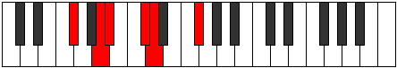

# Mode ANaturalThacritonic

## Links

- [Documentation](index.md)
- [Scales Index](Scales.md)
- [Modes Index](Modes.md)
- [Chords Index](Chords.md)

## Scale

[Zacritonic](ScaleZacritonic.md)

## Mode

[ANaturalThacritonic](ModeANaturalThacritonic.md)

## Tonic

A

## Signature

[CNaturalMajor]

## Perfection

 - 2 Perfect Notes

 - 3 Imperfect Notes

## Notes

- A (Imperfect)
- A# (Imperfect)
- C# (Imperfect)
- D
- F#
- A (Imperfect)

## Illustration

## Relative Modes

| Number | Mode | Tonic | Notes | Illustration |
|--------|------|-------|-------|--------------|
| [409](https://ianring.com/musictheory/scales/409) | [Laritonic](ModeLaritonic.md) | F# | F#, A, A#, C#, D, F# |  |
| [409](https://ianring.com/musictheory/scales/409) | [Laritonic](ModeLaritonic.md) | Gb | Gb, A, Bb, Db, D, Gb |  |
| [563](https://ianring.com/musictheory/scales/563) | [Thacritonic](ModeThacritonic.md) | A | A, A#, C#, D, F#, A |  |
| [803](https://ianring.com/musictheory/scales/803) | [Loritonic](ModeLoritonic.md) | C# | C#, D, F#, A, A#, C# |  |
| [803](https://ianring.com/musictheory/scales/803) | [Loritonic](ModeLoritonic.md) | Db | Db, D, Gb, A, Bb, Db |  |
| [2329](https://ianring.com/musictheory/scales/2329) | [Styditonic](ModeStyditonic.md) | A# | A#, C#, D, F#, A, A# |  |
| [2329](https://ianring.com/musictheory/scales/2329) | [Styditonic](ModeStyditonic.md) | Bb | Bb, Db, D, Gb, A, Bb |  |
| [2449](https://ianring.com/musictheory/scales/2449) | [Zacritonic](ModeZacritonic.md) | D | D, F#, A, A#, C#, D |  |

## Chords

### A

| Number | Root | Name | Notes | Illustration | Audio |
|--------|------|------|-------|--------------|-------|
| 578 | A | [AM##5](ChordANaturalMajorDoubleSharpFifth.md) | A, C#, F# |  | [midi](ChordANaturalMajorDoubleSharpFifthRootPosition.mid) [ogg](ChordANaturalMajorDoubleSharpFifthRootPosition.ogg) |
| 580 | A | [Asus4##5](ChordANaturalSuspendedFourthDoubleSharpFifth.md) | A, D, F# |  | [midi](ChordANaturalSuspendedFourthDoubleSharpFifthRootPosition.mid) [ogg](ChordANaturalSuspendedFourthDoubleSharpFifthRootPosition.ogg) |

### A#

| Number | Root | Name | Notes | Illustration | Audio |
|--------|------|------|-------|--------------|-------|

### C#

| Number | Root | Name | Notes | Illustration | Audio |
|--------|------|------|-------|--------------|-------|

### D

| Number | Root | Name | Notes | Illustration | Audio |
|--------|------|------|-------|--------------|-------|
| 516 | D | [D5](ChordDNaturalPowerChord.md) | D, A |  | [midi](ChordDNaturalPowerChordRootPosition.mid) [ogg](ChordDNaturalPowerChordRootPosition.ogg) |
| 580 | D | [DM](ChordDNaturalMajor.md) | D, F#, A |  | [midi](ChordDNaturalMajorRootPosition.mid) [ogg](ChordDNaturalMajorRootPosition.ogg) |
| 1092 | D | [D+](ChordDNaturalAugmented.md) | D, F#, A# |  | [midi](ChordDNaturalAugmentedRootPosition.mid) [ogg](ChordDNaturalAugmentedRootPosition.ogg) |
| 1092 | D | [D+7](ChordDNaturalAugmentedAugmentedSeventh.md) | D, F#, A#, C## |  | [midi](ChordDNaturalAugmentedAugmentedSeventhRootPosition.mid) [ogg](ChordDNaturalAugmentedAugmentedSeventhRootPosition.ogg) |
| 582 | D | [DM7](ChordDNaturalMajorSeventh.md) | D, F#, A, C# |  | [midi](ChordDNaturalMajorSeventhRootPosition.mid) [ogg](ChordDNaturalMajorSeventhRootPosition.ogg) |
| 1094 | D | [D+(M7)](ChordDNaturalAugmentedMajorSeventh.md) | D, F#, A#, C# |  | [midi](ChordDNaturalAugmentedMajorSeventhRootPosition.mid) [ogg](ChordDNaturalAugmentedMajorSeventhRootPosition.ogg) |

### F#

| Number | Root | Name | Notes | Illustration | Audio |
|--------|------|------|-------|--------------|-------|

