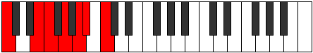

# Mode ANaturalZalimic

## Links

- [Documentation](index.md)
- [Scales Index](Scales.md)
- [Modes Index](Modes.md)
- [Chords Index](Chords.md)

## Scale

[Garimic](ScaleGarimic.md)

## Mode

[ANaturalZalimic](ModeANaturalZalimic.md)

## Tonic

A

## Signature

[CNaturalMajor]

## Perfection

 - 4 Perfect Notes

 - 2 Imperfect Notes

## Notes

- A
- Bb
- C
- D## (Imperfect)
- E#
- F## (Imperfect)
- A

## Illustration

## Relative Modes

| Number | Mode | Tonic | Notes | Illustration |
|--------|------|-------|-------|--------------|
| [363](https://ianring.com/musictheory/scales/363) | [Soptimic](ModeSoptimic.md) | E | E, F, G, A, Bb, C, E |  |
| [1419](https://ianring.com/musictheory/scales/1419) | [Zalimic](ModeZalimic.md) | A | A, Bb, C, D##, E#, F##, A |  |
| [1581](https://ianring.com/musictheory/scales/1581) | [Gyrimic](ModeGyrimic.md) | G | G, A, Bb, C, D##, E#, G |  |
| [1713](https://ianring.com/musictheory/scales/1713) | [Garimic](ModeGarimic.md) | C | C, D##, E#, F##, G##, A#, C |  |
| [2229](https://ianring.com/musictheory/scales/2229) | [Ionyptimic](ModeIonyptimic.md) | F | F, G, A, Bb, C, D##, F |  |
| [2757](https://ianring.com/musictheory/scales/2757) | [Stolimic](ModeStolimic.md) | A# | A#, B#, D##, E#, F##, G##, A# |  |
| [2757](https://ianring.com/musictheory/scales/2757) | [Stolimic](ModeStolimic.md) | Bb | Bb, C, D##, E#, F##, G##, Bb |  |

## Chords

### A

| Number | Root | Name | Notes | Illustration | Audio |
|--------|------|------|-------|--------------|-------|

### Bb

| Number | Root | Name | Notes | Illustration | Audio |
|--------|------|------|-------|--------------|-------|
| 1041 | Bb | [Bbsus2b5](ChordBFlatSuspendedSecondFlatFifth.md) | Bb, C, Fb |  | [midi](ChordBFlatSuspendedSecondFlatFifthRootPosition.mid) [ogg](ChordBFlatSuspendedSecondFlatFifthRootPosition.ogg) |
| 1056 | Bb | [Bb5](ChordBFlatPowerChord.md) | Bb, F |  | [midi](ChordBFlatPowerChordRootPosition.mid) [ogg](ChordBFlatPowerChordRootPosition.ogg) |
| 1057 | Bb | [Bbsus2](ChordBFlatSuspendedSecond.md) | Bb, C, F |  | [midi](ChordBFlatSuspendedSecondRootPosition.mid) [ogg](ChordBFlatSuspendedSecondRootPosition.ogg) |
| 1072 | Bb | [Bblyd](ChordBFlatLydian.md) | Bb, E, F |  | [midi](ChordBFlatLydianRootPosition.mid) [ogg](ChordBFlatLydianRootPosition.ogg) |
| 1169 | Bb | [BbM6sus2b5](ChordBFlatMajorSixthSuspendedSecondFlatFifth.md) | Bb, C, Fb, G |  | [midi](ChordBFlatMajorSixthSuspendedSecondFlatFifthRootPosition.mid) [ogg](ChordBFlatMajorSixthSuspendedSecondFlatFifthRootPosition.ogg) |
| 1185 | Bb | [BbM6sus2](ChordBFlatMajorSixthSuspendedSecond.md) | Bb, C, F, G |  | [midi](ChordBFlatMajorSixthSuspendedSecondRootPosition.mid) [ogg](ChordBFlatMajorSixthSuspendedSecondRootPosition.ogg) |
| 1185 | Bb | [Bb7sus2b5](ChordBFlatDominantSeventhSuspendedSecondFlatFifth.md) | Bb, C, F, Abb |  | [midi](ChordBFlatDominantSeventhSuspendedSecondFlatFifthRootPosition.mid) [ogg](ChordBFlatDominantSeventhSuspendedSecondFlatFifthRootPosition.ogg) |
| 1569 | Bb | [BbM7(sus2)](ChordBFlatMajorSeventhSuspendedSecond.md) | Bb, C, F, A |  | [midi](ChordBFlatMajorSeventhSuspendedSecondRootPosition.mid) [ogg](ChordBFlatMajorSeventhSuspendedSecondRootPosition.ogg) |
| 1569 | Bb | [BbM9sus2](ChordBFlatMajorNinthSuspendedSecond.md) | Bb, C, F, A, C |  | [midi](ChordBFlatMajorNinthSuspendedSecondRootPosition.mid) [ogg](ChordBFlatMajorNinthSuspendedSecondRootPosition.ogg) |
| 1584 | Bb | [Bblyd(M7)](ChordBFlatLydianMajorSeventh.md) | Bb, E, F, A |  | [midi](ChordBFlatLydianMajorSeventhRootPosition.mid) [ogg](ChordBFlatLydianMajorSeventhRootPosition.ogg) |

### C

| Number | Root | Name | Notes | Illustration | Audio |
|--------|------|------|-------|--------------|-------|
| 129 | C | [C5](ChordCNaturalPowerChord.md) | C, G |  | [midi](ChordCNaturalPowerChordRootPosition.mid) [ogg](ChordCNaturalPowerChordRootPosition.ogg) |
| 145 | C | [CM](ChordCNaturalMajor.md) | C, E, G |  | [midi](ChordCNaturalMajorRootPosition.mid) [ogg](ChordCNaturalMajorRootPosition.ogg) |
| 161 | C | [Csus4](ChordCNaturalSuspendedFourth.md) | C, F, G |  | [midi](ChordCNaturalSuspendedFourthRootPosition.mid) [ogg](ChordCNaturalSuspendedFourthRootPosition.ogg) |
| 177 | C | [CM(add11)](ChordCNaturalMajorAddEleventh.md) | C, E, G, F |  | [midi](ChordCNaturalMajorAddEleventhRootPosition.mid) [ogg](ChordCNaturalMajorAddEleventhRootPosition.ogg) |
| 177 | C | [CM(add4)](ChordCNaturalMajorAddFourth.md) | C, E, F, G |  | [midi](ChordCNaturalMajorAddFourthRootPosition.mid) [ogg](ChordCNaturalMajorAddFourthRootPosition.ogg) |
| 529 | C | [CM##5](ChordCNaturalMajorDoubleSharpFifth.md) | C, E, A |  | [midi](ChordCNaturalMajorDoubleSharpFifthRootPosition.mid) [ogg](ChordCNaturalMajorDoubleSharpFifthRootPosition.ogg) |
| 545 | C | [Csus4##5](ChordCNaturalSuspendedFourthDoubleSharpFifth.md) | C, F, A |  | [midi](ChordCNaturalSuspendedFourthDoubleSharpFifthRootPosition.mid) [ogg](ChordCNaturalSuspendedFourthDoubleSharpFifthRootPosition.ogg) |
| 657 | C | [CM6](ChordCNaturalMajorSixth.md) | C, E, G, A |  | [midi](ChordCNaturalMajorSixthRootPosition.mid) [ogg](ChordCNaturalMajorSixthRootPosition.ogg) |
| 673 | C | [CM6sus4](ChordCNaturalMajorSixthSuspendedFourth.md) | C, F, G, A |  | [midi](ChordCNaturalMajorSixthSuspendedFourthRootPosition.mid) [ogg](ChordCNaturalMajorSixthSuspendedFourthRootPosition.ogg) |
| 1057 | C | [CQ](ChordCNaturalQuartal.md) | C, F, Bb |  | [midi](ChordCNaturalQuartalRootPosition.mid) [ogg](ChordCNaturalQuartalRootPosition.ogg) |
| 1169 | C | [C7](ChordCNaturalDominantSeventh.md) | C, E, G, Bb |  | [midi](ChordCNaturalDominantSeventhRootPosition.mid) [ogg](ChordCNaturalDominantSeventhRootPosition.ogg) |
| 1185 | C | [C7sus4](ChordCNaturalDominantSeventhSuspendedFourth.md) | C, F, G, Bb |  | [midi](ChordCNaturalDominantSeventhSuspendedFourthRootPosition.mid) [ogg](ChordCNaturalDominantSeventhSuspendedFourthRootPosition.ogg) |
| 1201 | C | [C7add4](ChordCNaturalDominantSeventhAddFourth.md) | C, E, F, G, Bb |  | [midi](ChordCNaturalDominantSeventhAddFourthRootPosition.mid) [ogg](ChordCNaturalDominantSeventhAddFourthRootPosition.ogg) |
| 1201 | C | [C7add11](ChordCNaturalDominantSeventhAddEleventh.md) | C, E, G, Bb, F |  | [midi](ChordCNaturalDominantSeventhAddEleventhRootPosition.mid) [ogg](ChordCNaturalDominantSeventhAddEleventhRootPosition.ogg) |
| 1681 | C | [C7add13](ChordCNaturalDominantSeventhAddThirteenth.md) | C, E, G, Bb, A |  | [midi](ChordCNaturalDominantSeventhAddThirteenthRootPosition.mid) [ogg](ChordCNaturalDominantSeventhAddThirteenthRootPosition.ogg) |

### D##

| Number | Root | Name | Notes | Illustration | Audio |
|--------|------|------|-------|--------------|-------|

### E#

| Number | Root | Name | Notes | Illustration | Audio |
|--------|------|------|-------|--------------|-------|

### F##

| Number | Root | Name | Notes | Illustration | Audio |
|--------|------|------|-------|--------------|-------|

