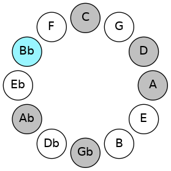

# Mode ASharpAeolocrimic

## Links

- [Documentation](README.md)
- [Scales Index](Scales.md)
- [Modes Index](Modes.md)
- [Chords Index](Chords.md)

## Scale

[Gacrimic](ScaleGacrimic.md)

## Mode

[ASharpAeolocrimic](ModeASharpAeolocrimic.md)

## Tonic

A#

## Signature

[CNaturalMajor]

## Interval Pattern

2, 2, 4, 2, 1, 1

## Chord Pattern

iv⁰

## Perfection

 - 1 Perfect Notes

 - 5 Imperfect Notes

## Notes

- A# (Imperfect)
- B# (Imperfect)
- C##
- E## (Imperfect)
- F### (Imperfect)
- G## (Imperfect)
- A# (Imperfect)

## Illustration

## Diagram

## Relative Modes

| Number | Mode | Tonic | Notes | Illustration |
|--------|------|-------|-------|--------------|
| [3349](https://ianring.com/musictheory/scales/3349) | [Aeolocrimic](ModeAeolocrimic.md) | A# | A#, B#, C##, E##, F###, G##, A# |  |
## Relative Brightness

| Number | Mode | Tonic | Notes | Illustration |
|--------|------|-------|-------|--------------|
| [3349](https://ianring.com/musictheory/scales/3349) | [Aeolocrimic](ModeAeolocrimic.md) | A# | A#, B#, C##, E##, F###, G##, A# |  |

## Chords

### A#

| Number | Root | Name | Notes | Illustration | Audio |
|--------|------|------|-------|--------------|-------|
| 1089 | A# | [A#sus2#5](ChordASharpSuspendedSecondSharpFifth.md) | A#, B#, E## |  | [midi](ChordASharpSuspendedSecondSharpFifthRootPosition.mid) |
| 1092 | A# | [A#+](ChordASharpAugmented.md) | A#, C##, E## |  | [midi](ChordASharpAugmentedRootPosition.mid) |
| 1092 | A# | [A#+7](ChordASharpAugmentedAugmentedSeventh.md) | A#, C##, E##, G### |  | [midi](ChordASharpAugmentedAugmentedSeventhRootPosition.mid) |
| 1604 | A# | [A#+(M7)](ChordASharpAugmentedMajorSeventh.md) | A#, C##, E##, G## |  | [midi](ChordASharpAugmentedMajorSeventhRootPosition.mid) |

### B#

| Number | Root | Name | Notes | Illustration | Audio |
|--------|------|------|-------|--------------|-------|

### C##

| Number | Root | Name | Notes | Illustration | Audio |
|--------|------|------|-------|--------------|-------|

### E##

| Number | Root | Name | Notes | Illustration | Audio |
|--------|------|------|-------|--------------|-------|

### F###

| Number | Root | Name | Notes | Illustration | Audio |
|--------|------|------|-------|--------------|-------|

### G##

| Number | Root | Name | Notes | Illustration | Audio |
|--------|------|------|-------|--------------|-------|

