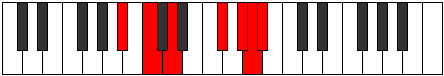

# Mode ASharpAeolocrimic

## Links

- [Documentation](index.md)
- [Scales Index](Scales.md)
- [Modes Index](Modes.md)
- [Chords Index](Chords.md)

## Scale

[Gacrimic](ScaleGacrimic.md)

## Mode

[ASharpAeolocrimic](ModeASharpAeolocrimic.md)

## Tonic

A#

## Signature

[CNaturalMajor]

## Perfection

 - 1 Perfect Notes

 - 5 Imperfect Notes

## Notes

- A# (Imperfect)
- B# (Imperfect)
- C##
- E## (Imperfect)
- F### (Imperfect)
- G## (Imperfect)
- A# (Imperfect)

## Illustration

## Relative Modes

| Number | Mode | Tonic | Notes | Illustration |
|--------|------|-------|-------|--------------|
| [349](https://ianring.com/musictheory/scales/349) | [Borimic](ModeBorimic.md) | F# | F#, G#, A, Bb, C, D, F# |  |
| [349](https://ianring.com/musictheory/scales/349) | [Borimic](ModeBorimic.md) | Gb | Gb, Ab, Bbb, Cbb, Dbb, Ebb, Gb |  |
| [1111](https://ianring.com/musictheory/scales/1111) | [Sycrimic](ModeSycrimic.md) | G# | G#, A, Bb, C, D, E##, G# |  |
| [1111](https://ianring.com/musictheory/scales/1111) | [Sycrimic](ModeSycrimic.md) | Ab | Ab, Bbb, Cbb, Dbb, Ebb, F#, Ab |  |
| [1489](https://ianring.com/musictheory/scales/1489) | [Gacrimic](ModeGacrimic.md) | D | D, E##, F###, G##, A#, B#, D |  |
| [1861](https://ianring.com/musictheory/scales/1861) | [Phrygimic](ModePhrygimic.md) | C | C, D, E##, F###, G##, A#, C |  |
| [2603](https://ianring.com/musictheory/scales/2603) | [Gadimic](ModeGadimic.md) | A | A, Bb, C, D, E##, F###, A |  |
| [3349](https://ianring.com/musictheory/scales/3349) | [Aeolocrimic](ModeAeolocrimic.md) | A# | A#, B#, C##, E##, F###, G##, A# |  |
| [3349](https://ianring.com/musictheory/scales/3349) | [Aeolocrimic](ModeAeolocrimic.md) | Bb | Bb, C, D, E##, F###, G##, Bb |  |

## Chords

### A#

| Number | Root | Name | Notes | Illustration | Audio |
|--------|------|------|-------|--------------|-------|

### B#

| Number | Root | Name | Notes | Illustration | Audio |
|--------|------|------|-------|--------------|-------|

### C##

| Number | Root | Name | Notes | Illustration | Audio |
|--------|------|------|-------|--------------|-------|

### E##

| Number | Root | Name | Notes | Illustration | Audio |
|--------|------|------|-------|--------------|-------|

### F###

| Number | Root | Name | Notes | Illustration | Audio |
|--------|------|------|-------|--------------|-------|

### G##

| Number | Root | Name | Notes | Illustration | Audio |
|--------|------|------|-------|--------------|-------|

