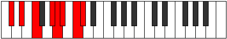

# Mode ASharpAeracrian

## Links

- [Documentation](index.md)
- [Scales Index](Scales.md)
- [Modes Index](Modes.md)
- [Chords Index](Chords.md)

## Scale

[Aerathian](ScaleAerathian.md)

## Mode

[ASharpAeracrian](ModeASharpAeracrian.md)

## Tonic

A#

## Signature

[CNaturalMajor]

## Perfection

 - 5 Perfect Notes

 - 2 Imperfect Notes

## Notes

- A#
- B# (Imperfect)
- C#
- D#
- E#
- F###
- G## (Imperfect)
- A#

## Illustration

## Relative Modes

| Number | Mode | Tonic | Notes | Illustration |
|--------|------|-------|-------|--------------|
| [3245](https://ianring.com/musictheory/scales/3245) | [Aeracrian](ModeAeracrian.md) | A# | A#, B#, C#, D#, E#, F###, G##, A# |  |
| [2965](https://ianring.com/musictheory/scales/2965) | [Darian](ModeDarian.md) | C# | C#, D#, E#, F###, G##, A#, B#, C# |  |
| [1765](https://ianring.com/musictheory/scales/1765) | [Lonian](ModeLonian.md) | D# | D#, E#, F###, G##, A#, B#, C#, D# |  |

## Chords

### A#

| Number | Root | Name | Notes | Illustration | Audio |
|--------|------|------|-------|--------------|-------|

### B#

| Number | Root | Name | Notes | Illustration | Audio |
|--------|------|------|-------|--------------|-------|

### C#

| Number | Root | Name | Notes | Illustration | Audio |
|--------|------|------|-------|--------------|-------|

### D#

| Number | Root | Name | Notes | Illustration | Audio |
|--------|------|------|-------|--------------|-------|

### E#

| Number | Root | Name | Notes | Illustration | Audio |
|--------|------|------|-------|--------------|-------|

### F###

| Number | Root | Name | Notes | Illustration | Audio |
|--------|------|------|-------|--------------|-------|

### G##

| Number | Root | Name | Notes | Illustration | Audio |
|--------|------|------|-------|--------------|-------|

