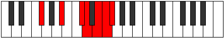

# Mode ASharpAeralimic

## Links

- [Documentation](index.md)
- [Scales Index](Scales.md)
- [Modes Index](Modes.md)
- [Chords Index](Chords.md)

## Scale

[Lathimic](ScaleLathimic.md)

## Mode

[ASharpAeralimic](ModeASharpAeralimic.md)

## Tonic

A#

## Signature

[CNaturalMajor]

## Perfection

 - 2 Perfect Notes

 - 4 Imperfect Notes

## Notes

- A#
- B## (Imperfect)
- C## (Imperfect)
- D## (Imperfect)
- E# (Imperfect)
- F#
- A#

## Illustration

## Relative Modes

| Number | Mode | Tonic | Notes | Illustration |
|--------|------|-------|-------|--------------|
| [473](https://ianring.com/musictheory/scales/473) | [Aeralimic](ModeAeralimic.md) | A# | A#, B##, C##, D##, E#, F#, A# |  |
| [473](https://ianring.com/musictheory/scales/473) | [Aeralimic](ModeAeralimic.md) | Bb | Bb, C#, D, E, F, Gb, Bb |  |
| [571](https://ianring.com/musictheory/scales/571) | [Kynimic](ModeKynimic.md) | C# | C#, D, E, F, Gb, A#, C# |  |
| [571](https://ianring.com/musictheory/scales/571) | [Kynimic](ModeKynimic.md) | Db | Db, Ebb, Fb, Gbb, Abbb, Bb, Db |  |
| [1607](https://ianring.com/musictheory/scales/1607) | [Epytimic](ModeEpytimic.md) | E | E, F, Gb, A#, B##, C##, E |  |
| [2333](https://ianring.com/musictheory/scales/2333) | [Stynimic](ModeStynimic.md) | D | D, E, F, Gb, A#, B##, D |  |
| [2851](https://ianring.com/musictheory/scales/2851) | [Katoptimic](ModeKatoptimic.md) | F | F, Gb, A#, B##, C##, D##, F |  |
| [3473](https://ianring.com/musictheory/scales/3473) | [Lathimic](ModeLathimic.md) | F# | F#, G###, Db, Ebb, Fb, Gbb, F# |  |
| [3473](https://ianring.com/musictheory/scales/3473) | [Lathimic](ModeLathimic.md) | Gb | Gb, A#, B##, C##, D##, E#, Gb |  |

## Chords

### A#

| Number | Root | Name | Notes | Illustration | Audio |
|--------|------|------|-------|--------------|-------|

### B##

| Number | Root | Name | Notes | Illustration | Audio |
|--------|------|------|-------|--------------|-------|

### C##

| Number | Root | Name | Notes | Illustration | Audio |
|--------|------|------|-------|--------------|-------|

### D##

| Number | Root | Name | Notes | Illustration | Audio |
|--------|------|------|-------|--------------|-------|

### E#

| Number | Root | Name | Notes | Illustration | Audio |
|--------|------|------|-------|--------------|-------|

### F#

| Number | Root | Name | Notes | Illustration | Audio |
|--------|------|------|-------|--------------|-------|

