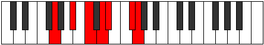

# Mode ASharpAeranimic

## Links

- [Documentation](index.md)
- [Scales Index](Scales.md)
- [Modes Index](Modes.md)
- [Chords Index](Chords.md)

## Scale

[Mothimic](ScaleMothimic.md)

## Mode

[ASharpAeranimic](ModeASharpAeranimic.md)

## Tonic

A#

## Signature

[CNaturalMajor]

## Perfection

 - 3 Perfect Notes

 - 3 Imperfect Notes

## Notes

- A# (Imperfect)
- B#
- C## (Imperfect)
- D#
- E## (Imperfect)
- F##
- A# (Imperfect)

## Illustration

## Relative Modes

| Number | Mode | Tonic | Notes | Illustration |
|--------|------|-------|-------|--------------|
| [821](https://ianring.com/musictheory/scales/821) | [Aeranimic](ModeAeranimic.md) | A# | A#, B#, C##, D#, E##, F##, A# |  |
| [821](https://ianring.com/musictheory/scales/821) | [Aeranimic](ModeAeranimic.md) | Bb | Bb, C, D, Eb, F#, G, Bb |  |
| [851](https://ianring.com/musictheory/scales/851) | [Aerylimic](ModeAerylimic.md) | F# | F#, G, A#, B#, C##, D#, F# |  |
| [851](https://ianring.com/musictheory/scales/851) | [Aerylimic](ModeAerylimic.md) | Gb | Gb, Abb, Bb, C, D, Eb, Gb |  |
| [1229](https://ianring.com/musictheory/scales/1229) | [Ragimic](ModeRagimic.md) | C | C, D, Eb, F#, G, A#, C |  |
| [1331](https://ianring.com/musictheory/scales/1331) | [Dolimic](ModeDolimic.md) | D | D, Eb, F#, G, A#, B#, D |  |
| [2473](https://ianring.com/musictheory/scales/2473) | [Mothimic](ModeMothimic.md) | G | G, A#, B#, C##, D#, E##, G |  |
| [2713](https://ianring.com/musictheory/scales/2713) | [Porimic](ModePorimic.md) | D# | D#, E##, F##, G###, A###, B###, D# |  |
| [2713](https://ianring.com/musictheory/scales/2713) | [Porimic](ModePorimic.md) | Eb | Eb, F#, G, A#, B#, C##, Eb |  |

## Chords

### A#

| Number | Root | Name | Notes | Illustration | Audio |
|--------|------|------|-------|--------------|-------|

### B#

| Number | Root | Name | Notes | Illustration | Audio |
|--------|------|------|-------|--------------|-------|

### C##

| Number | Root | Name | Notes | Illustration | Audio |
|--------|------|------|-------|--------------|-------|

### D#

| Number | Root | Name | Notes | Illustration | Audio |
|--------|------|------|-------|--------------|-------|

### E##

| Number | Root | Name | Notes | Illustration | Audio |
|--------|------|------|-------|--------------|-------|

### F##

| Number | Root | Name | Notes | Illustration | Audio |
|--------|------|------|-------|--------------|-------|

