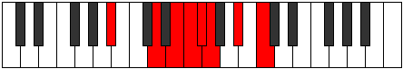
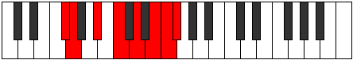
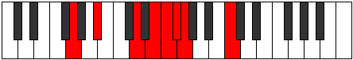

# Mode ASharpBacrian

## Links

- [Documentation](index.md)
- [Scales Index](Scales.md)
- [Modes Index](Modes.md)
- [Chords Index](Chords.md)

## Scale

[Phraptian](ScalePhraptian.md)

## Mode

[ASharpBacrian](ModeASharpBacrian.md)

## Tonic

A#

## Signature

[CNaturalMajor]

## Perfection

 - 4 Perfect Notes

 - 3 Imperfect Notes

## Notes

- A#
- B#
- C## (Imperfect)
- D## (Imperfect)
- E#
- F# (Imperfect)
- G
- A#

## Illustration

## Relative Modes

| Number | Mode | Tonic | Notes | Illustration |
|--------|------|-------|-------|--------------|
| [981](https://ianring.com/musictheory/scales/981) | [Bacrian](ModeBacrian.md) | A# | A#, B#, C##, D##, E#, F#, G, A# |  |
| [3411](https://ianring.com/musictheory/scales/3411) | [Ionathian](ModeIonathian.md) | F# | F#, G, A#, B#, C##, D##, E#, F# |  |
| [3753](https://ianring.com/musictheory/scales/3753) | [Phraptian](ModePhraptian.md) | G | G, A#, B#, C##, D##, E#, F#, G |  |

## Chords

### A#

| Number | Root | Name | Notes | Illustration | Audio |
|--------|------|------|-------|--------------|-------|

### B#

| Number | Root | Name | Notes | Illustration | Audio |
|--------|------|------|-------|--------------|-------|

### C##

| Number | Root | Name | Notes | Illustration | Audio |
|--------|------|------|-------|--------------|-------|

### D##

| Number | Root | Name | Notes | Illustration | Audio |
|--------|------|------|-------|--------------|-------|

### E#

| Number | Root | Name | Notes | Illustration | Audio |
|--------|------|------|-------|--------------|-------|

### F#

| Number | Root | Name | Notes | Illustration | Audio |
|--------|------|------|-------|--------------|-------|

### G

| Number | Root | Name | Notes | Illustration | Audio |
|--------|------|------|-------|--------------|-------|

