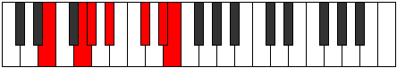

# Mode ASharpBocrimic

## Links

- [Documentation](index.md)
- [Scales Index](Scales.md)
- [Modes Index](Modes.md)
- [Chords Index](Chords.md)

## Scale

[Bocrimic](ScaleBocrimic.md)

## Mode

[ASharpBocrimic](ModeASharpBocrimic.md)

## Tonic

A#

## Signature

[CNaturalMajor]

## Perfection

 - 3 Perfect Notes

 - 3 Imperfect Notes

## Notes

- A# (Imperfect)
- B##
- C###
- D## (Imperfect)
- E### (Imperfect)
- F###
- A# (Imperfect)

## Illustration

## Relative Modes

| Number | Mode | Tonic | Notes | Illustration |
|--------|------|-------|-------|--------------|
| [717](https://ianring.com/musictheory/scales/717) | [Gythimic](ModeGythimic.md) | C# | C#, D#, E, F##, G#, A#, C# |  |
| [717](https://ianring.com/musictheory/scales/717) | [Gythimic](ModeGythimic.md) | Db | Db, Eb, Fb, G, Ab, Bb, Db |  |
| [843](https://ianring.com/musictheory/scales/843) | [Molimic](ModeMolimic.md) | G | G, Ab, Bb, C#, D#, E, G |  |
| [1203](https://ianring.com/musictheory/scales/1203) | [Pagimic](ModePagimic.md) | D# | D#, E, F##, G#, A#, B##, D# |  |
| [1203](https://ianring.com/musictheory/scales/1203) | [Pagimic](ModePagimic.md) | Eb | Eb, Fb, G, Ab, Bb, C#, Eb |  |
| [1641](https://ianring.com/musictheory/scales/1641) | [Bocrimic](ModeBocrimic.md) | A# | A#, B##, C###, D##, E###, F###, A# |  |
| [1641](https://ianring.com/musictheory/scales/1641) | [Bocrimic](ModeBocrimic.md) | Bb | Bb, C#, D#, E, F##, G#, Bb |  |
| [2469](https://ianring.com/musictheory/scales/2469) | [Staptimic](ModeStaptimic.md) | G# | G#, A#, B##, C###, D##, E###, G# |  |
| [2469](https://ianring.com/musictheory/scales/2469) | [Staptimic](ModeStaptimic.md) | Ab | Ab, Bb, C#, D#, E, F##, Ab |  |
| [2649](https://ianring.com/musictheory/scales/2649) | [Aeolythimic](ModeAeolythimic.md) | E | E, F##, G#, A#, B##, C###, E |  |

## Chords

### A#

| Number | Root | Name | Notes | Illustration | Audio |
|--------|------|------|-------|--------------|-------|

### B##

| Number | Root | Name | Notes | Illustration | Audio |
|--------|------|------|-------|--------------|-------|

### C###

| Number | Root | Name | Notes | Illustration | Audio |
|--------|------|------|-------|--------------|-------|

### D##

| Number | Root | Name | Notes | Illustration | Audio |
|--------|------|------|-------|--------------|-------|

### E###

| Number | Root | Name | Notes | Illustration | Audio |
|--------|------|------|-------|--------------|-------|

### F###

| Number | Root | Name | Notes | Illustration | Audio |
|--------|------|------|-------|--------------|-------|

