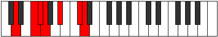

# Mode ASharpBogimic

## Links

- [Documentation](index.md)
- [Scales Index](Scales.md)
- [Modes Index](Modes.md)
- [Chords Index](Chords.md)

## Scale

[Ionodimic](ScaleIonodimic.md)

## Mode

[ASharpBogimic](ModeASharpBogimic.md)

## Tonic

A#

## Signature

[CNaturalMajor]

## Perfection

 - 3 Perfect Notes

 - 3 Imperfect Notes

## Notes

- A#
- B## (Imperfect)
- C## (Imperfect)
- D### (Imperfect)
- E##
- F##
- A#

## Illustration

## Relative Modes

| Number | Mode | Tonic | Notes | Illustration |
|--------|------|-------|-------|--------------|
| [627](https://ianring.com/musictheory/scales/627) | [Mogimic](ModeMogimic.md) | C# | C#, D, E#, F#, G, A#, C# |  |
| [627](https://ianring.com/musictheory/scales/627) | [Mogimic](ModeMogimic.md) | Db | Db, Ebb, F, Gb, Abb, Bb, Db |  |
| [807](https://ianring.com/musictheory/scales/807) | [Epadimic](ModeEpadimic.md) | F | F, Gb, Abb, Bb, C#, D, F |  |
| [921](https://ianring.com/musictheory/scales/921) | [Bogimic](ModeBogimic.md) | A# | A#, B##, C##, D###, E##, F##, A# |  |
| [921](https://ianring.com/musictheory/scales/921) | [Bogimic](ModeBogimic.md) | Bb | Bb, C#, D, E#, F#, G, Bb |  |
| [2361](https://ianring.com/musictheory/scales/2361) | [Docrimic](ModeDocrimic.md) | D | D, E#, F#, G, A#, B##, D |  |
| [2451](https://ianring.com/musictheory/scales/2451) | [Aerynimic](ModeAerynimic.md) | F# | F#, G, A#, B##, C##, D###, F# |  |
| [2451](https://ianring.com/musictheory/scales/2451) | [Aerynimic](ModeAerynimic.md) | Gb | Gb, Abb, Bb, C#, D, E#, Gb |  |
| [3273](https://ianring.com/musictheory/scales/3273) | [Ionodimic](ModeIonodimic.md) | G | G, A#, B##, C##, D###, E##, G |  |

## Chords

### A#

| Number | Root | Name | Notes | Illustration | Audio |
|--------|------|------|-------|--------------|-------|

### B##

| Number | Root | Name | Notes | Illustration | Audio |
|--------|------|------|-------|--------------|-------|

### C##

| Number | Root | Name | Notes | Illustration | Audio |
|--------|------|------|-------|--------------|-------|

### D###

| Number | Root | Name | Notes | Illustration | Audio |
|--------|------|------|-------|--------------|-------|

### E##

| Number | Root | Name | Notes | Illustration | Audio |
|--------|------|------|-------|--------------|-------|

### F##

| Number | Root | Name | Notes | Illustration | Audio |
|--------|------|------|-------|--------------|-------|

