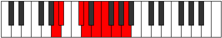
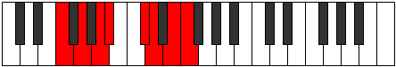

# Mode ASharpBycrian

## Links

- [Documentation](index.md)
- [Scales Index](Scales.md)
- [Modes Index](Modes.md)
- [Chords Index](Chords.md)

## Scale

[Bycrian](ScaleBycrian.md)

## Mode

[ASharpBycrian](ModeASharpBycrian.md)

## Tonic

A#

## Signature

[CNaturalMajor]

## Perfection

 - 4 Perfect Notes

 - 3 Imperfect Notes

## Notes

- A#
- B## (Imperfect)
- C##
- D## (Imperfect)
- E# (Imperfect)
- F##
- G##
- A#

## Illustration

## Relative Modes

| Number | Mode | Tonic | Notes | Illustration |
|--------|------|-------|-------|--------------|
| [859](https://ianring.com/musictheory/scales/859) | [Pathian](ModePathian.md) | C# | C#, D, E, F, G, A, Bb, C# |  |
| [859](https://ianring.com/musictheory/scales/859) | [Pathian](ModePathian.md) | Db | Db, Ebb, Fb, Gbb, Abb, Bbb, Cbb, Db |  |
| [1459](https://ianring.com/musictheory/scales/1459) | [Ionalian](ModeIonalian.md) | A | A, Bb, C#, D, E, F, G, A |  |
| [1643](https://ianring.com/musictheory/scales/1643) | [Thyptian](ModeThyptian.md) | E | E, F, G, A, Bb, C#, D, E |  |
| [1741](https://ianring.com/musictheory/scales/1741) | [Katycrian](ModeKatycrian.md) | G | G, A, Bb, C#, D, E, F, G |  |
| [2477](https://ianring.com/musictheory/scales/2477) | [Mydian](ModeMydian.md) | D | D, E, F, G, A, Bb, C#, D |  |
| [2777](https://ianring.com/musictheory/scales/2777) | [Bycrian](ModeBycrian.md) | A# | A#, B##, C##, D##, E#, F##, G##, A# |  |
| [2777](https://ianring.com/musictheory/scales/2777) | [Bycrian](ModeBycrian.md) | Bb | Bb, C#, D, E, F, G, A, Bb |  |
| [2869](https://ianring.com/musictheory/scales/2869) | [Phrothian](ModePhrothian.md) | F | F, G, A, Bb, C#, D, E, F |  |

## Chords

### A#

| Number | Root | Name | Notes | Illustration | Audio |
|--------|------|------|-------|--------------|-------|

### B##

| Number | Root | Name | Notes | Illustration | Audio |
|--------|------|------|-------|--------------|-------|

### C##

| Number | Root | Name | Notes | Illustration | Audio |
|--------|------|------|-------|--------------|-------|

### D##

| Number | Root | Name | Notes | Illustration | Audio |
|--------|------|------|-------|--------------|-------|

### E#

| Number | Root | Name | Notes | Illustration | Audio |
|--------|------|------|-------|--------------|-------|

### F##

| Number | Root | Name | Notes | Illustration | Audio |
|--------|------|------|-------|--------------|-------|

### G##

| Number | Root | Name | Notes | Illustration | Audio |
|--------|------|------|-------|--------------|-------|

