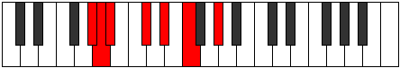

# Mode ASharpDalimic

## Links

- [Documentation](index.md)
- [Scales Index](Scales.md)
- [Modes Index](Modes.md)
- [Chords Index](Chords.md)

## Scale

[Dalimic](ScaleDalimic.md)

## Mode

[ASharpDalimic](ModeASharpDalimic.md)

## Tonic

A#

## Signature

[CNaturalMajor]

## Perfection

 - 4 Perfect Notes

 - 2 Imperfect Notes

## Notes

- A#
- B##
- C###
- D### (Imperfect)
- F###
- G## (Imperfect)
- A#

## Illustration

## Relative Modes

| Number | Mode | Tonic | Notes | Illustration |
|--------|------|-------|-------|--------------|
| [679](https://ianring.com/musictheory/scales/679) | [Lanimic](ModeLanimic.md) | G# | G#, A, Bb, C#, D#, E#, G# |  |
| [679](https://ianring.com/musictheory/scales/679) | [Lanimic](ModeLanimic.md) | Ab | Ab, Bbb, Cbb, Db, Eb, F, Ab |  |
| [917](https://ianring.com/musictheory/scales/917) | [Dygimic](ModeDygimic.md) | C# | C#, D#, E#, F###, G##, A#, C# |  |
| [917](https://ianring.com/musictheory/scales/917) | [Dygimic](ModeDygimic.md) | Db | Db, Eb, F, G#, A, Bb, Db |  |
| [1253](https://ianring.com/musictheory/scales/1253) | [Zolimic](ModeZolimic.md) | D# | D#, E#, F###, G##, A#, B##, D# |  |
| [1253](https://ianring.com/musictheory/scales/1253) | [Zolimic](ModeZolimic.md) | Eb | Eb, F, G#, A, Bb, C#, Eb |  |
| [1337](https://ianring.com/musictheory/scales/1337) | [Epogimic](ModeEpogimic.md) | F | F, G#, A, Bb, C#, D#, F |  |
| [2387](https://ianring.com/musictheory/scales/2387) | [Paptimic](ModePaptimic.md) | A | A, Bb, C#, D#, E#, F###, A |  |
| [3241](https://ianring.com/musictheory/scales/3241) | [Dalimic](ModeDalimic.md) | A# | A#, B##, C###, D###, F###, G##, A# |  |
| [3241](https://ianring.com/musictheory/scales/3241) | [Dalimic](ModeDalimic.md) | Bb | Bb, C#, D#, E#, F###, G##, Bb |  |

## Chords

### A#

| Number | Root | Name | Notes | Illustration | Audio |
|--------|------|------|-------|--------------|-------|

### B##

| Number | Root | Name | Notes | Illustration | Audio |
|--------|------|------|-------|--------------|-------|

### C###

| Number | Root | Name | Notes | Illustration | Audio |
|--------|------|------|-------|--------------|-------|

### D###

| Number | Root | Name | Notes | Illustration | Audio |
|--------|------|------|-------|--------------|-------|

### F###

| Number | Root | Name | Notes | Illustration | Audio |
|--------|------|------|-------|--------------|-------|

### G##

| Number | Root | Name | Notes | Illustration | Audio |
|--------|------|------|-------|--------------|-------|

