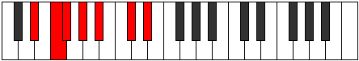

# Mode ASharpEpathimic

## Links

- [Documentation](index.md)
- [Scales Index](Scales.md)
- [Modes Index](Modes.md)
- [Chords Index](Chords.md)

## Scale

[Epathimic](ScaleEpathimic.md)

## Mode

[ASharpEpathimic](ModeASharpEpathimic.md)

## Tonic

A#

## Signature

[CNaturalMajor]

## Perfection

 - 5 Perfect Notes

 - 1 Imperfect Notes

## Notes

- A#
- B##
- C###
- D### (Imperfect)
- E##
- F###
- A#

## Illustration

## Relative Modes

| Number | Mode | Tonic | Notes | Illustration |
|--------|------|-------|-------|--------------|
| [693](https://ianring.com/musictheory/scales/693) | [Mynimic](ModeMynimic.md) | C# | C#, D#, E#, F#, G#, A#, C# |  |
| [693](https://ianring.com/musictheory/scales/693) | [Mynimic](ModeMynimic.md) | Db | Db, Eb, F, Gb, Ab, Bb, Db |  |
| [1197](https://ianring.com/musictheory/scales/1197) | [Rocrimic](ModeRocrimic.md) | D# | D#, E#, F#, G#, A#, B##, D# |  |
| [1197](https://ianring.com/musictheory/scales/1197) | [Rocrimic](ModeRocrimic.md) | Eb | Eb, F, Gb, Ab, Bb, C#, Eb |  |
| [1323](https://ianring.com/musictheory/scales/1323) | [Eporimic](ModeEporimic.md) | F | F, Gb, Ab, Bb, C#, D#, F |  |
| [1449](https://ianring.com/musictheory/scales/1449) | [Epathimic](ModeEpathimic.md) | A# | A#, B##, C###, D###, E##, F###, A# |  |
| [1449](https://ianring.com/musictheory/scales/1449) | [Epathimic](ModeEpathimic.md) | Bb | Bb, C#, D#, E#, F#, G#, Bb |  |
| [1701](https://ianring.com/musictheory/scales/1701) | [Lothimic](ModeLothimic.md) | G# | G#, A#, B##, C###, D###, E##, G# |  |
| [1701](https://ianring.com/musictheory/scales/1701) | [Lothimic](ModeLothimic.md) | Ab | Ab, Bb, C#, D#, E#, F#, Ab |  |
| [2709](https://ianring.com/musictheory/scales/2709) | [Thaptimic](ModeThaptimic.md) | F# | F#, G#, A#, B##, C###, D###, F# |  |
| [2709](https://ianring.com/musictheory/scales/2709) | [Thaptimic](ModeThaptimic.md) | Gb | Gb, Ab, Bb, C#, D#, E#, Gb |  |

## Chords

### A#

| Number | Root | Name | Notes | Illustration | Audio |
|--------|------|------|-------|--------------|-------|

### B##

| Number | Root | Name | Notes | Illustration | Audio |
|--------|------|------|-------|--------------|-------|

### C###

| Number | Root | Name | Notes | Illustration | Audio |
|--------|------|------|-------|--------------|-------|

### D###

| Number | Root | Name | Notes | Illustration | Audio |
|--------|------|------|-------|--------------|-------|

### E##

| Number | Root | Name | Notes | Illustration | Audio |
|--------|------|------|-------|--------------|-------|

### F###

| Number | Root | Name | Notes | Illustration | Audio |
|--------|------|------|-------|--------------|-------|

