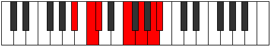

# Mode ASharpEpythimic

## Links

- [Documentation](index.md)
- [Scales Index](Scales.md)
- [Modes Index](Modes.md)
- [Chords Index](Chords.md)

## Scale

[Rycrimic](ScaleRycrimic.md)

## Mode

[ASharpEpythimic](ModeASharpEpythimic.md)

## Tonic

A#

## Signature

[CNaturalMajor]

## Perfection

 - 3 Perfect Notes

 - 3 Imperfect Notes

## Notes

- A#
- B#
- C# (Imperfect)
- D###
- E### (Imperfect)
- Cbbb (Imperfect)
- A#

## Illustration

## Relative Modes

| Number | Mode | Tonic | Notes | Illustration |
|--------|------|-------|-------|--------------|
| [2701](https://ianring.com/musictheory/scales/2701) | [Epythimic](ModeEpythimic.md) | A# | A#, B#, C#, D###, E###, Cbbb, A# |  |
| [2897](https://ianring.com/musictheory/scales/2897) | [Rycrimic](ModeRycrimic.md) | C# | C#, D###, E###, Cbbb, Cbb, Dbb, C# |  |

## Chords

### A#

| Number | Root | Name | Notes | Illustration | Audio |
|--------|------|------|-------|--------------|-------|

### B#

| Number | Root | Name | Notes | Illustration | Audio |
|--------|------|------|-------|--------------|-------|

### C#

| Number | Root | Name | Notes | Illustration | Audio |
|--------|------|------|-------|--------------|-------|

### D###

| Number | Root | Name | Notes | Illustration | Audio |
|--------|------|------|-------|--------------|-------|

### E###

| Number | Root | Name | Notes | Illustration | Audio |
|--------|------|------|-------|--------------|-------|

### Cbbb

| Number | Root | Name | Notes | Illustration | Audio |
|--------|------|------|-------|--------------|-------|

