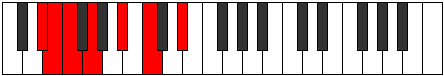

# Mode ASharpGathimic

## Links

- [Documentation](index.md)
- [Scales Index](Scales.md)
- [Modes Index](Modes.md)
- [Chords Index](Chords.md)

## Scale

[Ionacrimic](ScaleIonacrimic.md)

## Mode

[ASharpGathimic](ModeASharpGathimic.md)

## Tonic

A#

## Signature

[CNaturalMajor]

## Perfection

 - 4 Perfect Notes

 - 2 Imperfect Notes

## Notes

- A#
- B#
- C###
- D## (Imperfect)
- E#
- F## (Imperfect)
- A#

## Illustration

## Relative Modes

| Number | Mode | Tonic | Notes | Illustration |
|--------|------|-------|-------|--------------|
| [663](https://ianring.com/musictheory/scales/663) | [Phrynimic](ModePhrynimic.md) | D# | D#, E, F, G, A#, B#, D# |  |
| [663](https://ianring.com/musictheory/scales/663) | [Phrynimic](ModePhrynimic.md) | Eb | Eb, Fb, Gbb, Abb, Bb, C, Eb |  |
| [741](https://ianring.com/musictheory/scales/741) | [Gathimic](ModeGathimic.md) | A# | A#, B#, C###, D##, E#, F##, A# |  |
| [741](https://ianring.com/musictheory/scales/741) | [Gathimic](ModeGathimic.md) | Bb | Bb, C, D#, E, F, G, Bb |  |
| [1209](https://ianring.com/musictheory/scales/1209) | [Ionynimic](ModeIonynimic.md) | C | C, D#, E, F, G, A#, C |  |
| [1833](https://ianring.com/musictheory/scales/1833) | [Ionacrimic](ModeIonacrimic.md) | G | G, A#, B#, C###, D##, E#, G |  |
| [2379](https://ianring.com/musictheory/scales/2379) | [Stathimic](ModeStathimic.md) | E | E, F, G, A#, B#, C###, E |  |
| [3237](https://ianring.com/musictheory/scales/3237) | [Thatimic](ModeThatimic.md) | F | F, G, A#, B#, C###, D##, F |  |

## Chords

### A#

| Number | Root | Name | Notes | Illustration | Audio |
|--------|------|------|-------|--------------|-------|

### B#

| Number | Root | Name | Notes | Illustration | Audio |
|--------|------|------|-------|--------------|-------|

### C###

| Number | Root | Name | Notes | Illustration | Audio |
|--------|------|------|-------|--------------|-------|

### D##

| Number | Root | Name | Notes | Illustration | Audio |
|--------|------|------|-------|--------------|-------|

### E#

| Number | Root | Name | Notes | Illustration | Audio |
|--------|------|------|-------|--------------|-------|

### F##

| Number | Root | Name | Notes | Illustration | Audio |
|--------|------|------|-------|--------------|-------|

