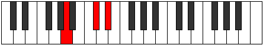

# Mode ASharpGothitonic

## Links

- [Documentation](index.md)
- [Scales Index](Scales.md)
- [Modes Index](Modes.md)
- [Chords Index](Chords.md)

## Scale

[Lyditonic](ScaleLyditonic.md)

## Mode

[ASharpGothitonic](ModeASharpGothitonic.md)

## Tonic

A#

## Signature

[CNaturalMajor]

## Perfection

 - 2 Perfect Notes

 - 3 Imperfect Notes

## Notes

- A# (Imperfect)
- C# (Imperfect)
- D#
- F#
- A (Imperfect)
- A# (Imperfect)

## Illustration

## Relative Modes

| Number | Mode | Tonic | Notes | Illustration |
|--------|------|-------|-------|--------------|
| [595](https://ianring.com/musictheory/scales/595) | [Sogitonic](ModeSogitonic.md) | A | A, A#, C#, D#, F#, A |  |
| [665](https://ianring.com/musictheory/scales/665) | [Mythitonic](ModeMythitonic.md) | F# | F#, A, A#, C#, D#, F# |  |
| [665](https://ianring.com/musictheory/scales/665) | [Mythitonic](ModeMythitonic.md) | Gb | Gb, A, Bb, Db, Eb, Gb |  |
| [805](https://ianring.com/musictheory/scales/805) | [Rothitonic](ModeRothitonic.md) | C# | C#, D#, F#, A, A#, C# |  |
| [805](https://ianring.com/musictheory/scales/805) | [Rothitonic](ModeRothitonic.md) | Db | Db, Eb, Gb, A, Bb, Db |  |
| [1225](https://ianring.com/musictheory/scales/1225) | [Lyditonic](ModeLyditonic.md) | D# | D#, F#, A, A#, C#, D# |  |
| [1225](https://ianring.com/musictheory/scales/1225) | [Lyditonic](ModeLyditonic.md) | Eb | Eb, Gb, A, Bb, Db, Eb |  |
| [2345](https://ianring.com/musictheory/scales/2345) | [Gothitonic](ModeGothitonic.md) | A# | A#, C#, D#, F#, A, A# |  |
| [2345](https://ianring.com/musictheory/scales/2345) | [Gothitonic](ModeGothitonic.md) | Bb | Bb, Db, Eb, Gb, A, Bb |  |

## Chords

### A#

| Number | Root | Name | Notes | Illustration | Audio |
|--------|------|------|-------|--------------|-------|

### C#

| Number | Root | Name | Notes | Illustration | Audio |
|--------|------|------|-------|--------------|-------|

### D#

| Number | Root | Name | Notes | Illustration | Audio |
|--------|------|------|-------|--------------|-------|

### F#

| Number | Root | Name | Notes | Illustration | Audio |
|--------|------|------|-------|--------------|-------|

### A

| Number | Root | Name | Notes | Illustration | Audio |
|--------|------|------|-------|--------------|-------|
| 1544 | A | [Aloc](ChordANaturalLocrian.md) | A, Bb, Eb |  | [midi](ChordANaturalLocrianRootPosition.mid) |
| 522 | A | [AMb5](ChordANaturalMajorFlatFifth.md) | A, C#, Eb |  | [midi](ChordANaturalMajorFlatFifthRootPosition.mid) |
| 578 | A | [AM##5](ChordANaturalMajorDoubleSharpFifth.md) | A, C#, F# |  | [midi](ChordANaturalMajorDoubleSharpFifthRootPosition.mid) |
| 586 | A | [AM6b5](ChordANaturalMajorSixthFlatFifth.md) | A, C#, Eb, F# |  | [midi](ChordANaturalMajorSixthFlatFifthRootPosition.mid) |

