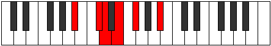
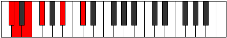

# Mode ASharpGylitonic

## Links

- [Documentation](index.md)
- [Scales Index](Scales.md)
- [Modes Index](Modes.md)
- [Chords Index](Chords.md)

## Scale

[Ryphitonic](ScaleRyphitonic.md)

## Mode

[ASharpGylitonic](ModeASharpGylitonic.md)

## Tonic

A#

## Signature

[CNaturalMajor]

## Perfection

 - 1 Perfect Notes

 - 4 Imperfect Notes

## Notes

- A# (Imperfect)
- C# (Imperfect)
- D (Imperfect)
- E (Imperfect)
- F#
- A# (Imperfect)

## Illustration

## Relative Modes

| Number | Mode | Tonic | Notes | Illustration |
|--------|------|-------|-------|--------------|
| [345](https://ianring.com/musictheory/scales/345) | [Gylitonic](ModeGylitonic.md) | A# | A#, C#, D, E, F#, A# |  |
| [555](https://ianring.com/musictheory/scales/555) | [Aeolycritonic](ModeAeolycritonic.md) | C# | C#, D, E, F#, A#, C# |  |
| [2325](https://ianring.com/musictheory/scales/2325) | [Pynitonic](ModePynitonic.md) | D | D, E, F#, A#, C#, D |  |
| [1605](https://ianring.com/musictheory/scales/1605) | [Zanitonic](ModeZanitonic.md) | E | E, F#, A#, C#, D, E |  |
| [1425](https://ianring.com/musictheory/scales/1425) | [Ryphitonic](ModeRyphitonic.md) | F# | F#, A#, C#, D, E, F# |  |

## Chords

### A#

| Number | Root | Name | Notes | Illustration | Audio |
|--------|------|------|-------|--------------|-------|

### C#

| Number | Root | Name | Notes | Illustration | Audio |
|--------|------|------|-------|--------------|-------|

### D

| Number | Root | Name | Notes | Illustration | Audio |
|--------|------|------|-------|--------------|-------|
| 1044 | D | [Dsus2#5](ChordDNaturalSuspendedSecondSharpFifth.md) | D, E, A# |  | [midi](ChordDNaturalSuspendedSecondSharpFifthRootPosition.mid) |
| 1092 | D | [D+](ChordDNaturalAugmented.md) | D, F#, A# |  | [midi](ChordDNaturalAugmentedRootPosition.mid) |
| 1092 | D | [D+7](ChordDNaturalAugmentedAugmentedSeventh.md) | D, F#, A#, C## |  | [midi](ChordDNaturalAugmentedAugmentedSeventhRootPosition.mid) |
| 1094 | D | [D+(M7)](ChordDNaturalAugmentedMajorSeventh.md) | D, F#, A#, C# |  | [midi](ChordDNaturalAugmentedMajorSeventhRootPosition.mid) |

### E

| Number | Root | Name | Notes | Illustration | Audio |
|--------|------|------|-------|--------------|-------|
| 1104 | E | [Esus2b5](ChordENaturalSuspendedSecondFlatFifth.md) | E, F#, Bb |  | [midi](ChordENaturalSuspendedSecondFlatFifthRootPosition.mid) |
| 1106 | E | [EM6sus2b5](ChordENaturalMajorSixthSuspendedSecondFlatFifth.md) | E, F#, Bb, C# |  | [midi](ChordENaturalMajorSixthSuspendedSecondFlatFifthRootPosition.mid) |

### F#

| Number | Root | Name | Notes | Illustration | Audio |
|--------|------|------|-------|--------------|-------|

