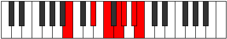

# Mode ASharpKaptimic

## Links

- [Documentation](index.md)
- [Scales Index](Scales.md)
- [Modes Index](Modes.md)
- [Chords Index](Chords.md)

## Scale

[Rycrimic](ScaleRycrimic.md)

## Mode

[ASharpKaptimic](ModeASharpKaptimic.md)

## Tonic

A#

## Signature

[CNaturalMajor]

## Perfection

 - 3 Perfect Notes

 - 3 Imperfect Notes

## Notes

- A#
- B (Imperfect)
- C###
- D### (Imperfect)
- E### (Imperfect)
- F###
- A#

## Illustration

## Relative Modes

| Number | Mode | Tonic | Notes | Illustration |
|--------|------|-------|-------|--------------|
| [437](https://ianring.com/musictheory/scales/437) | [Ronimic](ModeRonimic.md) | D# | D#, E#, F##, G#, A#, B, D# |  |
| [437](https://ianring.com/musictheory/scales/437) | [Ronimic](ModeRonimic.md) | Eb | Eb, F, G, Ab, Bb, Cb, Eb |  |
| [1133](https://ianring.com/musictheory/scales/1133) | [Stycrimic](ModeStycrimic.md) | F | F, G, Ab, Bb, Cb, D#, F |  |
| [1307](https://ianring.com/musictheory/scales/1307) | [Katorimic](ModeKatorimic.md) | G | G, Ab, Bb, Cb, D#, E#, G |  |
| [1699](https://ianring.com/musictheory/scales/1699) | [Kaptimic](ModeKaptimic.md) | A# | A#, B, C###, D###, E###, F###, A# |  |
| [1699](https://ianring.com/musictheory/scales/1699) | [Kaptimic](ModeKaptimic.md) | Bb | Bb, Cb, D#, E#, F##, G#, Bb |  |
| [2701](https://ianring.com/musictheory/scales/2701) | [Epythimic](ModeEpythimic.md) | G# | G#, A#, B, C###, D###, E###, G# |  |
| [2701](https://ianring.com/musictheory/scales/2701) | [Epythimic](ModeEpythimic.md) | Ab | Ab, Bb, Cb, D#, E#, F##, Ab |  |
| [2897](https://ianring.com/musictheory/scales/2897) | [Rycrimic](ModeRycrimic.md) | B | B, C###, D###, E###, F###, G###, B |  |

## Chords

### A#

| Number | Root | Name | Notes | Illustration | Audio |
|--------|------|------|-------|--------------|-------|

### B

| Number | Root | Name | Notes | Illustration | Audio |
|--------|------|------|-------|--------------|-------|
| 2088 | B | [BMb5](ChordBNaturalMajorFlatFifth.md) | B, D#, F |  | [midi](ChordBNaturalMajorFlatFifthRootPosition.mid) [ogg](ChordBNaturalMajorFlatFifthRootPosition.ogg) |
| 2184 | B | [B+](ChordBNaturalAugmented.md) | B, D#, F## |  | [midi](ChordBNaturalAugmentedRootPosition.mid) [ogg](ChordBNaturalAugmentedRootPosition.ogg) |
| 2184 | B | [B+7](ChordBNaturalAugmentedAugmentedSeventh.md) | B, D#, F##, A## |  | [midi](ChordBNaturalAugmentedAugmentedSeventhRootPosition.mid) [ogg](ChordBNaturalAugmentedAugmentedSeventhRootPosition.ogg) |
| 2312 | B | [BM##5](ChordBNaturalMajorDoubleSharpFifth.md) | B, D#, G# |  | [midi](ChordBNaturalMajorDoubleSharpFifthRootPosition.mid) [ogg](ChordBNaturalMajorDoubleSharpFifthRootPosition.ogg) |
| 2344 | B | [BM6b5](ChordBNaturalMajorSixthFlatFifth.md) | B, D#, F, G# |  | [midi](ChordBNaturalMajorSixthFlatFifthRootPosition.mid) [ogg](ChordBNaturalMajorSixthFlatFifthRootPosition.ogg) |
| 3112 | B | [BM7b5](ChordBNaturalMajorSeventhFlatFifth.md) | B, D#, F, A# |  | [midi](ChordBNaturalMajorSeventhFlatFifthRootPosition.mid) [ogg](ChordBNaturalMajorSeventhFlatFifthRootPosition.ogg) |
| 3208 | B | [B+(M7)](ChordBNaturalAugmentedMajorSeventh.md) | B, D#, F##, A# |  | [midi](ChordBNaturalAugmentedMajorSeventhRootPosition.mid) [ogg](ChordBNaturalAugmentedMajorSeventhRootPosition.ogg) |
| 3336 | B | [BM7##5](ChordBNaturalMajorSeventhDoubleSharpFifth.md) | B, D#, G#, A# |  | [midi](ChordBNaturalMajorSeventhDoubleSharpFifthRootPosition.mid) [ogg](ChordBNaturalMajorSeventhDoubleSharpFifthRootPosition.ogg) |

### C###

| Number | Root | Name | Notes | Illustration | Audio |
|--------|------|------|-------|--------------|-------|

### D###

| Number | Root | Name | Notes | Illustration | Audio |
|--------|------|------|-------|--------------|-------|

### E###

| Number | Root | Name | Notes | Illustration | Audio |
|--------|------|------|-------|--------------|-------|

### F###

| Number | Root | Name | Notes | Illustration | Audio |
|--------|------|------|-------|--------------|-------|

