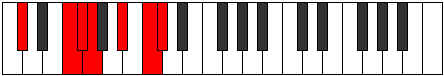

# Mode ASharpKatarimic

## Links

- [Documentation](index.md)
- [Scales Index](Scales.md)
- [Modes Index](Modes.md)
- [Chords Index](Chords.md)

## Scale

[Mythimic](ScaleMythimic.md)

## Mode

[ASharpKatarimic](ModeASharpKatarimic.md)

## Tonic

A#

## Signature

[CNaturalMajor]

## Perfection

 - 4 Perfect Notes

 - 2 Imperfect Notes

## Notes

- A#
- B#
- C# (Imperfect)
- D###
- E##
- F## (Imperfect)
- A#

## Illustration

## Relative Modes

| Number | Mode | Tonic | Notes | Illustration |
|--------|------|-------|-------|--------------|
| [423](https://ianring.com/musictheory/scales/423) | [Sogimic](ModeSogimic.md) | F | F, Gb, Abb, Bb, C, Db, F |  |
| [909](https://ianring.com/musictheory/scales/909) | [Katarimic](ModeKatarimic.md) | A# | A#, B#, C#, D###, E##, F##, A# |  |
| [909](https://ianring.com/musictheory/scales/909) | [Katarimic](ModeKatarimic.md) | Bb | Bb, C, Db, E#, F#, G, Bb |  |
| [1251](https://ianring.com/musictheory/scales/1251) | [Sylimic](ModeSylimic.md) | C | C, Db, E#, F#, G, A#, C |  |
| [2259](https://ianring.com/musictheory/scales/2259) | [Gogimic](ModeGogimic.md) | F# | F#, G, A#, B#, C#, D###, F# |  |
| [2259](https://ianring.com/musictheory/scales/2259) | [Gogimic](ModeGogimic.md) | Gb | Gb, Abb, Bb, C, Db, E#, Gb |  |
| [2673](https://ianring.com/musictheory/scales/2673) | [Mythimic](ModeMythimic.md) | C# | C#, D###, E##, F##, G###, A###, C# |  |
| [2673](https://ianring.com/musictheory/scales/2673) | [Mythimic](ModeMythimic.md) | Db | Db, E#, F#, G, A#, B#, Db |  |
| [3177](https://ianring.com/musictheory/scales/3177) | [Rothimic](ModeRothimic.md) | G | G, A#, B#, C#, D###, E##, G |  |

## Chords

### A#

| Number | Root | Name | Notes | Illustration | Audio |
|--------|------|------|-------|--------------|-------|

### B#

| Number | Root | Name | Notes | Illustration | Audio |
|--------|------|------|-------|--------------|-------|

### C#

| Number | Root | Name | Notes | Illustration | Audio |
|--------|------|------|-------|--------------|-------|

### D###

| Number | Root | Name | Notes | Illustration | Audio |
|--------|------|------|-------|--------------|-------|

### E##

| Number | Root | Name | Notes | Illustration | Audio |
|--------|------|------|-------|--------------|-------|

### F##

| Number | Root | Name | Notes | Illustration | Audio |
|--------|------|------|-------|--------------|-------|

