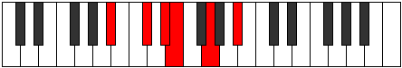

# Mode ASharpKatycritonic

## Links

- [Documentation](index.md)
- [Scales Index](Scales.md)
- [Modes Index](Modes.md)
- [Chords Index](Chords.md)

## Scale

[Mixitonic](ScaleMixitonic.md)

## Mode

[ASharpKatycritonic](ModeASharpKatycritonic.md)

## Tonic

A#

## Signature

[CNaturalMajor]

## Perfection

 - 1 Perfect Notes

 - 4 Imperfect Notes

## Notes

- A# (Imperfect)
- C# (Imperfect)
- D#
- E (Imperfect)
- G (Imperfect)
- A# (Imperfect)

## Illustration

## Relative Modes

| Number | Mode | Tonic | Notes | Illustration |
|--------|------|-------|-------|--------------|
| [589](https://ianring.com/musictheory/scales/589) | [Ionalitonic](ModeIonalitonic.md) | C# | C#, D#, E, G, A#, C# |  |
| [589](https://ianring.com/musictheory/scales/589) | [Ionalitonic](ModeIonalitonic.md) | Db | Db, Eb, E, G, Bb, Db |  |
| [617](https://ianring.com/musictheory/scales/617) | [Katycritonic](ModeKatycritonic.md) | A# | A#, C#, D#, E, G, A# |  |
| [617](https://ianring.com/musictheory/scales/617) | [Katycritonic](ModeKatycritonic.md) | Bb | Bb, Db, Eb, E, G, Bb |  |
| [841](https://ianring.com/musictheory/scales/841) | [Phrothitonic](ModePhrothitonic.md) | G | G, A#, C#, D#, E, G |  |
| [1171](https://ianring.com/musictheory/scales/1171) | [Loptitonic](ModeLoptitonic.md) | D# | D#, E, G, A#, C#, D# |  |
| [1171](https://ianring.com/musictheory/scales/1171) | [Loptitonic](ModeLoptitonic.md) | Eb | Eb, E, G, Bb, Db, Eb |  |
| [2633](https://ianring.com/musictheory/scales/2633) | [Mixitonic](ModeMixitonic.md) | E | E, G, A#, C#, D#, E |  |

## Chords

### A#

| Number | Root | Name | Notes | Illustration | Audio |
|--------|------|------|-------|--------------|-------|

### C#

| Number | Root | Name | Notes | Illustration | Audio |
|--------|------|------|-------|--------------|-------|

### D#

| Number | Root | Name | Notes | Illustration | Audio |
|--------|------|------|-------|--------------|-------|

### E

| Number | Root | Name | Notes | Illustration | Audio |
|--------|------|------|-------|--------------|-------|
| 1168 | E | [Eo](ChordENaturalDiminished.md) | E, G, Bb |  | [midi](ChordENaturalDiminishedRootPosition.mid) [ogg](ChordENaturalDiminishedRootPosition.ogg) |
| 1170 | E | [Eo7](ChordENaturalFullDiminishedSeventh.md) | E, G, Bb, Db |  | [midi](ChordENaturalFullDiminishedSeventhRootPosition.mid) [ogg](ChordENaturalFullDiminishedSeventhRootPosition.ogg) |
| 1176 | E | [EoM7](ChordENaturalDiminishedMajorSeventh.md) | E, G, Bb, D# |  | [midi](ChordENaturalDiminishedMajorSeventhRootPosition.mid) [ogg](ChordENaturalDiminishedMajorSeventhRootPosition.ogg) |

### G

| Number | Root | Name | Notes | Illustration | Audio |
|--------|------|------|-------|--------------|-------|
| 1154 | G | [Go](ChordGNaturalDiminished.md) | G, Bb, Db |  | [midi](ChordGNaturalDiminishedRootPosition.mid) [ogg](ChordGNaturalDiminishedRootPosition.ogg) |
| 1160 | G | [Gm#5](ChordGNaturalMinorSharpFifth.md) | G, Bb, Eb |  | [midi](ChordGNaturalMinorSharpFifthRootPosition.mid) [ogg](ChordGNaturalMinorSharpFifthRootPosition.ogg) |
| 1170 | G | [Go7](ChordGNaturalFullDiminishedSeventh.md) | G, Bb, Db, Fb |  | [midi](ChordGNaturalFullDiminishedSeventhRootPosition.mid) [ogg](ChordGNaturalFullDiminishedSeventhRootPosition.ogg) |

