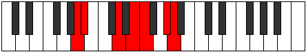

# Mode ASharpKatythimic

## Links

- [Documentation](index.md)
- [Scales Index](Scales.md)
- [Modes Index](Modes.md)
- [Chords Index](Chords.md)

## Scale

[Katythimic](ScaleKatythimic.md)

## Mode

[ASharpKatythimic](ModeASharpKatythimic.md)

## Tonic

A#

## Signature

[CNaturalMajor]

## Perfection

 - 3 Perfect Notes

 - 3 Imperfect Notes

## Notes

- A#
- B###
- D## (Imperfect)
- E# (Imperfect)
- F### (Imperfect)
- G##
- A#

## Illustration

## Relative Modes

| Number | Mode | Tonic | Notes | Illustration |
|--------|------|-------|-------|--------------|
| [461](https://ianring.com/musictheory/scales/461) | [Madimic](ModeMadimic.md) | D | D, E, F, G#, A, Bb, D |  |
| [839](https://ianring.com/musictheory/scales/839) | [Ionathimic](ModeIonathimic.md) | G# | G#, A, Bb, C##, D##, E#, G# |  |
| [839](https://ianring.com/musictheory/scales/839) | [Ionathimic](ModeIonathimic.md) | Ab | Ab, Bbb, Cbb, D, E, F, Ab |  |
| [1139](https://ianring.com/musictheory/scales/1139) | [Aerygimic](ModeAerygimic.md) | E | E, F, G#, A, Bb, C##, E |  |
| [2467](https://ianring.com/musictheory/scales/2467) | [Morimic](ModeMorimic.md) | A | A, Bb, C##, D##, E#, F###, A |  |
| [2617](https://ianring.com/musictheory/scales/2617) | [Pylimic](ModePylimic.md) | F | F, G#, A, Bb, C##, D##, F |  |
| [3281](https://ianring.com/musictheory/scales/3281) | [Katythimic](ModeKatythimic.md) | A# | A#, B###, D##, E#, F###, G##, A# |  |
| [3281](https://ianring.com/musictheory/scales/3281) | [Katythimic](ModeKatythimic.md) | Bb | Bb, C##, D##, E#, F###, G##, Bb |  |

## Chords

### A#

| Number | Root | Name | Notes | Illustration | Audio |
|--------|------|------|-------|--------------|-------|

### B###

| Number | Root | Name | Notes | Illustration | Audio |
|--------|------|------|-------|--------------|-------|

### D##

| Number | Root | Name | Notes | Illustration | Audio |
|--------|------|------|-------|--------------|-------|

### E#

| Number | Root | Name | Notes | Illustration | Audio |
|--------|------|------|-------|--------------|-------|

### F###

| Number | Root | Name | Notes | Illustration | Audio |
|--------|------|------|-------|--------------|-------|

### G##

| Number | Root | Name | Notes | Illustration | Audio |
|--------|------|------|-------|--------------|-------|

