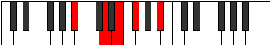
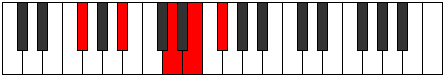

# Mode ASharpKoptic

## Links

- [Documentation](README.md)
- [Scales Index](Scales.md)
- [Modes Index](Modes.md)
- [Chords Index](Chords.md)

## Parent Scale

[Aeolic](ScaleAeolic.md)

## Mode

[ASharpKoptic](ModeASharpKoptic.md)

## Number

337

## Luminosity

-1

## Tonic

A#

## Signature

C

## Transposition

4, 2, 2, 4

## Chord Pattern

## Perfection

 - 0 Perfect Notes

 - 4 Imperfect Notes

 - Perfection Profile - false, false, false, false

## Notes

- A# (Imperfect)
- D (Imperfect)
- E (Imperfect)
- F# (Imperfect)
- A# (Imperfect)

## Illustration

## Diagram

| Circle of Fifth | Chromatic Circle |
|-----------------|------------------|
|  |  |
## Relative Modes

| Number | Mode | Luminosity | Tonic | Notes | Illustration |
|--------|------|------------|-------|-------|--------------|
| [337](https://ianring.com/musictheory/scales/337) | [Koptic](ModeKoptic.md) | -1 | A# | A#, D, E, F#, A# |  |
| [337](https://ianring.com/musictheory/scales/337) | [Koptic](ModeKoptic.md) | -1 | Bb | Bb, D, E, Gb, Bb |  |
| [277](https://ianring.com/musictheory/scales/277) | [Mixolyric](ModeMixolyric.md) | -1 | D | D, E, F#, A#, D |  |
| [1093](https://ianring.com/musictheory/scales/1093) | [Lydic](ModeLydic.md) | -1 | E | E, F#, A#, D, E |  |
| [1297](https://ianring.com/musictheory/scales/1297) | [Aeolic](ModeAeolic.md) | -1 | F# | F#, A#, D, E, F# |  |
| [1297](https://ianring.com/musictheory/scales/1297) | [Aeolic](ModeAeolic.md) | -1 | Gb | Gb, Bb, D, E, Gb |  |
## Relative Brightness

| Number | Mode | Luminosity | Tonic | Notes | Circle Of Fifth | Chromatic Circle |
|--------|------|------------|-------|-------|-----------------|------------------|
| [337](https://ianring.com/musictheory/scales/337) | [Koptic](ModeKoptic.md) | -1 | A# | A#, D, E, F#, A# |  |  |
| [337](https://ianring.com/musictheory/scales/337) | [Koptic](ModeKoptic.md) | -1 | Bb | Bb, D, E, Gb, Bb |  |  |
| [277](https://ianring.com/musictheory/scales/277) | [Mixolyric](ModeMixolyric.md) | -1 | D | D, E, F#, A#, D |  |  |
| [1093](https://ianring.com/musictheory/scales/1093) | [Lydic](ModeLydic.md) | -1 | E | E, F#, A#, D, E |  |  |
| [1297](https://ianring.com/musictheory/scales/1297) | [Aeolic](ModeAeolic.md) | -1 | F# | F#, A#, D, E, F# |  |  |
| [1297](https://ianring.com/musictheory/scales/1297) | [Aeolic](ModeAeolic.md) | -1 | Gb | Gb, Bb, D, E, Gb |  |  |

## Chords

### A#

| Number | Root | Name | Notes | Illustration | Audio |
|--------|------|------|-------|--------------|-------|
| 1044 | A# | [A#Mb5](ChordASharpMajorFlatFifth.md) | A#, C##, E |  | [midi](ChordASharpMajorFlatFifthRootPosition.mid) |
| 1044 | A# | [BbMb5](ChordBFlatMajorFlatFifth.md) | Bb, D, Fb |  | [midi](ChordBFlatMajorFlatFifthRootPosition.mid) |
| 1092 | A# | [A#+](ChordASharpAugmented.md) | A#, C##, E## |  | [midi](ChordASharpAugmentedRootPosition.mid) |
| 1092 | A# | [A#+7](ChordASharpAugmentedAugmentedSeventh.md) | A#, C##, E##, G### |  | [midi](ChordASharpAugmentedAugmentedSeventhRootPosition.mid) |
| 1092 | A# | [Bb+](ChordBFlatAugmented.md) | Bb, D, F# |  | [midi](ChordBFlatAugmentedRootPosition.mid) |
| 1092 | A# | [Bb+7](ChordBFlatAugmentedAugmentedSeventh.md) | Bb, D, F#, A# |  | [midi](ChordBFlatAugmentedAugmentedSeventhRootPosition.mid) |

### D

| Number | Root | Name | Notes | Illustration | Audio |
|--------|------|------|-------|--------------|-------|
| 1044 | D | [Dsus2#5](ChordDNaturalSuspendedSecondSharpFifth.md) | D, E, A# |  | [midi](ChordDNaturalSuspendedSecondSharpFifthRootPosition.mid) |
| 1092 | D | [D+](ChordDNaturalAugmented.md) | D, F#, A# |  | [midi](ChordDNaturalAugmentedRootPosition.mid) |
| 1092 | D | [D+7](ChordDNaturalAugmentedAugmentedSeventh.md) | D, F#, A#, C## |  | [midi](ChordDNaturalAugmentedAugmentedSeventhRootPosition.mid) |

### E

| Number | Root | Name | Notes | Illustration | Audio |
|--------|------|------|-------|--------------|-------|
| 1104 | E | [E](ChordENaturalDiminishedFlatThird.md) | E, Gb, Bb |  | [midi](ChordENaturalDiminishedFlatThirdRootPosition.mid) |
| 1104 | E | [Esus2b5](ChordENaturalSuspendedSecondFlatFifth.md) | E, F#, Bb |  | [midi](ChordENaturalSuspendedSecondFlatFifthRootPosition.mid) |

### F#

| Number | Root | Name | Notes | Illustration | Audio |
|--------|------|------|-------|--------------|-------|
| 1092 | F# | [F#+](ChordFSharpAugmented.md) | F#, A#, C## |  | [midi](ChordFSharpAugmentedRootPosition.mid) |
| 1092 | F# | [F#+7](ChordFSharpAugmentedAugmentedSeventh.md) | F#, A#, C##, E## |  | [midi](ChordFSharpAugmentedAugmentedSeventhRootPosition.mid) |
| 1092 | F# | [Gb+](ChordGFlatAugmented.md) | Gb, Bb, D |  | [midi](ChordGFlatAugmentedRootPosition.mid) |
| 1092 | F# | [Gb+7](ChordGFlatAugmentedAugmentedSeventh.md) | Gb, Bb, D, F# |  | [midi](ChordGFlatAugmentedAugmentedSeventhRootPosition.mid) |

