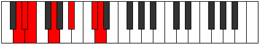

# Mode ASharpKydimic

## Links

- [Documentation](index.md)
- [Scales Index](Scales.md)
- [Modes Index](Modes.md)
- [Chords Index](Chords.md)

## Scale

[Epynimic](ScaleEpynimic.md)

## Mode

[ASharpKydimic](ModeASharpKydimic.md)

## Tonic

A#

## Signature

[CNaturalMajor]

## Perfection

 - 2 Perfect Notes

 - 4 Imperfect Notes

## Notes

- A# (Imperfect)
- B## (Imperfect)
- C## (Imperfect)
- D#
- E (Imperfect)
- F##
- A# (Imperfect)

## Illustration

## Relative Modes

| Number | Mode | Tonic | Notes | Illustration |
|--------|------|-------|-------|--------------|
| [591](https://ianring.com/musictheory/scales/591) | [Gaptimic](ModeGaptimic.md) | C# | C#, D, Eb, Fb, G, A#, C# |  |
| [591](https://ianring.com/musictheory/scales/591) | [Gaptimic](ModeGaptimic.md) | Db | Db, Ebb, Fbb, Gbbb, Abb, Bb, Db |  |
| [633](https://ianring.com/musictheory/scales/633) | [Kydimic](ModeKydimic.md) | A# | A#, B##, C##, D#, E, F##, A# |  |
| [633](https://ianring.com/musictheory/scales/633) | [Kydimic](ModeKydimic.md) | Bb | Bb, C#, D, Eb, Fb, G, Bb |  |
| [969](https://ianring.com/musictheory/scales/969) | [Ionogimic](ModeIonogimic.md) | G | G, A#, B##, C##, D#, E, G |  |
| [2343](https://ianring.com/musictheory/scales/2343) | [Tharimic](ModeTharimic.md) | D | D, Eb, Fb, G, A#, B##, D |  |
| [3219](https://ianring.com/musictheory/scales/3219) | [Ionaphimic](ModeIonaphimic.md) | D# | D#, E, F##, G###, Db, Ebb, D# |  |
| [3219](https://ianring.com/musictheory/scales/3219) | [Ionaphimic](ModeIonaphimic.md) | Eb | Eb, Fb, G, A#, B##, C##, Eb |  |
| [3657](https://ianring.com/musictheory/scales/3657) | [Epynimic](ModeEpynimic.md) | E | E, F##, G###, Db, Ebb, Fbb, E |  |

## Chords

### A#

| Number | Root | Name | Notes | Illustration | Audio |
|--------|------|------|-------|--------------|-------|

### B##

| Number | Root | Name | Notes | Illustration | Audio |
|--------|------|------|-------|--------------|-------|

### C##

| Number | Root | Name | Notes | Illustration | Audio |
|--------|------|------|-------|--------------|-------|

### D#

| Number | Root | Name | Notes | Illustration | Audio |
|--------|------|------|-------|--------------|-------|

### E

| Number | Root | Name | Notes | Illustration | Audio |
|--------|------|------|-------|--------------|-------|

### F##

| Number | Root | Name | Notes | Illustration | Audio |
|--------|------|------|-------|--------------|-------|

