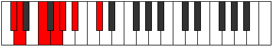

# Mode ASharpLorimic

## Links

- [Documentation](index.md)
- [Scales Index](Scales.md)
- [Modes Index](Modes.md)
- [Chords Index](Chords.md)

## Scale

[Zacrimic](ScaleZacrimic.md)

## Mode

[ASharpLorimic](ModeASharpLorimic.md)

## Tonic

A#

## Signature

[CNaturalMajor]

## Perfection

 - 3 Perfect Notes

 - 3 Imperfect Notes

## Notes

- A#
- B##
- C## (Imperfect)
- D### (Imperfect)
- E###
- F### (Imperfect)
- A#

## Illustration

## Relative Modes

| Number | Mode | Tonic | Notes | Illustration |
|--------|------|-------|-------|--------------|
| [723](https://ianring.com/musictheory/scales/723) | [Ionadimic](ModeIonadimic.md) | C# | C#, D, E#, F##, G#, A#, C# |  |
| [723](https://ianring.com/musictheory/scales/723) | [Ionadimic](ModeIonadimic.md) | Db | Db, Ebb, F, G, Ab, Bb, Db |  |
| [813](https://ianring.com/musictheory/scales/813) | [Larimic](ModeLarimic.md) | F | F, G, Ab, Bb, C#, D, F |  |
| [1227](https://ianring.com/musictheory/scales/1227) | [Thacrimic](ModeThacrimic.md) | G | G, Ab, Bb, C#, D, E#, G |  |
| [1689](https://ianring.com/musictheory/scales/1689) | [Lorimic](ModeLorimic.md) | A# | A#, B##, C##, D###, E###, F###, A# |  |
| [1689](https://ianring.com/musictheory/scales/1689) | [Lorimic](ModeLorimic.md) | Bb | Bb, C#, D, E#, F##, G#, Bb |  |
| [2409](https://ianring.com/musictheory/scales/2409) | [Zacrimic](ModeZacrimic.md) | D | D, E#, F##, G#, A#, B##, D |  |
| [2661](https://ianring.com/musictheory/scales/2661) | [Stydimic](ModeStydimic.md) | G# | G#, A#, B##, C##, D###, E###, G# |  |
| [2661](https://ianring.com/musictheory/scales/2661) | [Stydimic](ModeStydimic.md) | Ab | Ab, Bb, C#, D, E#, F##, Ab |  |

## Chords

### A#

| Number | Root | Name | Notes | Illustration | Audio |
|--------|------|------|-------|--------------|-------|

### B##

| Number | Root | Name | Notes | Illustration | Audio |
|--------|------|------|-------|--------------|-------|

### C##

| Number | Root | Name | Notes | Illustration | Audio |
|--------|------|------|-------|--------------|-------|

### D###

| Number | Root | Name | Notes | Illustration | Audio |
|--------|------|------|-------|--------------|-------|

### E###

| Number | Root | Name | Notes | Illustration | Audio |
|--------|------|------|-------|--------------|-------|

### F###

| Number | Root | Name | Notes | Illustration | Audio |
|--------|------|------|-------|--------------|-------|

