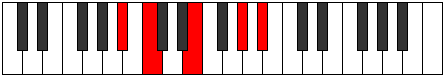
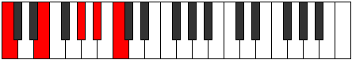
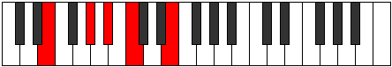
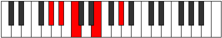
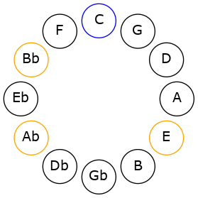
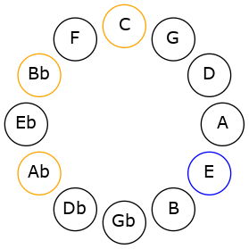
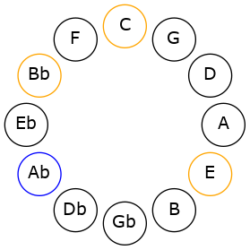

# Mode ASharpLydic

## Links

- [Documentation](README.md)
- [Scales Index](Scales.md)
- [Modes Index](Modes.md)
- [Chords Index](Chords.md)

## Scale

[Aeolic](ScaleAeolic.md)

## Mode

[ASharpLydic](ModeASharpLydic.md)

## Tonic

A#

## Signature

[CNaturalMajor]

## Transposition

2, 4, 4, 2

## Chord Pattern

## Perfection

 - 0 Perfect Notes

 - 4 Imperfect Notes

## Notes

- A# (Imperfect)
- C (Imperfect)
- E (Imperfect)
- G# (Imperfect)
- A# (Imperfect)

## Illustration

## Diagram

## Relative Modes

| Number | Mode | Tonic | Notes | Illustration |
|--------|------|-------|-------|--------------|
| [1093](https://ianring.com/musictheory/scales/1093) | [Lydic](ModeLydic.md) | A# | A#, C, E, G#, A# |  |
| [1297](https://ianring.com/musictheory/scales/1297) | [Aeolic](ModeAeolic.md) | C | C, E, G#, A#, C |  |
| [337](https://ianring.com/musictheory/scales/337) | [Koptic](ModeKoptic.md) | E | E, G#, A#, C, E |  |
| [277](https://ianring.com/musictheory/scales/277) | [Mixolyric](ModeMixolyric.md) | G# | G#, A#, C, E, G# |  |
## Relative Brightness

| Number | Mode | Tonic | Notes | Illustration |
|--------|------|-------|-------|--------------|
| [1093](https://ianring.com/musictheory/scales/1093) | [Lydic](ModeLydic.md) | A# | A#, C, E, G#, A# |  |
| [1297](https://ianring.com/musictheory/scales/1297) | [Aeolic](ModeAeolic.md) | C | C, E, G#, A#, C |  |
| [337](https://ianring.com/musictheory/scales/337) | [Koptic](ModeKoptic.md) | E | E, G#, A#, C, E |  |
| [277](https://ianring.com/musictheory/scales/277) | [Mixolyric](ModeMixolyric.md) | G# | G#, A#, C, E, G# |  |

## Chords

### A#

| Number | Root | Name | Notes | Illustration | Audio |
|--------|------|------|-------|--------------|-------|
| 1041 | A# | [A#](ChordASharpDiminishedFlatThird.md) | A#, C, E |  | [midi](ChordASharpDiminishedFlatThirdRootPosition.mid) |
| 1041 | A# | [A#sus2b5](ChordASharpSuspendedSecondFlatFifth.md) | A#, B#, E |  | [midi](ChordASharpSuspendedSecondFlatFifthRootPosition.mid) |

### C

| Number | Root | Name | Notes | Illustration | Audio |
|--------|------|------|-------|--------------|-------|
| 273 | C | [C+](ChordCNaturalAugmented.md) | C, E, G# |  | [midi](ChordCNaturalAugmentedRootPosition.mid) |
| 273 | C | [C+7](ChordCNaturalAugmentedAugmentedSeventh.md) | C, E, G#, B# |  | [midi](ChordCNaturalAugmentedAugmentedSeventhRootPosition.mid) |

### E

| Number | Root | Name | Notes | Illustration | Audio |
|--------|------|------|-------|--------------|-------|
| 1296 | E | [EMb5](ChordENaturalMajorFlatFifth.md) | E, G#, Bb |  | [midi](ChordENaturalMajorFlatFifthRootPosition.mid) |
| 273 | E | [E+](ChordENaturalAugmented.md) | E, G#, B# |  | [midi](ChordENaturalAugmentedRootPosition.mid) |
| 273 | E | [E+7](ChordENaturalAugmentedAugmentedSeventh.md) | E, G#, B#, D## |  | [midi](ChordENaturalAugmentedAugmentedSeventhRootPosition.mid) |

### G#

| Number | Root | Name | Notes | Illustration | Audio |
|--------|------|------|-------|--------------|-------|
| 1296 | G# | [G#sus2#5](ChordGSharpSuspendedSecondSharpFifth.md) | G#, A#, D## |  | [midi](ChordGSharpSuspendedSecondSharpFifthRootPosition.mid) |
| 273 | G# | [G#+](ChordGSharpAugmented.md) | G#, B#, D## |  | [midi](ChordGSharpAugmentedRootPosition.mid) |
| 273 | G# | [G#+7](ChordGSharpAugmentedAugmentedSeventh.md) | G#, B#, D##, F### |  | [midi](ChordGSharpAugmentedAugmentedSeventhRootPosition.mid) |

