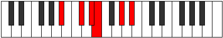

# Mode ASharpPhrynitonic

## Links

- [Documentation](index.md)
- [Scales Index](Scales.md)
- [Modes Index](Modes.md)
- [Chords Index](Chords.md)

## Scale

[Gathitonic](ScaleGathitonic.md)

## Mode

[ASharpPhrynitonic](ModeASharpPhrynitonic.md)

## Tonic

A#

## Signature

[CNaturalMajor]

## Perfection

 - 3 Perfect Notes

 - 2 Imperfect Notes

## Notes

- A# (Imperfect)
- C#
- D#
- E (Imperfect)
- G#
- A# (Imperfect)

## Illustration

## Relative Modes

| Number | Mode | Tonic | Notes | Illustration |
|--------|------|-------|-------|--------------|
| [421](https://ianring.com/musictheory/scales/421) | [Ionitonic](ModeIonitonic.md) | G# | G#, A#, C#, D#, E, G# |  |
| [421](https://ianring.com/musictheory/scales/421) | [Ionitonic](ModeIonitonic.md) | Ab | Ab, Bb, Db, Eb, E, Ab |  |
| [653](https://ianring.com/musictheory/scales/653) | [Stathitonic](ModeStathitonic.md) | C# | C#, D#, E, G#, A#, C# |  |
| [653](https://ianring.com/musictheory/scales/653) | [Stathitonic](ModeStathitonic.md) | Db | Db, Eb, E, Ab, Bb, Db |  |
| [1129](https://ianring.com/musictheory/scales/1129) | [Phrynitonic](ModePhrynitonic.md) | A# | A#, C#, D#, E, G#, A# |  |
| [1129](https://ianring.com/musictheory/scales/1129) | [Phrynitonic](ModePhrynitonic.md) | Bb | Bb, Db, Eb, E, Ab, Bb |  |
| [1187](https://ianring.com/musictheory/scales/1187) | [Thalitonic](ModeThalitonic.md) | D# | D#, E, G#, A#, C#, D# |  |
| [1187](https://ianring.com/musictheory/scales/1187) | [Thalitonic](ModeThalitonic.md) | Eb | Eb, E, Ab, Bb, Db, Eb |  |
| [2641](https://ianring.com/musictheory/scales/2641) | [Gathitonic](ModeGathitonic.md) | E | E, G#, A#, C#, D#, E |  |

## Chords

### A#

| Number | Root | Name | Notes | Illustration | Audio |
|--------|------|------|-------|--------------|-------|

### C#

| Number | Root | Name | Notes | Illustration | Audio |
|--------|------|------|-------|--------------|-------|

### D#

| Number | Root | Name | Notes | Illustration | Audio |
|--------|------|------|-------|--------------|-------|

### E

| Number | Root | Name | Notes | Illustration | Audio |
|--------|------|------|-------|--------------|-------|
| 1296 | E | [EMb5](ChordENaturalMajorFlatFifth.md) | E, G#, Bb |  | [midi](ChordENaturalMajorFlatFifthRootPosition.mid) [ogg](ChordENaturalMajorFlatFifthRootPosition.ogg) |
| 274 | E | [EM##5](ChordENaturalMajorDoubleSharpFifth.md) | E, G#, C# |  | [midi](ChordENaturalMajorDoubleSharpFifthRootPosition.mid) [ogg](ChordENaturalMajorDoubleSharpFifthRootPosition.ogg) |
| 1298 | E | [EM6b5](ChordENaturalMajorSixthFlatFifth.md) | E, G#, Bb, C# |  | [midi](ChordENaturalMajorSixthFlatFifthRootPosition.mid) [ogg](ChordENaturalMajorSixthFlatFifthRootPosition.ogg) |
| 1304 | E | [EM7b5](ChordENaturalMajorSeventhFlatFifth.md) | E, G#, Bb, D# |  | [midi](ChordENaturalMajorSeventhFlatFifthRootPosition.mid) [ogg](ChordENaturalMajorSeventhFlatFifthRootPosition.ogg) |
| 282 | E | [EM7##5](ChordENaturalMajorSeventhDoubleSharpFifth.md) | E, G#, C#, D# |  | [midi](ChordENaturalMajorSeventhDoubleSharpFifthRootPosition.mid) [ogg](ChordENaturalMajorSeventhDoubleSharpFifthRootPosition.ogg) |

### G#

| Number | Root | Name | Notes | Illustration | Audio |
|--------|------|------|-------|--------------|-------|

