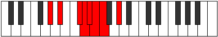

# Mode ASharpRonian

## Links

- [Documentation](index.md)
- [Scales Index](Scales.md)
- [Modes Index](Modes.md)
- [Chords Index](Chords.md)

## Scale

[Morian](ScaleMorian.md)

## Mode

[ASharpRonian](ModeASharpRonian.md)

## Tonic

A#

## Signature

[CNaturalMajor]

## Perfection

 - 4 Perfect Notes

 - 3 Imperfect Notes

## Notes

- A#
- B##
- C## (Imperfect)
- D#
- E (Imperfect)
- F (Imperfect)
- G#
- A#

## Illustration

## Relative Modes

| Number | Mode | Tonic | Notes | Illustration |
|--------|------|-------|-------|--------------|
| [1273](https://ianring.com/musictheory/scales/1273) | [Ronian](ModeRonian.md) | A# | A#, B##, C##, D#, E, F, G#, A# |  |
| [3239](https://ianring.com/musictheory/scales/3239) | [Epythian](ModeEpythian.md) | D# | D#, E, F, G#, A#, B##, C##, D# |  |
| [3667](https://ianring.com/musictheory/scales/3667) | [Kaptian](ModeKaptian.md) | E | E, F, G#, A#, B##, C##, D#, E |  |
| [3881](https://ianring.com/musictheory/scales/3881) | [Morian](ModeMorian.md) | F | F, G#, A#, B##, C##, D#, E, F |  |
| [997](https://ianring.com/musictheory/scales/997) | [Rycrian](ModeRycrian.md) | G# | G#, A#, B##, C##, D#, E, F, G# |  |

## Chords

### A#

| Number | Root | Name | Notes | Illustration | Audio |
|--------|------|------|-------|--------------|-------|

### B##

| Number | Root | Name | Notes | Illustration | Audio |
|--------|------|------|-------|--------------|-------|

### C##

| Number | Root | Name | Notes | Illustration | Audio |
|--------|------|------|-------|--------------|-------|

### D#

| Number | Root | Name | Notes | Illustration | Audio |
|--------|------|------|-------|--------------|-------|

### E

| Number | Root | Name | Notes | Illustration | Audio |
|--------|------|------|-------|--------------|-------|

### F

| Number | Root | Name | Notes | Illustration | Audio |
|--------|------|------|-------|--------------|-------|

### G#

| Number | Root | Name | Notes | Illustration | Audio |
|--------|------|------|-------|--------------|-------|

